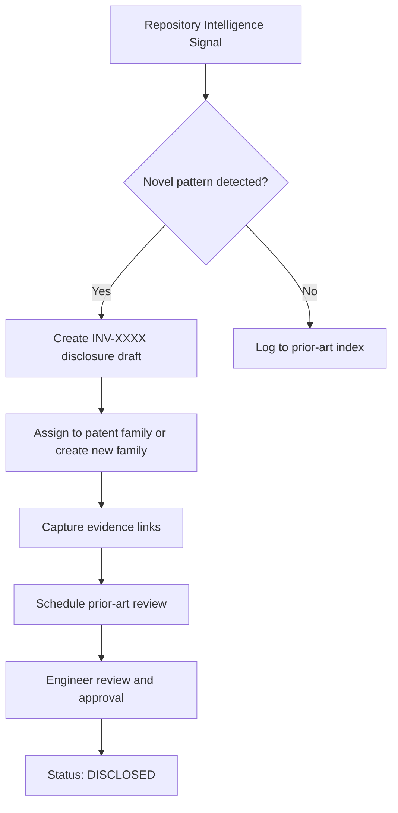
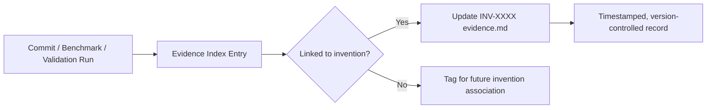
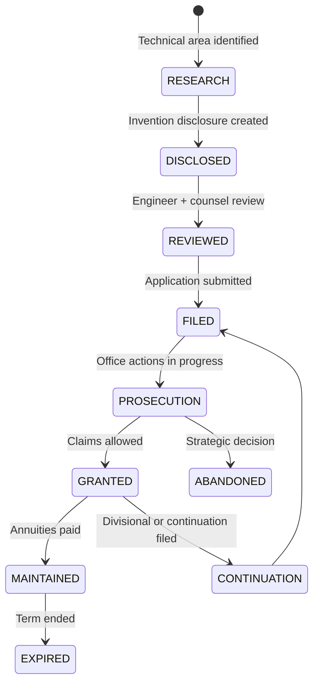

# Intellectual Property Subsystem

## Purpose

This subsystem treats intellectual property as a continuously evolving engineering artifact.
It exists to help Agent IDE repositories discover, organize, validate, preserve, and mature
inventions alongside source code — through the same disciplines applied to production software.

This is not a patent-generation feature. It is an engineering system that produces artifacts
capable of supporting future patent filings, defensive publications, standards contributions,
licensing negotiations, commercialization analysis, and long-term innovation management.

## Audience

- Engineers building Agent IDE
- Inventors contributing novel technical work
- Patent counsel preparing filings or freedom-to-operate analyses
- Investors evaluating the IP portfolio
- Future AI systems operating within Agent IDE

## Status

`ACTIVE — v1.0 — Initialized 2026-06-28`

## Dependencies

| Dependency | Location | Relationship |
|---|---|---|
| Goals | `.ai/goals/` | Every invention must trace to at least one goal |
| Architecture | `.ai/architecture/` | Invention enablement depends on architectural decisions |
| Decisions | `.ai/decisions/` | ADRs provide implementation rationale and prior-art evidence |
| Repository Intelligence | `.ai/repository-intelligence/` | Source of continuous invention discovery signals |
| Validation | `.ai/validation/` | Validation artifacts serve as implementation evidence |
| Outcomes | `.ai/outcomes/` | Outcomes demonstrate commercial and technical impact |
| Backlog | `.ai/backlog/` | Backlog items may surface prototype opportunities |

## Revision History

| Version | Date | Author | Summary |
|---|---|---|---|
| 1.0 | 2026-06-28 | Agent IDE Architect | Initial subsystem creation |

---

## What This Subsystem Does

Intellectual property in software is created continuously — in architecture decisions, in
prototype commits, in validation runs, in novel algorithms — but almost always goes unrecorded.
By the time legal counsel is engaged, the evidence of inventive date, technical novelty, and
reduction to practice is scattered across commit history, design docs, and individual memory.

This subsystem solves that by treating IP management as a first-class engineering discipline:

- Inventions are identified and documented at the moment of creation
- Evidence is captured at the source: commits, benchmarks, architecture records, validation runs
- Prior art is reviewed continuously, not retrospectively
- Patent families are maintained like software modules — incrementally, with version history
- Traceability from invention to goal to architecture to implementation to evidence is enforced

---

## Repository Structure

```
.ai/intellectual-property/
│
├── README.md                    ← This file. Subsystem overview and orientation.
├── glossary.md                  ← Canonical definitions for all technical terms.
│
├── inventions/                  ← Individual invention disclosures.
│   └── {INV-XXXX}/
│       ├── disclosure.md        ← Full technical disclosure
│       ├── novelty.md           ← Novelty and differentiator analysis
│       ├── evidence.md          ← Links to implementation evidence
│       └── status.md            ← Filing status and decisions
│
├── patent-families/             ← Grouped inventions sharing a common technical core.
│   └── {FAMILY-XX}/
│       ├── overview.md          ← Family scope and strategy
│       ├── claims-map.md        ← Logical claim landscape
│       ├── continuation-plan.md ← Continuation and divisional roadmap
│       └── risk.md              ← Invalidity and design-around analysis
│
├── prior-art/                   ← Prior-art references and analysis.
│   ├── index.md                 ← Master index of all reviewed references
│   └── {REF-XXXX}.md           ← Individual prior-art record
│
├── evidence/                    ← Preserved implementation evidence.
│   ├── index.md                 ← Master evidence index
│   ├── prototypes/              ← Prototype records and inventive-date evidence
│   ├── benchmarks/              ← Performance and correctness benchmarks
│   ├── screenshots/             ← UI and behavioral evidence
│   └── demonstrations/          ← Recorded demonstrations and walkthroughs
│
├── validation/                  ← IP-specific validation records.
│   └── {INV-XXXX}/
│       └── validation-report.md ← How validation supports enablement claims
│
├── figures/                     ← Architectural and patent figures.
│   ├── index.md                 ← Figure index with descriptions
│   └── {FIG-XX}.md             ← Figure definition with Mermaid source
│
├── research/                    ← Technical research supporting inventions.
│   └── {TOPIC}.md
│
├── continuations/               ← Continuation and divisional planning.
│   └── {FAMILY-XX}/
│       └── continuation-{N}.md
│
├── commercialization/           ← Commercialization and licensing analysis.
│   └── {FAMILY-XX}/
│       ├── market-analysis.md
│       ├── licensing-strategy.md
│       └── competitive-analysis.md
│
├── filings/                     ← Filing records and prosecution history.
│   └── {FILING-XXXX}/
│       ├── application.md       ← Filing metadata (no confidential content)
│       └── prosecution-log.md   ← Office action and response timeline
│
├── history/                     ← Long-term invention and portfolio history.
│   └── {YEAR}/
│       └── annual-review.md
│
└── appendices/                  ← Formal technical specifications.
    ├── glossary-extended.md     ← Extended definitions and mathematical formalism
    ├── state-machines/          ← Formal state machine specifications
    ├── protocols/               ← Protocol specifications
    ├── algorithms/              ← Algorithm specifications
    ├── schemas/                 ← JSON and data schemas
    └── api-definitions/         ← API specifications
```

---

## Core Workflows

### Invention Discovery



### Evidence Preservation



### Patent Family Lifecycle



---

## Traceability Model

Every invention must be traceable across the following dimensions. Gaps in any dimension
are treated as engineering deficiencies, not legal risks.

| Dimension | Required Link | Location |
|---|---|---|
| Goal | Which user or system goal does this invention advance? | `.ai/goals/` |
| Architecture | Which architectural component implements this invention? | `.ai/architecture/` |
| Decision | Which ADRs document the inventive choices made? | `.ai/decisions/` |
| Implementation | Which commits, files, or modules contain the implementation? | Git history |
| Validation | What tests or benchmarks confirm correct operation? | `.ai/validation/` |
| Evidence | What artifacts establish inventive date and reduction to practice? | `evidence/` |
| Outcome | What measurable outcomes demonstrate value? | `.ai/outcomes/` |

---

## Canonical Terminology

All canonical technical definitions belong exclusively in:

```
.ai/intellectual-property/glossary.md
```

No other document in this subsystem or elsewhere in Agent IDE may define a canonical term.
Documents may reference terms from the glossary and may include local context notes, but
must not redefine the canonical meaning.

When a new technical term is introduced, the glossary must be updated in the same commit
that introduces the term.

---

## Document Standards

Every document in this subsystem must open with the following front matter, rendered as
Markdown headers or a table:

- **Title** — The document's full name
- **Purpose** — One paragraph describing what the document does and why it exists
- **Audience** — Who reads this document and what they need from it
- **Status** — One of: `DRAFT | REVIEW | ACTIVE | SUPERSEDED | ARCHIVED`
- **Dependencies** — Other documents this document depends on
- **Revision History** — Dated list of material changes

Every document must:

- Be self-contained (readable without navigating other files)
- Use only canonical terminology from `glossary.md`
- Cross-reference all related documents by relative path
- Include a **Future Work** section describing known gaps and planned extensions
- Include an **Open Questions** section listing unresolved technical or strategic questions

When describing architectures, include Mermaid diagrams.

---

## Invention ID Scheme

Inventions are assigned IDs at disclosure time:

```
INV-{YEAR}-{SEQUENCE}
```

Example: `INV-2026-0001`

Patent families are assigned IDs when a family is established:

```
FAM-{YEAR}-{SEQUENCE}
```

Example: `FAM-2026-0001`

Prior-art references:

```
REF-{YEAR}-{SEQUENCE}
```

Example: `REF-2026-0001`

Figures:

```
FIG-{FAMILY}-{SEQUENCE}
```

Example: `FIG-FAM-2026-0001-01`

---

## Integration with Agent IDE

This subsystem is designed to be read and written by Agent IDE's AI systems as well as
by human engineers. AI systems operating within Agent IDE should:

1. Monitor repository intelligence signals for novel patterns warranting a disclosure
2. Propose invention disclosures for engineer review — never file autonomously
3. Maintain evidence index links as implementation progresses
4. Flag prior-art candidates when similar approaches are observed in external sources
5. Surface traceability gaps as validation failures

Human engineers retain authority over all disclosure, filing, and abandonment decisions.

---

## Getting Started

To introduce a new invention:

1. Create a directory under `inventions/INV-{YEAR}-{XXXX}/`
2. Copy the disclosure template from `inventions/TEMPLATE/disclosure.md`
3. Complete all required sections — leave none blank, use `TBD` where genuinely unknown
4. Add at least one evidence link before marking status `REVIEW`
5. Link the invention to its patent family, or create a new family record
6. Update `glossary.md` with any new canonical terms
7. Commit with message: `ip: disclose INV-{YEAR}-{XXXX} — {short title}`

---

## Future Work

- Automated invention discovery pipeline integrated with Repository Intelligence signals
- Evidence capture hooks on commit and validation events
- Prior-art watch service monitoring patent databases and academic preprints
- Traceability dashboard surfacing coverage gaps across all inventions
- Commercialization scoring integrated with Outcomes subsystem
- Continuation opportunity detection as claims mature

## Open Questions

1. What is the minimum evidence threshold before a disclosure is considered enabling?
2. Should trade-secret inventions live in a separate access-controlled subtree?
3. How should inventions that span multiple repositories be handled?
4. What is the escalation path when AI-detected signals are ambiguous — auto-draft or alert only?
5. Should the glossary be a single file or a structured index as the vocabulary grows?
