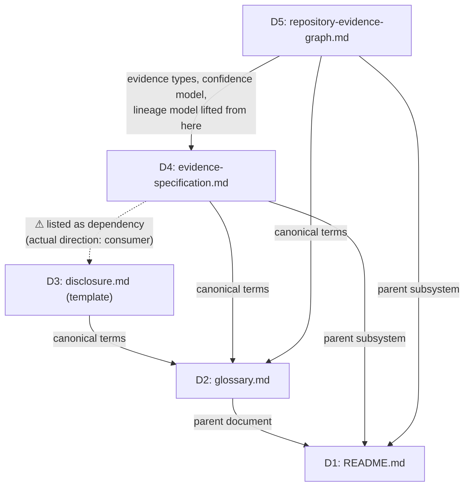
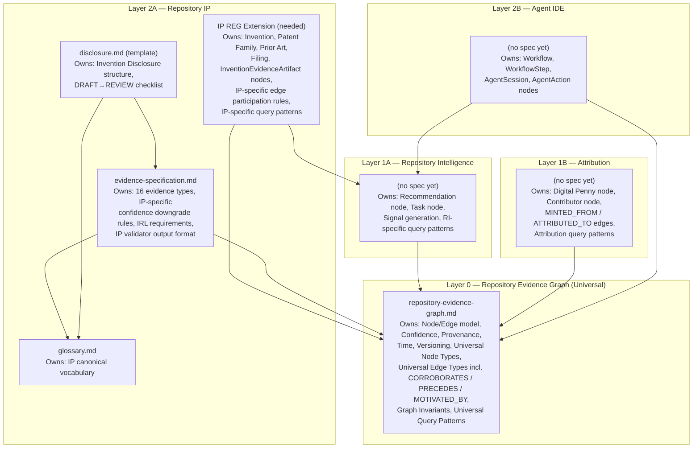

# Repository IP Architecture Review

**Date:** 2026-06-28  
**Scope:** All documents produced within `.ai/intellectual-property/` as of 2026-06-28  
**Type:** Architectural analysis — no new specifications, no rewrites, no implementation proposals

---

## Documents Under Review

| ID | Path | Version | Role |
|---|---|---|---|
| D1 | `README.md` | v1.0 | Subsystem overview and directory contract |
| D2 | `glossary.md` | v1.1 | Canonical vocabulary |
| D3 | `inventions/TEMPLATE/disclosure.md` | v1.0 | Invention disclosure template |
| D4 | `specifications/evidence-specification.md` | v1.0 | Evidence model for IP subsystem |
| D5 | `specifications/repository-evidence-graph.md` | v1.0 | Universal knowledge substrate |

---

## Section 1 — Document Dependency Graph

### 1.1 Declared Dependencies

Each document's stated dependency table was read directly.



### 1.2 Implicit Dependencies Not Declared

Beyond the declared tables, the following implicit dependencies exist based on content analysis:

| Source | Target | Implicit Dependency |
|---|---|---|
| D3 (disclosure.md) | D4 (evidence-spec) | Template Section 6 and 12 require evidence artifacts conforming to D4's schema; not declared |
| D3 (disclosure.md) | D5 (REG) | Template's `evidence-graph.json` reference is superseded by REG; not declared |
| D5 (REG) | D2 (glossary) | Uses canonical terms (Invention, Patent Family, Filing Status, etc.) from D2; declared |
| D4 (evidence-spec) | D5 (REG) | Evidence-spec's per-invention graph model is superseded by D5; not acknowledged in D4 |

---

## Section 2 — Circular Dependencies

### 2.1 Direct Circular Dependency: D4 ↔ D3

**Finding: CIRCULAR DEPENDENCY — BLOCKING**

`evidence-specification.md` (D4) declares in its Dependencies table:

```
| Disclosure Template | ../inventions/TEMPLATE/disclosure.md | Consumer of this specification |
```

This entry lists a document that depends *on* D4 as a dependency *of* D4. The relationship
annotation "Consumer of this specification" reveals the confusion: D4 is using the
dependency table to track its consumers rather than its inputs.

A specification depends on documents it reads from. `disclosure.md` reads from
`evidence-specification.md`, not the reverse. Reversing this entry's direction in the
dependency table would correctly express: D3 depends on D4. As written, it creates
a nominal circular dependency (D4 → D3 → D2, and D3 declares D4 as a source).

**Severity:** Structural — will cause confusion for any automated dependency resolver
and for engineers maintaining the documents. Does not cause logical inconsistency in
the content itself, but violates the dependency table's stated purpose.

### 2.2 Conceptual Circular Authority: D4 ↔ D5

**Finding: AUTHORITY INVERSION — CRITICAL**

`repository-evidence-graph.md` (D5) declares in its Dependencies:

```
| Evidence Specification | ./evidence-specification.md | Defines evidence artifact types,
  confidence levels, and lineage model that are lifted into the REG |
```

This means D5 derives its confidence model, evidence types, and lineage model **from** D4.

However, D5's Purpose section states:

> "This document supersedes any subsystem-specific evidence graph definition, including
> the per-invention evidence graphs described in evidence-specification.md."

And D5's intended architectural position is Layer 0 — the universal substrate underlying
all subsystems including the IP subsystem that owns D4.

The result is an inverted authority chain:

- D4 (IP-subsystem-specific) is the **source** of the confidence model
- D5 (universal substrate, Layer 0) **derives from** that IP-specific source

This means the universal layer currently depends on the IP layer for one of its
most fundamental concepts. If D4 is ever modified for IP-specific reasons (e.g., adding
an IP-specific confidence downgrade rule), the universal model changes silently.

**Severity:** Critical architectural inversion. Every future subsystem that uses the
REG confidence model will inherit an IP-subsystem dependency they are not aware of.

---

## Section 3 — Duplicated Concepts

### 3.1 Confidence Model

**Defined in:** D4 Sections 3.1, 3.2, 3.3 (primary, with full detail)  
**Re-defined in:** D5 Section 2.6 (as "the same five-level scale defined in evidence-specification.md Section 3, extended to all node and edge types")

The confidence model is substantively identical in both documents. D5 acknowledges D4 as the origin. Because D5 is intended as the universal substrate, this is authority at the wrong layer. The confidence model belongs in D5 with D4 referencing D5 for the base levels and adding only IP-specific downgrade rules.

**Duplication score:** High — same five levels, same meanings, same inheritance rules.

### 3.2 Evidence Lineage Model

**Defined in:** D4 Section 4 (per-invention DAG with Mermaid flowchart, four time phases, temporal monotonicity rule, supersession, gap detection)  
**Superseded by:** D5 (entire document, per D5 Purpose section)

D4 defines an evidence lineage model as a per-invention directed acyclic graph with typed edges (temporal succession, corroboration, derivation, supersession). D5 defines the REG as the universal graph with the same structural properties — append-only, immutable, DAG for certain edge types, supersession without deletion.

The per-invention lineage model in D4 is a subgraph view of the REG, not a separate model. The structural rules (temporal monotonicity, DAG acyclicity, supersession) are stated independently in both documents and may drift.

**Duplication score:** High — same structural properties, same invariants, stated twice.

### 3.3 Relationship Types / Edge Types

**Defined in:** D4 Section 5 (7 relationship types with semantics)  
**Defined in:** D5 Section 4 (10 edge types with semantics)

Overlap analysis:

| Relationship | In D4 | In D5 | Status |
|---|---|---|---|
| SUPPORTS | ✓ | ✓ | **Duplicated** — semantics consistent but defined independently |
| DERIVES_FROM | ✓ | ✓ | **Duplicated** — semantics consistent but defined independently |
| SUPERSEDES | ✓ | ✓ | **Duplicated** — semantics consistent but defined independently |
| CONTRADICTS | ✓ | ✓ | **Duplicated** — semantics consistent but defined independently |
| CORROBORATES | ✓ | ✗ | D4-only — not absorbed into D5 |
| PRECEDES | ✓ | ✗ | D4-only — not absorbed into D5 |
| MOTIVATED_BY | ✓ | ✗ | D4-only — not absorbed into D5 |
| IMPLEMENTS | ✗ | ✓ | D5-only |
| VALIDATES | ✗ | ✓ | D5-only |
| DEPENDS_ON | ✗ | ✓ | D5-only |
| GENERATED | ✗ | ✓ | D5-only |
| ATTRIBUTED_TO | ✗ | ✓ | D5-only |
| MINTED_FROM | ✗ | ✓ | D5-only |

Four edge types (SUPPORTS, DERIVES_FROM, SUPERSEDES, CONTRADICTS) have dual authority.
Three edge types (CORROBORATES, PRECEDES, MOTIVATED_BY) defined only in D4 are
missing from the universal model in D5.

**Duplication score:** Medium — four types have dual authority; three types exist in
only one document despite being generally useful.

### 3.4 Graph Invariants vs. Validation Rules

**Defined in:** D4 Section 9 (24 validation rules: EV-S01–08, EV-C01–08, EV-Q01–04, EV-L01–03)  
**Defined in:** D5 Section 5 (20 graph invariants: INV-01 through INV-20)

Overlap analysis:

| D4 Rule | D5 Invariant | Overlap |
|---|---|---|
| EV-S03 (no cycles) | INV-04 (DAG for DERIVES_FROM, DEPENDS_ON) | Partial — D4 is broader, D5 is specific to two edge types |
| EV-S06 (PRECEDES temporal order) | INV-07 (PRECEDES temporal order) | Full duplicate |
| EV-S07 (DERIVES_FROM temporal order) | INV-06 (DERIVES_FROM temporal order) | Full duplicate |
| EV-Q01 (UNVERIFIED cannot be sole support) | INV-14 (confidence inheritance rule) | Partial overlap |
| EV-S04 (schema validation) | INV-18 (schemaVersion) | Related but different scope |

D4's rules are framed as IP-subsystem validator checks. D5's invariants are framed
as universal graph rules. Where they overlap, the rule is stated twice with no
explicit cross-reference, allowing them to drift.

**Duplication score:** Medium — 5 rules have partial or full duplicates across documents.

### 3.5 Per-Invention Evidence Graph vs. REG

**Defined in:** D4 Section 6 (per-invention `evidence-graph.json`, node/edge model, graph invariants, section-reference addressing)  
**Superseded by:** D5 (universal REG)

D4 Section 6 defines a complete graph model — nodes, edges, a JSON document schema,
and graph invariants — for a single invention's evidence. D5 defines the same structural
model universally. D5's Purpose section explicitly supersedes D4's per-invention graph.

However, D4 Section 7 defines a standalone JSON schema for `EvidenceArtifact` and
`EvidenceGraph` documents. D5 does not define a JSON schema. This means:

- The conceptual model is in D5 (authoritative, universal)
- The JSON schema is in D4 (authoritative, IP-scoped)
- These are inconsistent in their scope — the schema belongs with the conceptual model
  at the universal layer, not with the IP subsystem

**Duplication score:** High for structure; schema authority gap for implementation.

---

## Section 4 — Concepts to Move from Repository IP to REG

The following concepts currently residing in D4 (evidence-specification.md) are
not IP-specific. They apply equally to any repository artifact and should reside
at the REG layer.

### 4.1 Evidence Principles (D4 Section 1)

The seven principles — Repository-First, Verifiable, Immutable, Traceable, Time-Aware,
Human-Reviewable, AI-Readable — are stated as governing principles for IP evidence.
In practice they are governing principles for **all nodes and edges in the REG**.

- Repository-First: applies to any REG node (commits are preferred over external claims)
- Verifiable: applies to provenance of any REG node
- Immutable: is already an explicit REG invariant (INV-12, INV-13)
- Traceable: is the purpose of the entire REG edge model
- Time-Aware: maps directly to D5 Section 2.5 (three time dimensions)
- Human-Reviewable: applies to all REG payloads
- AI-Readable: applies to all REG payloads (D5 Section 2.1 already states AI readability)

These principles should be the foundational properties of the REG node model, with D4
referencing D5 for them rather than re-defining them from scratch.

### 4.2 Confidence Model (D4 Section 3)

Analyzed in Section 3.1 above. Should move to D5 as the authoritative definition.
D4 should reference D5 and add only the IP-specific downgrade rules
(e.g., the rule specific to human declarations and corroboration requirements for
inventive-date claims).

### 4.3 CORROBORATES, PRECEDES, MOTIVATED_BY Edge Types (D4 Section 5)

These three edge types defined only in D4 are not IP-specific:

- **CORROBORATES**: any two evidence nodes that independently support the same claim
  — useful for Repository Intelligence (two signals corroborate the same recommendation)
  and Attribution (two outcome records corroborate the same value event)
- **PRECEDES**: temporal ordering between any two nodes — a universal graph primitive
  used in any lineage traversal
- **MOTIVATED_BY**: a node was created in response to another node — useful for
  tracing why any engineering work was done, not only IP work

All three should be absorbed into D5's edge type set. Their absence creates a gap:
the REG cannot express temporal ordering (PRECEDES) between arbitrary nodes without
borrowing from the IP subsystem.

### 4.4 Graph Invariants That Are Universal (D4 Section 9)

The following D4 validation rules are REG-level invariants that should reside in D5:

| D4 Rule | Content | Should Move To |
|---|---|---|
| EV-S03 | Graph is acyclic | D5 (INV-04 already partially covers this) |
| EV-S06 | PRECEDES temporal order | D5 (alongside PRECEDES edge type) |
| EV-S07 | DERIVES_FROM temporal order | D5 (INV-06 already covers this — deduplicate) |
| EV-S01 | Node IDs unique | D5 (INV-01 already covers this — deduplicate) |

---

## Section 5 — Concepts to Move from REG Back into Repository IP

The following node types currently defined in D5 are IP-specific and do not belong
at the universal substrate layer.

### 5.1 Evidence Artifact Node Type (D5 Section 3.14)

The `EvidenceArtifact` node as defined in D5 carries IP-specific fields:

```
inventionId   : The Invention node this artifact supports
inventiveRole : "conception" / "progression" / "reduction-to-practice" / "commercial-impact"
evidenceType  : One of the 16 types defined in evidence-specification.md Section 2
```

`inventionId` and `inventiveRole` are IP-specific. They have no meaning outside
the IP subsystem. A commit used as evidence for a Digital Penny attribution event
is not linked to an `inventionId`.

**Resolution:** The REG should define a general-purpose `EvidenceArtifact` node
with no IP-specific fields. The IP subsystem should define an IP-specific extension
(an `InventionEvidenceArtifact`) that adds `inventionId`, `inventiveRole`, and the
16 IP-specific evidence types. See Section 6 for the layering model.

### 5.2 Invention, Patent Family, Prior Art, Filing Node Types (D5 Sections 3.15–3.18)

These four node types are entirely IP-specific. No other subsystem (Repository
Intelligence, Digital Penny, autonomous agents) produces or consumes Invention,
Patent Family, Prior Art, or Filing nodes.

Their presence in D5 makes the universal substrate aware of IP-domain concepts
that are irrelevant to other consumers. This violates the principle that Layer 0
should be domain-agnostic.

**Resolution:** These node types should be formally defined in a Layer 2 IP
Subsystem Extension to the REG, not in the REG itself. Their definitions can
remain in D5 as a temporary record, but they must be annotated as Layer 2
extensions and their specification ownership must be transferred to the IP subsystem.

### 5.3 Digital Penny Node Type (D5 Section 3.19)

The Digital Penny node type is not IP-specific, but it is also not a general-purpose
repository concept. It belongs to an Attribution subsystem that does not yet have
a specification. Placing Digital Penny in the universal REG before the Attribution
subsystem is specified creates a premature dependency.

**Resolution:** Digital Penny should remain in D5 as a placeholder but be formally
annotated as an unowned extension node whose specification belongs to a future
Attribution subsystem. ATTRIBUTED_TO and MINTED_FROM edges should carry the same
annotation.

### 5.4 IP-Specific Query Patterns in the Query Model (D5 Section 6)

Queries 6.3 ("Which evidence supports this Invention?"), 6.4 ("Which Patent Family
owns this implementation?"), and the IP components of 6.6 ("Full traceability chain
for an Invention") reference IP-specific node types in the universal query model.

**Resolution:** The REG query model should define only universal traversal patterns
(lineage backward, lineage forward, attribution chain, confidence propagation). IP-specific
query patterns should be defined in the IP subsystem extension specification.

---

## Section 6 — Recommended Layered Architecture

Based on the analysis above, the system should be organized in four layers:



### Layer 0 — Repository Evidence Graph

The REG is the only document at Layer 0. It owns:
- The node model, edge model, provenance model, confidence model, and time model
- All universal node types: Repository, Goal, Strategy, Architecture, Decision, Issue,
  Commit, Source File, Test, Validation, Benchmark, Outcome
- All universal edge types: SUPPORTS, DERIVES_FROM, IMPLEMENTS, VALIDATES,
  CONTRADICTS, DEPENDS_ON, GENERATED, SUPERSEDES, CORROBORATES, PRECEDES, MOTIVATED_BY
- All graph invariants
- Universal query patterns (lineage, confidence propagation)

The REG must not depend on any Layer 1 or Layer 2 document.

### Layer 1A — Repository Intelligence

No specification exists yet. Must be written before Layer 2A IP can be fully specified,
because the IP subsystem's evidence lineage model begins with a Repository Intelligence
Signal (referenced in D4 Section 4 lineage diagram) that has no owning specification.

Owns: Recommendation node, Task node, Signal concept, workflow key derivation.

### Layer 1B — Attribution

No specification exists yet. Digital Penny is currently parked in the REG (D5) without
an owning subsystem specification. Must be defined before Digital Penny nodes carry
a `value` field with no governing model for what "value" means or how it is computed.

Owns: Digital Penny node, Contributor node, attribution model, MINTED_FROM and
ATTRIBUTED_TO edges.

### Layer 2A — Repository IP

The IP subsystem occupies Layer 2A and consists of four existing documents (D1–D4)
plus a missing **IP REG Extension** specification that formally defines how IP-specific
node types (Invention, Patent Family, Prior Art, Filing, InventionEvidenceArtifact) extend
the REG. This extension document is the highest-priority missing piece.

The glossary (D2) is Layer 2A-internal vocabulary. It should not be referenced by
Layer 0 or Layer 1 — and currently is not, except that D5 lists D2 as a dependency.
This is a Layer 0 document depending on a Layer 2 vocabulary document.

**Specific issue:** D5 declares `glossary.md` as a dependency for "canonical term
definitions; all node and edge type names are canonical vocabulary." However, the REG
must define its own canonical vocabulary for Layer 0 concepts (node types, edge types,
confidence levels) independently of the IP-domain glossary. IP-domain terms (Invention,
Filing Status, Prior Art) appear in D5 as node type names — this is the mechanism by
which the IP layer leaked into Layer 0.

### Layer 2B — Agent IDE

No specification exists yet. Workflow and WorkflowStep concepts (present in the
existing codebase as `src/workflow.ts`) have no architectural specification.

---

## Section 7 — Responsibility Matrix

Every concept identified in the five documents is assigned to exactly one owning layer
and document. Concepts marked ⚠ have the wrong current owner.

### Foundational Model

| Concept | Current Owner | Correct Owner | Status |
|---|---|---|---|
| Node model (properties, identity, versioning) | D5 REG | D5 REG | ✓ Correct |
| Edge model (properties, immutability) | D5 REG | D5 REG | ✓ Correct |
| Provenance model | D5 REG | D5 REG | ✓ Correct |
| Time model (graph/artifact/effective time) | D5 REG | D5 REG | ✓ Correct |
| Confidence model (5-level scale) | D4 evidence-spec ⚠ | D5 REG | ⚠ Move to REG |
| Confidence inheritance rules | D5 REG, D4 ⚠ | D5 REG | ⚠ Deduplicate |
| Append-only / immutability invariants | D5 REG | D5 REG | ✓ Correct |
| Graph versioning and schema versioning | D5 REG | D5 REG | ✓ Correct |
| Branching and merging model | D5 REG | D5 REG | ✓ Correct |

### Universal Node Types

| Concept | Current Owner | Correct Owner | Status |
|---|---|---|---|
| Repository node | D5 REG | D5 REG | ✓ Correct |
| Goal node | D5 REG | D5 REG | ✓ Correct |
| Strategy node | D5 REG | D5 REG | ✓ Correct |
| Architecture node | D5 REG | D5 REG | ✓ Correct |
| Decision node | D5 REG | D5 REG | ✓ Correct |
| Issue node | D5 REG | D5 REG | ✓ Correct |
| Commit node | D5 REG | D5 REG | ✓ Correct |
| Source File node | D5 REG | D5 REG | ✓ Correct |
| Test node | D5 REG | D5 REG | ✓ Correct |
| Validation node | D5 REG | D5 REG | ✓ Correct |
| Benchmark node | D5 REG | D5 REG | ✓ Correct |
| Outcome node | D5 REG | D5 REG | ✓ Correct |
| EvidenceArtifact (general, no IP fields) | D4 evidence-spec ⚠ | D5 REG | ⚠ Move base type to REG |

### Layer 1A — Repository Intelligence Node Types

| Concept | Current Owner | Correct Owner | Status |
|---|---|---|---|
| Recommendation node | D5 REG ⚠ | Layer 1A RI spec (missing) | ⚠ Wrong layer |
| Task node | D5 REG ⚠ | Layer 1A RI spec (missing) | ⚠ Wrong layer |
| Repository Intelligence Signal concept | D4, D2 ⚠ | Layer 1A RI spec (missing) | ⚠ No owner |

### Layer 1B — Attribution Node Types

| Concept | Current Owner | Correct Owner | Status |
|---|---|---|---|
| Digital Penny node | D5 REG ⚠ | Layer 1B Attribution spec (missing) | ⚠ Wrong layer; placeholder only |
| Attribution model (value, weighting) | D5 REG ⚠ | Layer 1B Attribution spec (missing) | ⚠ Undefined |
| Contributor identity node | D5 REG ⚠ | Layer 1B Attribution spec (missing) | ⚠ Referenced but undefined |
| MINTED_FROM edge type | D5 REG ⚠ | Layer 1B Attribution spec (missing) | ⚠ Wrong layer |
| ATTRIBUTED_TO edge type | D5 REG ⚠ | Layer 1B Attribution spec (missing) | ⚠ Wrong layer |

### Universal Edge Types

| Concept | Current Owner | Correct Owner | Status |
|---|---|---|---|
| SUPPORTS | D4 and D5 ⚠ | D5 REG | ⚠ Dual authority |
| DERIVES_FROM | D4 and D5 ⚠ | D5 REG | ⚠ Dual authority |
| IMPLEMENTS | D5 REG | D5 REG | ✓ Correct |
| VALIDATES | D5 REG | D5 REG | ✓ Correct |
| CONTRADICTS | D4 and D5 ⚠ | D5 REG | ⚠ Dual authority |
| DEPENDS_ON | D5 REG | D5 REG | ✓ Correct |
| GENERATED | D5 REG | D5 REG | ✓ Correct |
| SUPERSEDES | D4 and D5 ⚠ | D5 REG | ⚠ Dual authority |
| CORROBORATES | D4 only ⚠ | D5 REG | ⚠ Missing from universal layer |
| PRECEDES | D4 only ⚠ | D5 REG | ⚠ Missing from universal layer |
| MOTIVATED_BY | D4 only ⚠ | D5 REG | ⚠ Missing from universal layer |

### Layer 2A — Repository IP Node Types and Concepts

| Concept | Current Owner | Correct Owner | Status |
|---|---|---|---|
| Invention node | D5 REG ⚠ | Layer 2A IP REG Extension (missing) | ⚠ Wrong layer |
| Patent Family node | D5 REG ⚠ | Layer 2A IP REG Extension (missing) | ⚠ Wrong layer |
| Prior Art node | D5 REG ⚠ | Layer 2A IP REG Extension (missing) | ⚠ Wrong layer |
| Filing node | D5 REG ⚠ | Layer 2A IP REG Extension (missing) | ⚠ Wrong layer |
| InventionEvidenceArtifact (IP extension) | D4 evidence-spec | D4 evidence-spec / IP REG Extension | Needs scoping clarification |
| 16 evidence types and their schemas | D4 evidence-spec | D4 evidence-spec | ✓ Correct layer |
| IP-specific confidence downgrade rules | D4 evidence-spec | D4 evidence-spec | ✓ Correct layer |
| IRL level requirements | D4 evidence-spec | D4 evidence-spec | ✓ Correct layer |
| Validator output format | D4 evidence-spec | D4 evidence-spec | ✓ Correct layer |
| IP-specific query patterns | D5 REG ⚠ | Layer 2A IP REG Extension (missing) | ⚠ Wrong layer |
| Filing Status state machine | D2 glossary | D2 glossary | ✓ Correct |
| Inventive Date, Priority Date, Filing Date | D2 glossary | D2 glossary | ✓ Correct |
| Innovation Lifecycle | D2 glossary | D2 glossary | ✓ Correct |
| IP canonical vocabulary (all terms) | D2 glossary | D2 glossary | ✓ Correct |
| Invention Disclosure structure | D3 template | D3 template | ✓ Correct |
| DRAFT → REVIEW checklist | D3 template | D3 template | ✓ Correct |
| Subsystem directory structure | D1 README | D1 README | ✓ Correct |

### Evidence Principles

| Concept | Current Owner | Correct Owner | Status |
|---|---|---|---|
| Repository-First principle | D4 evidence-spec ⚠ | D5 REG | ⚠ Universal principle at wrong layer |
| Verifiable principle | D4 evidence-spec ⚠ | D5 REG | ⚠ Universal principle at wrong layer |
| Immutable principle | D4 evidence-spec ⚠ | D5 REG (INV-12, INV-13) | ⚠ Duplicated; D5 is primary |
| Traceable principle | D4 evidence-spec ⚠ | D5 REG (entire edge model) | ⚠ Duplicated; D5 is primary |
| Time-Aware principle | D4 evidence-spec ⚠ | D5 REG (Section 2.5) | ⚠ Duplicated; D5 is primary |
| Human-Reviewable principle | D4 evidence-spec ⚠ | D5 REG | ⚠ Universal principle at wrong layer |
| AI-Readable principle | D4 evidence-spec ⚠ | D5 REG | ⚠ Universal principle at wrong layer |

---

## Section 8 — Smallest Architectural Refactoring Before Additional Specifications

The following is the minimum set of changes that must be made before generating additional
specifications. These are ordered by dependency: each item unblocks the items after it.

### Refactoring 1 — Resolve Authority Inversion: Confidence Model (CRITICAL)

**Problem:** The confidence model is defined in D4 (IP subsystem) and referenced by D5 (Layer 0).
D5 depends on D4. This inverts the layer dependency.

**Minimum change:** Update D5 to define the confidence model as its own authoritative content
(not derived from D4). Update D4 to reference D5 for the base confidence levels and add only
IP-specific rules as a D4-local extension. Remove D4 from D5's dependency table; replace with
a note that D4 was the model's origin before it was lifted to Layer 0.

**What this unblocks:** All future Layer 1 and Layer 2 specifications can reference D5 for
confidence without a hidden D4 dependency.

### Refactoring 2 — Fix D4's Dependency Table Entry for D3 (STRUCTURAL)

**Problem:** D4 lists D3 (disclosure.md) as a dependency with the annotation "Consumer of this
specification." This inverts the direction. D4 is a dependency of D3, not the reverse.

**Minimum change:** Remove the D3 entry from D4's dependency table. Add a "Known Consumers"
section to D4 that documents D3 as a consumer (if such tracking is desired), clearly separated
from the dependency table.

**What this unblocks:** Eliminates the nominal circular dependency. Clarifies that D4 has
no dependency on D3 and that D3 depends on D4.

### Refactoring 3 — Add CORROBORATES, PRECEDES, MOTIVATED_BY to D5 (GAP)

**Problem:** Three edge types defined in D4 (IP-specific scope) are actually universal and
missing from D5 (universal scope). Any future specification that needs to express temporal
ordering (PRECEDES) or corroboration (CORROBORATES) between non-IP nodes must either borrow
from D4 or re-define these types.

**Minimum change:** Add CORROBORATES, PRECEDES, and MOTIVATED_BY to D5's edge type catalog
(Section 4) with deterministic semantics. Update D4's Section 5 to cross-reference D5 for
these types rather than defining them independently.

**What this unblocks:** Repository Intelligence specification (Layer 1A) can use PRECEDES
and MOTIVATED_BY for signal lineage without depending on IP documents.

### Refactoring 4 — Annotate Layer-Mismatch Node Types in D5 (GOVERNANCE)

**Problem:** Invention, Patent Family, Prior Art, Filing (IP-specific), Digital Penny,
Contributor (Attribution-specific), Recommendation, Task (RI-specific) are all defined
in D5 as if they are universal. This conflates layers.

**Minimum change:** Add a preamble to each affected node type section in D5 that explicitly
annotates its layer:

```
> **Layer annotation:** This node type is owned by Layer 2A (Repository IP). Its authoritative
> definition will be in the IP REG Extension specification. This section is a placeholder
> pending that specification.
```

This does not require moving content — only annotating ownership so that readers and
future specification authors know which layer owns these node types and that the content
here is temporary.

**What this unblocks:** Future IP REG Extension specification can supersede these
placeholder definitions without confusion about which document is authoritative.

### Refactoring 5 — D5 Must Not Depend on D2 (LAYER BOUNDARY)

**Problem:** D5 (Layer 0) declares D2 (Layer 2A vocabulary) as a dependency. This means
the universal substrate depends on IP-domain terminology.

**Root cause:** D5's node type names (Invention, Patent Family, Filing Status) are borrowed
from D2's IP vocabulary. The REG node type names for IP concepts entered D5 because IP
concepts entered D5 (see Refactoring 4).

**Minimum change:** Once Refactoring 4 is applied (annotating IP node types as Layer 2A
placeholders), update D5's dependency table to remove D2. Replace with: "IP node type
names follow the vocabulary in glossary.md but that document is not a dependency of the
REG; the REG's node types are defined here and the vocabulary alignment is incidental."

**What this unblocks:** Layer 0 becomes fully independent of Layer 2A. Repository
Intelligence (Layer 1A) and Attribution (Layer 1B) specifications can reference D5 without
inheriting an IP vocabulary dependency.

### Summary of Refactoring Priority

| Priority | Refactoring | Type | Effort |
|---|---|---|---|
| 1 | Resolve confidence model authority inversion (D4 → D5) | Critical | Medium |
| 2 | Fix D4 dependency table entry for D3 | Structural | Low |
| 3 | Add CORROBORATES, PRECEDES, MOTIVATED_BY to D5 | Gap | Low |
| 4 | Annotate layer-mismatch node types in D5 | Governance | Low |
| 5 | Remove D2 dependency from D5 | Layer boundary | Low |

None of these refactorings require creating a new document. All are targeted edits to
existing documents. Together they take approximately one authoring session and should be
completed before any Layer 1 or Layer 2 specification is generated, because those
specifications will declare dependencies on D5 and will inherit the current inversions if
not corrected first.

---

## Recommended Next File

**`specifications/repository-intelligence-specification.md`**

**Rationale:**

Every blocking dependency chain in the current document set eventually traces upward to
a missing Layer 1A definition. Specifically:

1. `evidence-specification.md` Section 4 (Evidence Lineage) begins the lifecycle at
   "Repository Intelligence Signal" — a concept that has no owning specification. Two
   documents reference it; none defines it authoritatively.

2. `repository-evidence-graph.md` defines Recommendation and Task as first-class node
   types with full payload schemas and query patterns, but no specification owns their
   production rules, selection logic, or lifecycle.

3. The IP subsystem's disclosure template (D3) asks engineers to link an Invention
   Disclosure to the Recommendation that motivated it, but there is no specification
   describing what a Recommendation is, how it is produced, or how it relates to
   Repository Intelligence Signals. This makes Section 15 of the template (Future Work)
   impossible to complete correctly.

4. The glossary (D2) defines Repository Intelligence and Repository Intelligence Signal
   as canonical terms in an IP vocabulary document, when they are Layer 1 concepts that
   should be defined in a Layer 1 specification and referenced (not defined) in D2.

5. The five proposed refactorings above (particularly Refactoring 3: adding CORROBORATES,
   PRECEDES, MOTIVATED_BY to D5) cannot be written without knowing what the Repository
   Intelligence signal lineage model requires from the universal edge type set.

The Repository Intelligence specification, once written, will:
- Define the Recommendation and Task node types at Layer 1A, allowing them to be
  annotated as placeholders in D5 (Refactoring 4)
- Define the Signal concept authoritatively, resolving the orphaned references in D2 and D4
- Define which edge types RI requires from the REG, enabling Refactoring 3
- Establish the Layer 1A / Layer 0 boundary precisely, which is the prerequisite for
  writing the Layer 2A IP REG Extension specification (the second most critical missing file)
