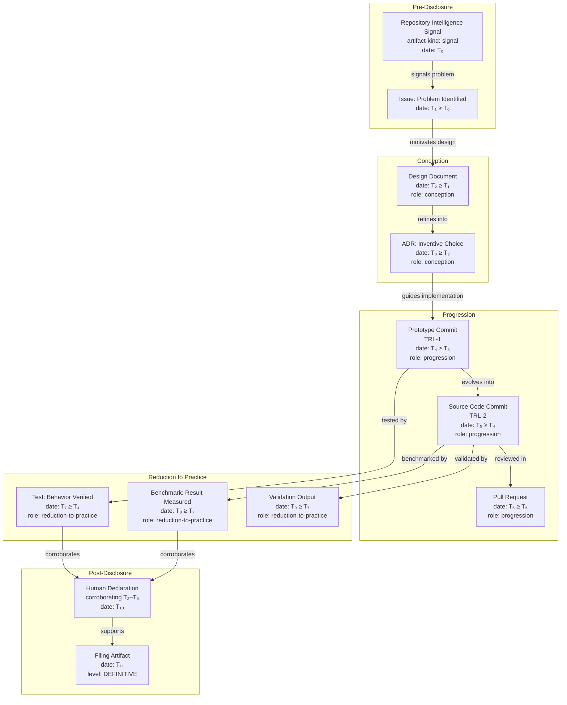
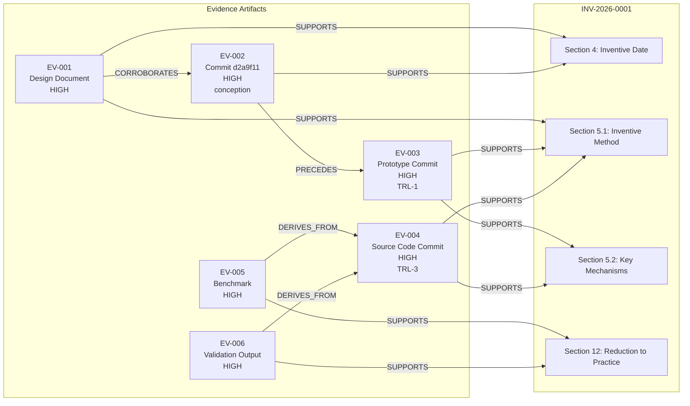

# Evidence Specification

## Purpose

This document is the authoritative engineering specification for evidence within the
Repository IP subsystem. It defines what constitutes evidence, how evidence is
classified, what metadata is required, how confidence is assessed, how evidence
relationships are expressed, and how validators determine whether an evidence set
is sufficient to support an Invention Disclosure.

Every evidence artifact linked from an Invention Disclosure, Patent Family record,
prior-art analysis, continuation plan, or commercialization record must conform to
this specification. AI systems operating within Agent IDE must use this specification
as the ground truth when collecting, linking, validating, or reasoning about evidence.

This is an engineering specification, not a legal document. It does not discuss
patentability, claim construction, or legal sufficiency. Those determinations are
the domain of qualified patent counsel.

---

## Audience

- Engineers documenting inventions and linking evidence artifacts
- AI systems collecting, validating, and reasoning about evidence
- Patent counsel consuming engineering evidence packages (read-only orientation)
- Future tooling authors building evidence collection, validation, or valuation pipelines
- Engineers building automated IP generation, Digital Penny attribution, or
  repository intelligence systems that depend on the evidence model

---

## Status

`ACTIVE — v1.0 — 2026-06-28`

---

## Dependencies

| Document | Path | Relationship |
|---|---|---|
| Glossary | `../glossary.md` | Canonical definitions for all terms used here |
| IP README | `../README.md` | Parent subsystem overview and directory structure |
| Disclosure Template | `../inventions/TEMPLATE/disclosure.md` | Consumer of this specification |

---

## Revision History

| Version | Date | Author | Summary |
|---|---|---|---|
| 1.0 | 2026-06-28 | Agent IDE Architect | Initial specification |

---

## Section 1 — Evidence Principles

Evidence in the Repository IP subsystem is governed by seven principles. Every
evidence artifact must satisfy all seven. An artifact that fails any principle
is either ineligible as evidence or requires remediation before it can be used.

---

### 1.1 Repository-First

Evidence is sourced from version-controlled repository artifacts before any
external source. Commits, architecture documents, decision records, validation
reports, and benchmarks that live in the repository carry inherent timestamp
provenance from the version-control system and require no additional verification.

External evidence (publications, customer communications, filed artifacts) is
acceptable but secondary. When external evidence is used, its provenance must
be documented explicitly and its timestamp independently verified.

**Implication for tooling:** Evidence collection pipelines must walk repository
history first and only query external sources for supplemental or corroborating
artifacts.

---

### 1.2 Verifiable

Every evidence artifact must have a timestamp that can be verified by a party
other than the inventor. Version-control commit timestamps, file-system modification
times preserved in repository history, and publication dates from external venues
all satisfy this requirement. Undated notes, verbal descriptions, or artifacts
with only self-reported dates do not.

Verifiability does not require a third-party timestamp authority in normal
engineering practice. The version-control system's commit log, combined with
the repository's push history on a hosted platform, is sufficient for engineering
purposes. Litigation-grade verifiability (notarized timestamps, blockchain anchoring)
is a future evolution described in Section 10.

---

### 1.3 Immutable

Once an artifact is linked as evidence, it must not be modified. If the underlying
artifact is amended, the evidence record must preserve a reference to the original
state (a specific commit hash, a specific file revision) alongside any reference to
the amended state. The original reference is the evidence; the amendment is a
separate artifact that may or may not also serve as evidence.

For repository artifacts, immutability is satisfied by referencing a specific commit
hash rather than a branch name or file path. Branch names and paths are mutable
references; commit hashes are immutable.

---

### 1.4 Traceable

Every evidence artifact must be linked to the specific claim it supports within the
Invention Disclosure. Generic bundles of evidence attached to a disclosure without
per-claim linkage do not satisfy this requirement. The linkage must be explicit:
artifact X supports claim Y of section Z.

Traceability also flows upward: every Invention Disclosure must link to at least one
Repository Goal, and at least one evidence artifact must establish the connection
between the inventive work and the goal it advances.

---

### 1.5 Time-Aware

Evidence is time-ordered. The evidence model distinguishes:

- **Conception evidence** — artifacts that establish when an inventive concept
  was first documented. Sets the upper bound for Inventive Date.
- **Progression evidence** — artifacts that show the invention being developed,
  refined, or extended over time. Establishes the engineering timeline.
- **Reduction-to-practice evidence** — artifacts that show the invention working
  as described. Required for IRL-3 and above.
- **Commercial-impact evidence** — artifacts that show the invention producing
  measurable value. Required for commercialization records.

An evidence set that contains only one time point is weaker than one that
documents the full progression. Validators enforce minimum time-point requirements
by IRL level.

---

### 1.6 Human-Reviewable

Every evidence artifact must be readable by a human engineer or patent counsel
without specialized tooling. Binary artifacts (compiled binaries, model weights,
proprietary formats) are not acceptable as standalone evidence. They may be
supplemented by human-readable descriptions, but the description — not the binary
— is the evidence artifact.

Acceptable formats: Markdown, plain text, JSON, YAML, source code in any language,
SVG, PNG with embedded alt-text, PDF with selectable text, standard video formats
(MP4, WebM) with a timestamped description.

---

### 1.7 AI-Readable

Evidence artifacts must be parseable by AI systems operating within Agent IDE
without requiring human interpretation. This means:

- Structured metadata fields use the JSON schema defined in Section 7.
- Free-text fields use Markdown with consistent heading conventions.
- Diagrams use Mermaid syntax (preferred) or include a machine-readable textual
  description alongside any binary image.
- Dates use ISO 8601 format (`YYYY-MM-DD` or `YYYY-MM-DDTHH:MM:SSZ`).
- IDs use the canonical ID schemes defined in `../README.md`.

AI systems must be able to extract the evidence type, confidence level, timestamp,
artifact reference, and claim linkage from any conforming evidence record without
ambiguity.

---

## Section 2 — Evidence Types

Each evidence type below is defined with: canonical definition, required metadata,
acceptable sources, confidence level, and examples. Confidence levels are defined
formally in Section 3.

---

### 2.1 Source Code

**Definition**
A file or set of files containing the implementation of the inventive method,
stored in a version-controlled repository and referenced at a specific commit.

**Required Metadata**

| Field | Type | Description |
|---|---|---|
| `evidenceId` | string | REF-scoped unique ID (see Section 7) |
| `evidenceType` | `"source-code"` | Fixed value |
| `commitHash` | string | Full SHA-1 or SHA-256 commit hash |
| `repositoryPath` | string | Relative path within the repository |
| `date` | ISO 8601 | Date of the commit |
| `description` | string | What inventive behavior this code implements |
| `claimLinks` | string[] | Disclosure section references this artifact supports |
| `confidence` | string | See Section 3 |

**Acceptable Sources**
Any version-controlled source file at a specific commit. Branch references are
not acceptable; commit hashes are required.

**Confidence Level**
`HIGH` when the file directly implements a mechanism described in Section 5 of
the disclosure. `MEDIUM` when it is supporting infrastructure. `LOW` when the
connection to the inventive method requires explanation.

**Examples**
- `src/evidence-correlator.ts` at commit `a3f7b9c` implementing the core
  evidence-anchoring algorithm described in INV-2026-0001 Section 5.1.
- `tests/evidence-correlator.test.ts` showing the inventive method is testable
  and produces the described result.

---

### 2.2 Commit

**Definition**
A discrete version-control commit that marks a point in the engineering timeline,
used to establish inventive date, progression, or reduction to practice.

**Required Metadata**

| Field | Type | Description |
|---|---|---|
| `evidenceId` | string | Unique ID |
| `evidenceType` | `"commit"` | Fixed value |
| `commitHash` | string | Full commit hash |
| `authorDate` | ISO 8601 | Author-recorded date (may differ from committer date) |
| `committerDate` | ISO 8601 | Committer-recorded date |
| `message` | string | Full commit message |
| `changedFiles` | string[] | Paths of files changed |
| `inventiveRole` | string | `"conception"` / `"progression"` / `"reduction-to-practice"` |
| `description` | string | Why this commit is evidentially significant |
| `claimLinks` | string[] | Disclosure section references |
| `confidence` | string | See Section 3 |

**Acceptable Sources**
Any commit in the repository's version-control history. The `authorDate` field
is used for inventive-date purposes; the `committerDate` is recorded for
completeness.

**Confidence Level**
`HIGH` for commits that implement a named mechanism or produce a measurable result.
`MEDIUM` for commits that extend or refactor an existing mechanism. `LOW` for
commits that modify surrounding infrastructure without touching the core method.

**Examples**
- Commit `d2a9f11` (2026-04-01): first implementation of the evidence-anchor
  data structure — conception evidence for INV-2026-0001.
- Commit `a3f7b9c` (2026-04-12): first working end-to-end correlation — reduction-
  to-practice evidence.

---

### 2.3 Pull Request

**Definition**
A code-review record documenting the collaborative engineering process that
produced or validated an inventive implementation, including review comments,
revision cycles, and merge decision.

**Required Metadata**

| Field | Type | Description |
|---|---|---|
| `evidenceId` | string | Unique ID |
| `evidenceType` | `"pull-request"` | Fixed value |
| `prId` | string | Platform-native PR identifier |
| `url` | string | Stable URL to the PR record |
| `openedDate` | ISO 8601 | Date PR was opened |
| `mergedDate` | ISO 8601 | Date PR was merged (if applicable) |
| `mergeCommitHash` | string | Commit hash of the merge |
| `title` | string | PR title |
| `description` | string | Why this PR is evidentially significant |
| `claimLinks` | string[] | Disclosure section references |
| `confidence` | string | See Section 3 |

**Acceptable Sources**
GitHub, GitLab, Bitbucket, or any hosted code-review platform. A self-hosted
platform is acceptable if the record is preserved in the repository as a markdown
snapshot.

**Confidence Level**
`MEDIUM` in general. `HIGH` when review comments specifically discuss the
inventive mechanism and confirm its novelty or non-obviousness. `LOW` when the
PR covers mostly styling or unrelated changes.

**Examples**
- PR #47: "Add continuous evidence correlation pipeline" — merged 2026-04-15.
  Review comments confirm that reviewers recognized the approach as novel.

---

### 2.4 Issue

**Definition**
A dated issue, bug report, or feature request in a project tracking system that
documents the identification of the problem the invention solves, predating the
invention itself.

**Required Metadata**

| Field | Type | Description |
|---|---|---|
| `evidenceId` | string | Unique ID |
| `evidenceType` | `"issue"` | Fixed value |
| `issueId` | string | Platform-native issue identifier |
| `url` | string | Stable URL |
| `openedDate` | ISO 8601 | Date issue was opened |
| `title` | string | Issue title |
| `description` | string | What this issue establishes (problem identification, prior-art note, etc.) |
| `claimLinks` | string[] | Disclosure section references |
| `confidence` | string | See Section 3 |

**Acceptable Sources**
GitHub Issues, GitLab Issues, Linear, Jira, or any traceable issue-tracking system.
Issues must have a verifiable creation timestamp.

**Confidence Level**
`MEDIUM` for issues that clearly document the problem the invention solves, predating
the first implementation commit. `LOW` for issues that are only tangentially related.

**Examples**
- Issue #12 (2026-03-15): "Evidence timestamps are lost when commits are squashed" —
  establishes that the problem predates the invention.

---

### 2.5 Architecture Document

**Definition**
A document in `.ai/architecture/` that records the design of the system or
component that implements the inventive method, with a version-controlled timestamp.

**Required Metadata**

| Field | Type | Description |
|---|---|---|
| `evidenceId` | string | Unique ID |
| `evidenceType` | `"architecture-document"` | Fixed value |
| `filePath` | string | Relative repository path |
| `commitHash` | string | Commit at which this version was current |
| `date` | ISO 8601 | Date of the commit |
| `description` | string | What design decision or structure this establishes |
| `claimLinks` | string[] | Disclosure section references |
| `confidence` | string | See Section 3 |

**Acceptable Sources**
Any version-controlled architecture document within the repository. Diagrams must
be in Mermaid or a human-readable text format to satisfy the AI-readable principle.

**Confidence Level**
`HIGH` when the document describes the inventive mechanism directly and its date
precedes or equals the Inventive Date. `MEDIUM` when it describes the surrounding
system context. `LOW` when only tangentially related to the inventive method.

**Examples**
- `.ai/architecture/evidence-pipeline.md` at commit `b5c2e33` (2026-03-28):
  describes the data-flow design of the evidence correlation component.

---

### 2.6 Repository Intelligence Artifact

**Definition**
A structured output from Agent IDE's Repository Intelligence subsystem — a signal,
recommendation, judgment, or analysis — that identifies or characterizes the
inventive pattern in the repository.

**Required Metadata**

| Field | Type | Description |
|---|---|---|
| `evidenceId` | string | Unique ID |
| `evidenceType` | `"repository-intelligence-artifact"` | Fixed value |
| `artifactPath` | string | Path within `.ai/` |
| `commitHash` | string | Commit at which this artifact was generated |
| `generatedDate` | ISO 8601 | Date generated |
| `artifactKind` | string | `"signal"` / `"recommendation"` / `"judgment"` / `"analysis"` |
| `description` | string | What pattern or inventive behavior the artifact identifies |
| `claimLinks` | string[] | Disclosure section references |
| `confidence` | string | See Section 3 |

**Acceptable Sources**
Files within `.ai/repository-intelligence/`, `.ai/next-improvement-prompt.md`,
`.ai/active-recommendation.json`, `.ai/repository-judgment.json`, or any
structured artifact produced by Agent IDE's intelligence pipeline.

**Confidence Level**
`MEDIUM` by default. `HIGH` when the artifact directly names the inventive method
and its date precedes the Inventive Date claimed in the disclosure. `LOW` when the
artifact addresses the problem domain generally without identifying the specific method.

**Examples**
- `.ai/active-recommendation.json` at commit `e9d0f14` (2026-04-08): selects
  "Add continuous evidence correlation" as the top-ranked recommendation, confirming
  that the repository intelligence system identified the inventive problem before
  a solution was implemented.

---

### 2.7 Benchmark

**Definition**
A reproducible performance or correctness measurement that demonstrates the
inventive method produces the described technical result at a specific scale
or under specific conditions.

**Required Metadata**

| Field | Type | Description |
|---|---|---|
| `evidenceId` | string | Unique ID |
| `evidenceType` | `"benchmark"` | Fixed value |
| `filePath` | string | Path to benchmark definition and results |
| `commitHash` | string | Commit at which benchmark was run |
| `runDate` | ISO 8601 | Date the benchmark was executed |
| `environment` | object | Hardware, OS, runtime, and dependency versions |
| `metric` | string | What was measured |
| `result` | string | Measured value with units |
| `baselineResult` | string | Baseline for comparison (prior approach or absence of invention) |
| `description` | string | What result this establishes for the invention |
| `claimLinks` | string[] | Disclosure section references |
| `confidence` | string | See Section 3 |

**Acceptable Sources**
Any reproducible benchmark stored in the repository at a specific commit. The
benchmark must be re-runnable from the commit alone; environment dependencies
must be fully specified.

**Confidence Level**
`HIGH` when the benchmark directly measures the claimed result and shows
measurable improvement over the baseline. `MEDIUM` when the benchmark is
partial or covers a subset of the claimed behavior. `LOW` when the benchmark
is tangentially related.

**Examples**
- `benchmarks/evidence-correlation-throughput.md` at commit `a3f7b9c`: shows
  correlation latency of 12ms median vs. 4,200ms for the prior manual approach
  across 10,000 repository events.

---

### 2.8 Validation Output

**Definition**
The output of a Repository Validation run (defined in glossary.md
§ Repository Validation) that confirms the inventive method operates correctly
end-to-end, produced by the Agent IDE validation pipeline.

**Required Metadata**

| Field | Type | Description |
|---|---|---|
| `evidenceId` | string | Unique ID |
| `evidenceType` | `"validation-output"` | Fixed value |
| `validationId` | string | VAL-{ID} assigned by validation subsystem |
| `filePath` | string | Path to validation report |
| `commitHash` | string | Commit under which validation was run |
| `runDate` | ISO 8601 | Date validation was executed |
| `outcome` | string | `"pass"` / `"fail"` / `"partial"` |
| `coverage` | string | What aspects of the inventive method were validated |
| `description` | string | What this validation output establishes |
| `claimLinks` | string[] | Disclosure section references |
| `confidence` | string | See Section 3 |

**Acceptable Sources**
Outputs from `.ai/validation/` pipeline only. External CI outputs are acceptable
as supplementary evidence but must be imported and stored in the repository to
satisfy the Repository-First principle.

**Confidence Level**
`HIGH` for a passing validation that specifically tests the inventive mechanism.
`MEDIUM` for a passing validation that covers the surrounding system. `LOW` for
a partial pass or for a validation that does not directly exercise the inventive method.

**Examples**
- `VAL-0004` (2026-04-17): full end-to-end validation of the evidence correlation
  pipeline; all 23 checks pass; directly validates INV-2026-0001 Section 5.1.

---

### 2.9 Test

**Definition**
An automated test — unit, integration, or end-to-end — that verifies a specific
behavior of the inventive method and is stored in the repository at a specific commit.

**Required Metadata**

| Field | Type | Description |
|---|---|---|
| `evidenceId` | string | Unique ID |
| `evidenceType` | `"test"` | Fixed value |
| `filePath` | string | Path to test file |
| `commitHash` | string | Commit at which test was introduced |
| `date` | ISO 8601 | Date of the commit |
| `testName` | string | Name or description of the specific test |
| `assertionDescription` | string | What the test asserts about the inventive method |
| `claimLinks` | string[] | Disclosure section references |
| `confidence` | string | See Section 3 |

**Acceptable Sources**
Any automated test stored in the repository. Tests must be runnable from the
commit alone. Test stubs or tests that always pass regardless of implementation
do not qualify.

**Confidence Level**
`HIGH` for tests that directly assert the inventive mechanism produces the claimed
result. `MEDIUM` for integration tests that cover broader behavior. `LOW` for
tests that cover infrastructure around the inventive method.

**Examples**
- `tests/evidence-correlator.test.ts:42` at commit `a3f7b9c`: asserts that
  correlating 1,000 events produces deterministic anchors within 50ms.

---

### 2.10 Prototype

**Definition**
A working but incomplete implementation of the inventive method, sufficient to
demonstrate that the method produces the described result. A Prototype constitutes
Implementation Evidence and contributes to the Evidence Bundle.

**Required Metadata**

| Field | Type | Description |
|---|---|---|
| `evidenceId` | string | Unique ID |
| `evidenceType` | `"prototype"` | Fixed value |
| `filePath` | string | Path to prototype root or entry point |
| `commitHash` | string | Commit at which prototype was functional |
| `date` | ISO 8601 | Date of the commit |
| `trl` | string | Technology Readiness Level: `TRL-1` through `TRL-5` |
| `description` | string | What the prototype demonstrates |
| `limitations` | string | Known limitations relative to a full implementation |
| `claimLinks` | string[] | Disclosure section references |
| `confidence` | string | See Section 3 |

**Acceptable Sources**
Any version-controlled prototype implementation. A prototype that only runs with
hardcoded inputs and produces hardcoded outputs does not qualify; it must exercise
the inventive method with real or representative inputs.

**Confidence Level**
`HIGH` for a prototype at TRL-2 or above that exercises the inventive mechanism
end-to-end. `MEDIUM` for TRL-1 (core mechanism demonstrated in isolation).

**Examples**
- `prototypes/evidence-anchor-v0/` at commit `c7a1b8d` (2026-04-05):
  TRL-1 prototype demonstrating the anchor-matching algorithm with synthetic input.

---

### 2.11 Screenshot

**Definition**
A captured image of a user interface, terminal output, or visualization that
shows the inventive method in operation or its result, accompanied by a
timestamped description.

**Required Metadata**

| Field | Type | Description |
|---|---|---|
| `evidenceId` | string | Unique ID |
| `evidenceType` | `"screenshot"` | Fixed value |
| `filePath` | string | Path to image file in `evidence/screenshots/` |
| `commitHash` | string | Commit at which screenshot was captured |
| `captureDate` | ISO 8601 | Date screenshot was taken |
| `description` | string | What the screenshot shows; which inventive behavior is visible |
| `altText` | string | Full textual description for AI-readable principle |
| `claimLinks` | string[] | Disclosure section references |
| `confidence` | string | See Section 3 |

**Acceptable Sources**
Screenshots stored in `evidence/screenshots/` at a specific commit. Screenshots
must include a textual description (`altText`) sufficient to convey the evidential
content without viewing the image, to satisfy the AI-readable principle.

**Confidence Level**
`MEDIUM` in general. `HIGH` when the screenshot directly shows the inventive
output (e.g., a UI rendering a novel interaction) and is corroborated by a commit.
`LOW` for screenshots that show general system state without specifically
illustrating the inventive method.

---

### 2.12 Design Document

**Definition**
A document that captures the design of the inventive method before or during
implementation — including problem framing, proposed solution, trade-off analysis,
and open questions — stored in the repository with a version-control timestamp.

**Required Metadata**

| Field | Type | Description |
|---|---|---|
| `evidenceId` | string | Unique ID |
| `evidenceType` | `"design-document"` | Fixed value |
| `filePath` | string | Repository path |
| `commitHash` | string | Commit at which this version was authored |
| `date` | ISO 8601 | Date of the commit |
| `description` | string | What design decision or inventive concept this establishes |
| `inventiveRole` | string | `"conception"` / `"progression"` |
| `claimLinks` | string[] | Disclosure section references |
| `confidence` | string | See Section 3 |

**Acceptable Sources**
Any design document in the repository. Architecture Decision Records (ADRs) in
`.ai/decisions/` are the preferred format. Informal design notes are acceptable
if version-controlled.

**Confidence Level**
`HIGH` for design documents that describe the inventive method in detail and
predate the first implementation commit. `MEDIUM` for documents that describe
the surrounding system or related trade-offs.

**Examples**
- `.ai/decisions/ADR-0012.md` at commit `b9f3a2d` (2026-03-22): proposes the
  evidence-anchoring approach and documents three alternative approaches that were
  rejected — conception evidence for INV-2026-0001.

---

### 2.13 Publication

**Definition**
A publicly accessible document — academic paper, conference presentation, blog post,
standards contribution, or technical report — that references or is contemporaneous
with the inventive work. Used primarily as supporting evidence for inventive timeline
or as a prior-art reference.

**Required Metadata**

| Field | Type | Description |
|---|---|---|
| `evidenceId` | string | Unique ID |
| `evidenceType` | `"publication"` | Fixed value |
| `title` | string | Full title |
| `authors` | string[] | Author list |
| `venue` | string | Journal, conference, or platform |
| `publicationDate` | ISO 8601 | Date of publication or public availability |
| `url` | string | Stable URL or DOI |
| `localCopy` | string | Path to a repository-stored copy, if preserved |
| `description` | string | What this publication establishes |
| `role` | string | `"supporting-evidence"` / `"prior-art"` / `"contemporaneous"` |
| `claimLinks` | string[] | Disclosure section references |
| `confidence` | string | See Section 3 |

**Acceptable Sources**
Peer-reviewed papers, conference proceedings, publicly accessible technical blogs,
standards body documents, or official technical reports. Preprints are acceptable
with the preprint server and submission date noted.

**Confidence Level**
`HIGH` for publications authored by the inventor that predate a competing
disclosure. `MEDIUM` for publications that corroborate the problem or context
without describing the inventive method. `LOW` for general background references.

---

### 2.14 Customer Feedback

**Definition**
Documented feedback, support request, or user report that establishes that the
problem the invention solves existed in practice and affected real users, predating
the invention.

**Required Metadata**

| Field | Type | Description |
|---|---|---|
| `evidenceId` | string | Unique ID |
| `evidenceType` | `"customer-feedback"` | Fixed value |
| `feedbackDate` | ISO 8601 | Date the feedback was received |
| `source` | string | Anonymized source identifier (do not include PII) |
| `channel` | string | How the feedback was received (support ticket, survey, interview, etc.) |
| `summary` | string | Anonymized summary of the feedback relevant to the invention |
| `description` | string | What this feedback establishes for the disclosure |
| `claimLinks` | string[] | Disclosure section references |
| `confidence` | string | See Section 3 |

**Acceptable Sources**
Support tickets, user interviews, survey responses, or NPS comments, stored in
the repository in anonymized form. Do not include personal identifying information.
The source must be documented internally but may be anonymized in the repository artifact.

**Confidence Level**
`MEDIUM` for feedback that directly identifies the problem the invention solves.
`LOW` for feedback that is only tangentially related.

---

### 2.15 Human Declaration

**Definition**
A signed, dated statement by an inventor or witness affirming a specific fact
about the inventive timeline — such as the date of first conception, a meeting
in which the idea was first described, or a demonstration that occurred before
a specific date.

**Required Metadata**

| Field | Type | Description |
|---|---|---|
| `evidenceId` | string | Unique ID |
| `evidenceType` | `"human-declaration"` | Fixed value |
| `declarantRole` | string | `"inventor"` / `"witness"` / `"counsel"` |
| `declarationDate` | ISO 8601 | Date the declaration was signed |
| `filePath` | string | Path to signed declaration document |
| `factAsserted` | string | The specific fact the declaration asserts |
| `corroboratingArtifacts` | string[] | Evidence IDs that independently corroborate the declaration |
| `claimLinks` | string[] | Disclosure section references |
| `confidence` | string | See Section 3 |

**Acceptable Sources**
Signed statements stored in the repository. A human declaration without at least
one corroborating repository artifact is `UNVERIFIED` and may not be used as
sole evidence for any timeline claim.

**Confidence Level**
`HIGH` when corroborated by at least one repository artifact of `MEDIUM` or higher
confidence. `MEDIUM` when corroborated only by other human declarations.
`UNVERIFIED` when no corroborating artifact exists.

---

### 2.16 Filing Artifact

**Definition**
A document produced by the patent filing or prosecution process — application
receipt, office action, notice of allowance, grant certificate, or publication
notice — that establishes an official date or status in the patent system.

**Required Metadata**

| Field | Type | Description |
|---|---|---|
| `evidenceId` | string | Unique ID |
| `evidenceType` | `"filing-artifact"` | Fixed value |
| `filingId` | string | FILING-{YEAR}-{SEQUENCE} from the IP subsystem |
| `filePath` | string | Path to document in `filings/` |
| `officialDate` | ISO 8601 | Date assigned by the patent office or publication venue |
| `issuingAuthority` | string | USPTO, EPO, WIPO, or other office / venue |
| `documentType` | string | `"application-receipt"` / `"office-action"` / `"notice-of-allowance"` / `"grant-certificate"` / `"publication-notice"` / `"other"` |
| `description` | string | What this filing artifact establishes |
| `claimLinks` | string[] | Disclosure section references |
| `confidence` | string | See Section 3 |

**Acceptable Sources**
Official documents from patent offices or publication venues, stored in
`filings/{FILING-ID}/`. A filing artifact is the only acceptable evidence type
for establishing Priority Date and Filing Date.

**Confidence Level**
`DEFINITIVE` — filing artifacts from official patent offices are the only evidence
type that achieves the `DEFINITIVE` confidence level (see Section 3). All other
evidence types are capped at `HIGH`.

---

## Section 3 — Evidence Confidence

Confidence is an assessment of how reliably an evidence artifact establishes
the claim it supports. Confidence is assigned per artifact, not per evidence type,
though type constrains the maximum achievable confidence.

### 3.1 Confidence Levels

| Level | Code | Meaning | Maximum Achievable By |
|---|---|---|---|
| Definitive | `DEFINITIVE` | Established by an authoritative external institution | Filing Artifact only |
| High | `HIGH` | Verifiable, repository-native, directly supports the claim | Commit, Source Code, Benchmark, Validation Output, Test, Architecture Document (when dated before inventive date), Human Declaration (when corroborated) |
| Medium | `MEDIUM` | Verifiable and relevant; indirect or contextual support | Pull Request, Issue, Repository Intelligence Artifact, Design Document, Prototype (TRL-1), Screenshot, Customer Feedback, Publication |
| Low | `LOW` | Verifiable but weak connection to the specific claim | Any type when connection to claim requires significant interpretation |
| Unverified | `UNVERIFIED` | Timestamp or provenance cannot be independently confirmed | Human Declaration without corroboration; undated external artifact |

### 3.2 Confidence Downgrade Rules

An artifact's confidence must be downgraded if any of the following apply:

| Condition | Downgrade |
|---|---|
| Artifact is referenced by branch name or file path (not commit hash) | Downgrade one level; `UNVERIFIED` if path is mutable |
| Artifact date cannot be independently verified | Downgrade to `UNVERIFIED` |
| Artifact has been modified after being linked as evidence | Downgrade to `LOW` until a new immutable reference is established |
| Claim link is missing or vague | Downgrade one level |
| Artifact is a human declaration without corroboration | Force to `UNVERIFIED` regardless of other factors |

### 3.3 Minimum Confidence Requirements by Use Case

| Use Case | Minimum Level | Notes |
|---|---|---|
| Inventive Date establishment | `HIGH` | At least one `HIGH` artifact required; `MEDIUM` artifacts may supplement |
| Reduction-to-Practice establishment | `HIGH` | At least one `HIGH` artifact showing the method executing and producing the result |
| IRL-3 (Evidenced Disclosure) | `MEDIUM` | At least one artifact at `MEDIUM` or higher |
| IRL-4 (Reviewed Disclosure) | `HIGH` | All required fields must have at least `HIGH` support |
| Priority Date establishment | `DEFINITIVE` | Filing Artifact only |
| Filing Date establishment | `DEFINITIVE` | Filing Artifact only |
| Commercialization evidence | `MEDIUM` | Customer Feedback, Benchmark, or Validation Output |

---

## Section 4 — Evidence Lineage

Evidence lineage tracks how an invention's evidentiary record evolves from first
signal through filing. The lineage graph is a directed acyclic graph (DAG) where
nodes are evidence artifacts and edges represent: temporal succession,
corroboration, derivation, or supersession.

### 4.1 Lineage Model



### 4.2 Lineage Properties

**Temporal monotonicity**: Every edge in the lineage graph must go forward in time
or connect artifacts at the same time point. An artifact may not claim to corroborate
an artifact that postdates it.

**Derivation tracking**: When an artifact is derived from another (e.g., a benchmark
runs against source code at a specific commit), the `derivedFrom` field in the
evidence record must reference the parent artifact's `evidenceId`.

**Supersession**: When an artifact is superseded by a more complete or more authoritative
artifact of the same type, the original artifact remains in the lineage with a
`supersededBy` field pointing to the new artifact. Superseded artifacts retain their
confidence level for the period during which they were the current evidence; they
do not retroactively lose their evidential value.

**Gap detection**: A lineage with no evidence artifacts between Inventive Date
and the first Reduction-to-Practice artifact is a lineage gap. Validators must
flag lineage gaps and request progression artifacts.

---

## Section 5 — Evidence Relationships

Evidence artifacts relate to each other and to Invention Disclosure elements
through typed relationships. Every relationship must be declared explicitly;
implicit relationships are not recognized by validators.

### 5.1 Relationship Types

| Relationship | Source | Target | Meaning |
|---|---|---|---|
| `SUPPORTS` | Evidence artifact | Disclosure section | The artifact provides evidence for the named section |
| `CORROBORATES` | Evidence artifact | Evidence artifact | The source independently supports the same claim as the target |
| `DERIVES_FROM` | Evidence artifact | Evidence artifact | The source was produced by running against or processing the target |
| `SUPERSEDES` | Evidence artifact | Evidence artifact | The source replaces the target as the current best evidence for a claim |
| `CONTRADICTS` | Evidence artifact | Evidence artifact | The source conflicts with the target; resolution required |
| `PRECEDES` | Evidence artifact | Evidence artifact | The source predates the target in the inventive timeline |
| `MOTIVATED_BY` | Evidence artifact | Evidence artifact | The source artifact was created in response to the target (e.g., a benchmark motivated by a design document) |

### 5.2 Minimum Required Relationships

| Disclosure Element | Minimum Required Evidence Relationships |
|---|---|
| Inventive Date (Section 4 of template) | At least one `SUPPORTS` at `HIGH` confidence; `PRECEDES` chain to earliest artifact |
| Technical Solution (Section 5) | At least one `SUPPORTS` per mechanism at `MEDIUM` or higher |
| Reduction to Practice (Section 12) | At least one `SUPPORTS` from a test, benchmark, or validation output at `HIGH` |
| Novelty Summary (Section 8) | At least one prior-art reference with `SUPPORTS` relationship to novelty claim |
| Traceability — Goal | At least one `SUPPORTS` linking to goal record |
| Traceability — Implementation | At least one commit or source-code artifact `SUPPORTS` each mechanism |

---

## Section 6 — Repository Evidence Graph

The evidence graph is the machine-readable representation of all evidence artifacts
and their relationships for a single Invention Disclosure. It is stored as a JSON
document in the invention's directory (`evidence-graph.json`) and is the authoritative
input for all evidence validators and tooling.

### 6.1 Graph Structure



### 6.2 Graph Nodes

Each node in the graph is an evidence artifact conforming to the JSON schema
in Section 7. Nodes are uniquely identified by their `evidenceId`.

### 6.3 Graph Edges

Each edge is a typed relationship (Section 5.1) between two node IDs or between
a node ID and a disclosure section reference.

**Section reference format:** `"{inventionId}:section:{sectionNumber}"`.
Example: `"INV-2026-0001:section:4"` for the Inventive Date section.

### 6.4 Graph Invariants

Validators must enforce:

1. No cycles. The graph is a DAG.
2. Every `PRECEDES` edge must have `source.date ≤ target.date`.
3. Every `DERIVES_FROM` edge must have `source.date ≥ target.date`.
4. Every node with `confidence: UNVERIFIED` must not be used as the sole
   artifact for any minimum-confidence requirement.
5. At least one path from an evidence node to each required disclosure section
   must exist.
6. No `CONTRADICTS` edges may remain unresolved in a disclosure at REVIEW status.

---

## Section 7 — JSON Schema

The canonical JSON representation of an evidence artifact. Every evidence record
stored in `evidence.md` must also exist in `evidence-graph.json` as a conforming
JSON object.

### 7.1 Base Schema

```json
{
  "$schema": "https://json-schema.org/draft/2020-12/schema",
  "$id": "https://agent-ide/ip/evidence/v1",
  "title": "EvidenceArtifact",
  "description": "Canonical evidence artifact for Repository IP subsystem v1.0",
  "type": "object",
  "required": [
    "evidenceId",
    "evidenceType",
    "confidence",
    "date",
    "description",
    "claimLinks"
  ],
  "properties": {
    "evidenceId": {
      "type": "string",
      "pattern": "^EV-[0-9]{3,}$",
      "description": "Unique identifier within this invention's evidence graph"
    },
    "evidenceType": {
      "type": "string",
      "enum": [
        "source-code",
        "commit",
        "pull-request",
        "issue",
        "architecture-document",
        "repository-intelligence-artifact",
        "benchmark",
        "validation-output",
        "test",
        "prototype",
        "screenshot",
        "design-document",
        "publication",
        "customer-feedback",
        "human-declaration",
        "filing-artifact"
      ]
    },
    "confidence": {
      "type": "string",
      "enum": ["DEFINITIVE", "HIGH", "MEDIUM", "LOW", "UNVERIFIED"]
    },
    "date": {
      "type": "string",
      "format": "date",
      "description": "ISO 8601 date. For commits, use authorDate."
    },
    "description": {
      "type": "string",
      "minLength": 20,
      "description": "Human- and AI-readable description of what this artifact establishes"
    },
    "claimLinks": {
      "type": "array",
      "items": { "type": "string" },
      "minItems": 1,
      "description": "Disclosure section references in format '{inventionId}:section:{N}'"
    },
    "relationships": {
      "type": "array",
      "items": {
        "type": "object",
        "required": ["relationshipType", "targetId"],
        "properties": {
          "relationshipType": {
            "type": "string",
            "enum": [
              "SUPPORTS",
              "CORROBORATES",
              "DERIVES_FROM",
              "SUPERSEDES",
              "CONTRADICTS",
              "PRECEDES",
              "MOTIVATED_BY"
            ]
          },
          "targetId": {
            "type": "string",
            "description": "Target evidenceId or disclosure section reference"
          }
        }
      }
    },
    "supersededBy": {
      "type": "string",
      "description": "evidenceId of the artifact that supersedes this one, if applicable"
    },
    "derivedFrom": {
      "type": "string",
      "description": "evidenceId of the parent artifact this artifact was derived from"
    },
    "inventiveRole": {
      "type": "string",
      "enum": ["conception", "progression", "reduction-to-practice", "commercial-impact"],
      "description": "The role this artifact plays in the inventive timeline"
    }
  },
  "allOf": [
    {
      "if": { "properties": { "evidenceType": { "const": "commit" } } },
      "then": {
        "required": ["commitHash", "authorDate", "committerDate", "inventiveRole"],
        "properties": {
          "commitHash": { "type": "string", "pattern": "^[0-9a-f]{40}$" },
          "authorDate": { "type": "string", "format": "date-time" },
          "committerDate": { "type": "string", "format": "date-time" }
        }
      }
    },
    {
      "if": { "properties": { "evidenceType": { "const": "source-code" } } },
      "then": {
        "required": ["commitHash", "repositoryPath"],
        "properties": {
          "commitHash": { "type": "string", "pattern": "^[0-9a-f]{40}$" },
          "repositoryPath": { "type": "string" }
        }
      }
    },
    {
      "if": { "properties": { "evidenceType": { "const": "benchmark" } } },
      "then": {
        "required": ["commitHash", "metric", "result", "environment"],
        "properties": {
          "metric": { "type": "string" },
          "result": { "type": "string" },
          "baselineResult": { "type": "string" },
          "environment": { "type": "object" }
        }
      }
    },
    {
      "if": { "properties": { "evidenceType": { "const": "human-declaration" } } },
      "then": {
        "required": ["declarantRole", "declarationDate", "factAsserted", "corroboratingArtifacts"],
        "properties": {
          "declarantRole": {
            "type": "string",
            "enum": ["inventor", "witness", "counsel"]
          },
          "declarationDate": { "type": "string", "format": "date" },
          "factAsserted": { "type": "string" },
          "corroboratingArtifacts": {
            "type": "array",
            "items": { "type": "string" }
          }
        }
      }
    },
    {
      "if": { "properties": { "evidenceType": { "const": "filing-artifact" } } },
      "then": {
        "required": ["filingId", "officialDate", "issuingAuthority", "documentType"],
        "properties": {
          "filingId": { "type": "string" },
          "officialDate": { "type": "string", "format": "date" },
          "issuingAuthority": { "type": "string" },
          "documentType": {
            "type": "string",
            "enum": [
              "application-receipt",
              "office-action",
              "notice-of-allowance",
              "grant-certificate",
              "publication-notice",
              "other"
            ]
          }
        }
      }
    }
  ]
}
```

### 7.2 Evidence Graph Document Schema

```json
{
  "$schema": "https://json-schema.org/draft/2020-12/schema",
  "$id": "https://agent-ide/ip/evidence-graph/v1",
  "title": "EvidenceGraph",
  "type": "object",
  "required": ["inventionId", "schemaVersion", "generatedDate", "artifacts"],
  "properties": {
    "inventionId": { "type": "string", "pattern": "^INV-[0-9]{4}-[0-9]{4}$" },
    "schemaVersion": { "type": "string", "const": "1.0" },
    "generatedDate": { "type": "string", "format": "date" },
    "generatedBy": { "type": "string" },
    "artifacts": {
      "type": "array",
      "items": { "$ref": "https://agent-ide/ip/evidence/v1" }
    }
  }
}
```

---

## Section 8 — Examples

### 8.1 Commit Artifact (Conception Evidence)

```json
{
  "evidenceId": "EV-001",
  "evidenceType": "commit",
  "confidence": "HIGH",
  "date": "2026-04-01",
  "commitHash": "d2a9f11b3c8e7f4a1059b63d2c8f7e9a4b5c1d0e",
  "authorDate": "2026-04-01T14:22:00Z",
  "committerDate": "2026-04-01T14:22:00Z",
  "inventiveRole": "conception",
  "description": "First implementation of the evidence-anchor data structure. Introduces the AnchorKey type and the correlate() function that maps repository events to invention disclosure sections by timestamp proximity. This is the earliest verifiable artifact establishing conception of the continuous evidence correlation method.",
  "claimLinks": ["INV-2026-0001:section:4", "INV-2026-0001:section:5"],
  "relationships": [
    { "relationshipType": "SUPPORTS", "targetId": "INV-2026-0001:section:4" },
    { "relationshipType": "SUPPORTS", "targetId": "INV-2026-0001:section:5" },
    { "relationshipType": "PRECEDES", "targetId": "EV-003" }
  ]
}
```

### 8.2 Benchmark Artifact (Reduction-to-Practice Evidence)

```json
{
  "evidenceId": "EV-005",
  "evidenceType": "benchmark",
  "confidence": "HIGH",
  "date": "2026-04-16",
  "commitHash": "a3f7b9c2d8e1f5b0c9d4e7f2a1b3c8d5e0f9a2b4",
  "inventiveRole": "reduction-to-practice",
  "metric": "Median correlation latency for 10,000 repository events",
  "result": "12ms",
  "baselineResult": "4200ms (prior manual correlation approach)",
  "environment": {
    "hardware": "Apple M3 Pro, 36GB RAM",
    "os": "macOS 15.2",
    "runtime": "Node.js 22.4.0",
    "repoSize": "10,000 events across 847 commits"
  },
  "description": "Demonstrates that the continuous evidence correlation method achieves 350x latency improvement over the prior manual approach at repository scale. Directly establishes reduction to practice for the claimed result in INV-2026-0001 Section 5.3.",
  "claimLinks": ["INV-2026-0001:section:12", "INV-2026-0001:section:5"],
  "derivedFrom": "EV-004",
  "relationships": [
    { "relationshipType": "SUPPORTS", "targetId": "INV-2026-0001:section:12" },
    { "relationshipType": "SUPPORTS", "targetId": "INV-2026-0001:section:5" },
    { "relationshipType": "DERIVES_FROM", "targetId": "EV-004" },
    { "relationshipType": "CORROBORATES", "targetId": "EV-006" }
  ]
}
```

### 8.3 Human Declaration with Corroboration

```json
{
  "evidenceId": "EV-009",
  "evidenceType": "human-declaration",
  "confidence": "HIGH",
  "date": "2026-06-01",
  "declarantRole": "inventor",
  "declarationDate": "2026-06-01",
  "filePath": "evidence/declarations/EV-009-inventor-declaration.md",
  "inventiveRole": "conception",
  "factAsserted": "On 2026-03-28, during an architecture review meeting, I described the event-anchoring approach to two colleagues before any implementation existed. The design document at EV-001 captures this description in written form as of 2026-04-01.",
  "corroboratingArtifacts": ["EV-001", "EV-002"],
  "description": "Inventor declaration affirming that the evidence-anchoring concept was conceived on 2026-03-28, predating the first implementation commit. Corroborated by design document EV-001 (2026-04-01) and ADR EV-002 (2026-03-22).",
  "claimLinks": ["INV-2026-0001:section:4"],
  "relationships": [
    { "relationshipType": "SUPPORTS", "targetId": "INV-2026-0001:section:4" },
    { "relationshipType": "CORROBORATES", "targetId": "EV-001" },
    { "relationshipType": "CORROBORATES", "targetId": "EV-002" }
  ]
}
```

### 8.4 Repository Intelligence Artifact (Pre-Invention Signal)

```json
{
  "evidenceId": "EV-002",
  "evidenceType": "repository-intelligence-artifact",
  "confidence": "MEDIUM",
  "date": "2026-03-22",
  "artifactPath": ".ai/active-recommendation.json",
  "commitHash": "b9f3a2d1c7e4f8b2a0d5c9e3f1b4a7d2c6e0f5b8",
  "generatedDate": "2026-03-22",
  "artifactKind": "recommendation",
  "inventiveRole": "conception",
  "description": "Agent IDE recommendation selecting 'Add continuous evidence correlation' as the top-ranked engineering task, generated before any implementation existed. Establishes that the repository intelligence system independently identified the same problem the invention solves, supporting the problem's real-world significance.",
  "claimLinks": ["INV-2026-0001:section:3", "INV-2026-0001:section:4"],
  "relationships": [
    { "relationshipType": "SUPPORTS", "targetId": "INV-2026-0001:section:3" },
    { "relationshipType": "PRECEDES", "targetId": "EV-001" },
    { "relationshipType": "MOTIVATED_BY", "targetId": "EV-001" }
  ]
}
```

### 8.5 Complete Evidence Graph Document

```json
{
  "inventionId": "INV-2026-0001",
  "schemaVersion": "1.0",
  "generatedDate": "2026-06-28",
  "generatedBy": "Agent IDE Evidence Pipeline v1.0",
  "artifacts": [
    {
      "evidenceId": "EV-001",
      "evidenceType": "design-document",
      "confidence": "HIGH",
      "date": "2026-04-01",
      "filePath": ".ai/decisions/ADR-0012.md",
      "commitHash": "b9f3a2d1c7e4f8b2a0d5c9e3f1b4a7d2c6e0f5b8",
      "inventiveRole": "conception",
      "description": "ADR proposing the evidence-anchoring approach with three alternative approaches documented and rejected.",
      "claimLinks": ["INV-2026-0001:section:4", "INV-2026-0001:section:5"],
      "relationships": [
        { "relationshipType": "SUPPORTS", "targetId": "INV-2026-0001:section:4" },
        { "relationshipType": "PRECEDES", "targetId": "EV-003" }
      ]
    }
  ]
}
```

---

## Section 9 — Validation Rules

Evidence validators are AI systems or automated scripts that assess whether
the evidence set for an Invention Disclosure satisfies the requirements of
this specification. Validators operate on the `evidence-graph.json` file.

### 9.1 Structural Validation

| Rule ID | Rule | Severity |
|---|---|---|
| EV-S01 | Every `evidenceId` is unique within the graph | BLOCKING |
| EV-S02 | Every relationship target ID resolves to a node in the graph or to a valid disclosure section reference | BLOCKING |
| EV-S03 | The graph contains no cycles | BLOCKING |
| EV-S04 | Every artifact passes JSON schema validation (Section 7) | BLOCKING |
| EV-S05 | Every `commit`-type artifact has a `commitHash` matching the pattern `^[0-9a-f]{40}$` | BLOCKING |
| EV-S06 | Every `PRECEDES` edge has `source.date ≤ target.date` | BLOCKING |
| EV-S07 | Every `DERIVES_FROM` edge has `source.date ≥ target.date` | BLOCKING |
| EV-S08 | No `CONTRADICTS` edge exists without a corresponding resolution note in `evidence.md` | BLOCKING |

### 9.2 Coverage Validation

| Rule ID | Rule | Severity | Applies At |
|---|---|---|---|
| EV-C01 | At least one `HIGH` or `DEFINITIVE` artifact `SUPPORTS` the Inventive Date section | BLOCKING | IRL-3+ |
| EV-C02 | At least one artifact `SUPPORTS` the Technical Solution section (5.1) | BLOCKING | IRL-3+ |
| EV-C03 | At least one artifact with `inventiveRole: "reduction-to-practice"` at `HIGH` confidence | BLOCKING | IRL-4+ |
| EV-C04 | At least one prior-art reference exists | BLOCKING | IRL-3+ |
| EV-C05 | All seven traceability dimensions have at least one supporting artifact | BLOCKING | IRL-4+ |
| EV-C06 | At least one `SUPPORTS` relationship exists for each mechanism listed in Section 5.2 of the disclosure | WARNING | IRL-3+ |
| EV-C07 | Commercial-impact evidence exists (customer feedback, benchmark, or outcome artifact) | WARNING | IRL-5 |
| EV-C08 | Inventive Date is supported by an artifact that predates the first implementation commit by at least one day | WARNING | IRL-3+ |

### 9.3 Confidence Validation

| Rule ID | Rule | Severity |
|---|---|---|
| EV-Q01 | No `UNVERIFIED` artifact is the sole support for any required section | BLOCKING |
| EV-Q02 | Any `human-declaration` artifact with an empty `corroboratingArtifacts` array is automatically `UNVERIFIED` | BLOCKING |
| EV-Q03 | Any artifact referenced by mutable path (no `commitHash`) is automatically downgraded one confidence level | WARNING |
| EV-Q04 | Any artifact with `confidence: LOW` that is the only artifact supporting a section generates a warning | WARNING |

### 9.4 Lineage Validation

| Rule ID | Rule | Severity |
|---|---|---|
| EV-L01 | At least one `PRECEDES` chain connects the earliest artifact to a reduction-to-practice artifact | WARNING |
| EV-L02 | No gap of more than 180 days exists between the earliest conception artifact and the earliest reduction-to-practice artifact without at least one progression artifact | WARNING |
| EV-L03 | Every `DERIVES_FROM` chain resolves to a root artifact with a `commitHash` | WARNING |

### 9.5 Validator Output Format

Validators must produce output conforming to the following structure:

```json
{
  "inventionId": "INV-2026-0001",
  "validationDate": "2026-06-28",
  "validatorVersion": "1.0",
  "irlLevel": "IRL-3",
  "overallStatus": "PASS | FAIL | WARN",
  "blockingFailures": [
    { "ruleId": "EV-S01", "message": "...", "artifactId": "..." }
  ],
  "warnings": [
    { "ruleId": "EV-C08", "message": "...", "artifactId": "..." }
  ],
  "coverage": {
    "inventiveDateSupported": true,
    "reductionToPracticeSupported": false,
    "allMechanismsSupported": true,
    "priorArtReviewed": true,
    "traceabilityComplete": false
  }
}
```

---

## Section 10 — Future Evolution

This specification is designed to accommodate new evidence types and new validation
requirements without breaking compatibility with existing evidence graphs.

### 10.1 Adding a New Evidence Type

To add a new evidence type:

1. Add a new value to the `evidenceType` enum in Section 7.1.
2. Define required metadata fields specific to that type as an `allOf` conditional
   in the base schema.
3. Document the type in Section 2 with: definition, required metadata, acceptable
   sources, confidence level, and examples.
4. Add validator rules in Section 9 if the new type introduces new coverage
   or confidence requirements.
5. Update the revision history with the schema version bump.

**Compatibility guarantee**: New `evidenceType` values are additive. Existing
evidence graphs that do not use the new type remain valid. Validators must not
reject graphs that lack the new type unless a new BLOCKING rule explicitly requires it.

### 10.2 Planned Evidence Types

The following types are anticipated as the subsystem matures:

| Planned Type | Purpose | Expected Addition |
|---|---|---|
| `ai-generated-summary` | Structured AI analysis of an inventive pattern, generated by Agent IDE | When AI discovery pipeline is operational |
| `blockchain-anchor` | Timestamp anchor on a public blockchain for litigation-grade immutability | When litigation-support use case is active |
| `standards-contribution` | Record of an invention contributed to a standards body | When standards workflow is implemented |
| `digital-penny-attribution` | Record linking an inventive contribution to a Digital Penny attribution event | When Digital Penny attribution pipeline is built |
| `cross-repository-signal` | Evidence from a related artifact in a different repository | When cross-repository IP tracking is implemented |
| `continuation-basis` | Evidence establishing the basis for a continuation or CIP claim | When continuation workflow is operational |
| `valuation-input` | Structured input to the IP valuation model | When automated valuation is implemented |

### 10.3 Versioning

The evidence schema is versioned with a `schemaVersion` field in the evidence
graph document. The current version is `1.0`. Version increments follow this policy:

| Change Type | Version Increment | Compatibility |
|---|---|---|
| New optional field | Patch (1.0 → 1.0.1) | Fully backward compatible |
| New evidence type | Minor (1.0 → 1.1) | Backward compatible; old graphs remain valid |
| New required field on existing type | Major (1.0 → 2.0) | Breaking; migration required for existing graphs |
| Enum value removed | Major (1.0 → 2.0) | Breaking; migration required |
| New BLOCKING validator rule | Minor (1.0 → 1.1) | Existing graphs that fail new rule are flagged but not invalidated until next major version |

### 10.4 Integration Roadmap

This specification is the foundation for the following planned capabilities:

- **Automated IP generation**: evidence graphs provide the structured input from
  which disclosure drafts can be generated without human authoring from scratch.
- **IP valuation**: evidence density, confidence distribution, and lineage depth
  are the primary signals for automated portfolio valuation.
- **Digital Penny attribution**: evidence graphs provide the timestamped
  contribution records from which individual engineering contributions can be
  attributed and compensated.
- **Repository intelligence integration**: Repository Intelligence Signals
  automatically become `repository-intelligence-artifact` evidence nodes when
  they reference an active Invention Disclosure.
- **Litigation support**: `blockchain-anchor` evidence type and litigation-grade
  export format will be added when that use case is active.

---

## Open Questions

1. Should `evidenceId` be globally unique across all inventions in a repository,
   or invention-scoped? Global uniqueness supports cross-invention relationship
   edges; invention-scoping keeps graphs self-contained.
2. Should the evidence graph be a single `evidence-graph.json` file per invention,
   or split into one file per evidence type for easier partial updates?
3. What is the minimum retention period for evidence artifacts after a patent term
   expires? Evidence may be relevant to continuation applications filed years later.
4. Should customer feedback evidence require a minimum sample size or
   statistical confidence threshold before it can be used as `MEDIUM` evidence?
5. How should conflicting timestamps be resolved when the `authorDate` of a commit
   has been manually overridden and differs significantly from the `committerDate`?
