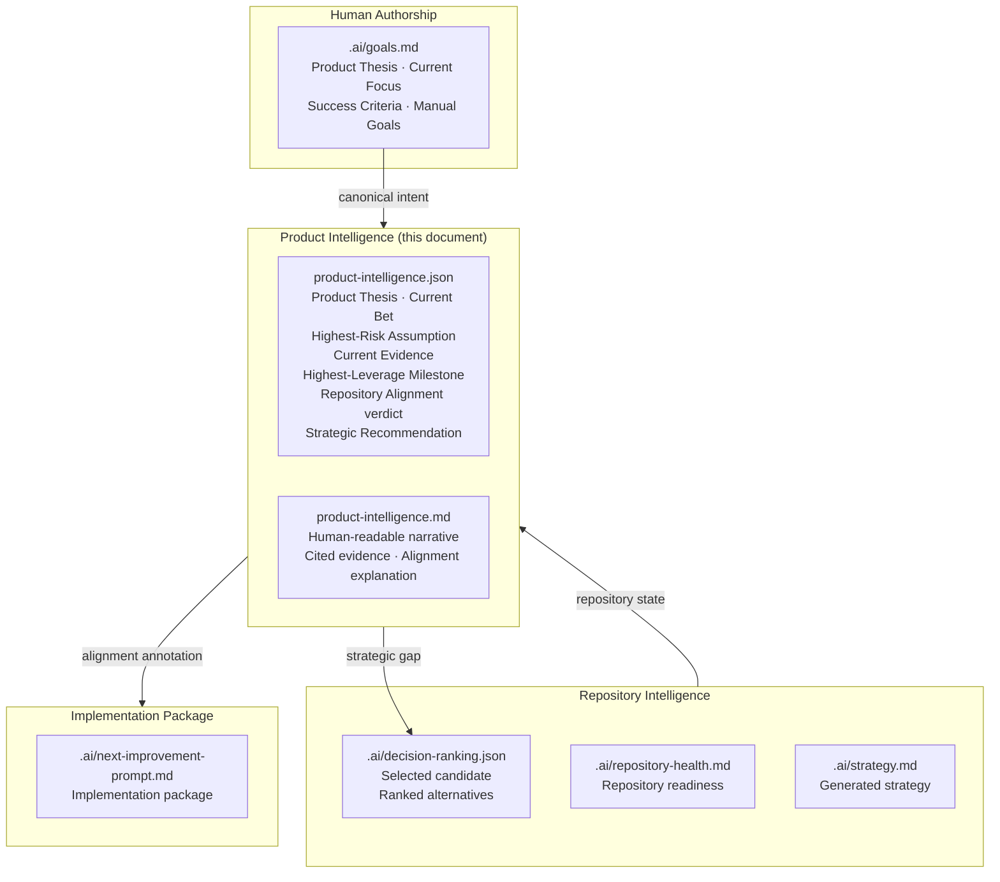
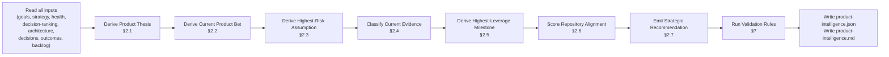
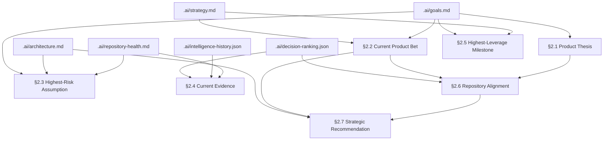
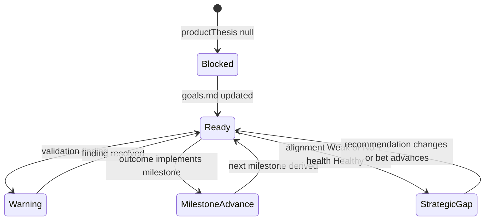

# Product Intelligence Specification

## Purpose

This document specifies the Product Intelligence subsystem — the canonical layer that
governs repository evolution. It sits above Repository Intelligence and below human
strategy authorship. Its sole function is to answer, on every refresh, whether the
repository is evolving toward its Product Thesis, and which candidate implementation
most increases confidence that the thesis will succeed.

Repository Intelligence describes the repository.
Product Intelligence decides where the repository should evolve next.

---

## Status

`ACTIVE — v1.0 — 2026-06-29`

---

## Audience

- Engineers implementing the Product Intelligence pipeline
- AI agents generating implementation packages for this repository
- Repository owners who write `.ai/goals.md` and interpret the Product Bet
- Architects extending the Decision Ranking and Repository Judgment engines

---

## Dependencies

| Document | Path | Relationship |
|---|---|---|
| Goals | `.ai/goals.md` | Primary canonical input — Product Thesis, Current Focus, Success Criteria, Manual Goals |
| Strategy | `.ai/strategy.md` | Generated canonical input — Current Product Bet, Current Experiment, What Not To Build |
| Repository Health | `.ai/repository-health.md` | Signals repository readiness; determines whether Product Intelligence may safely advance |
| Decision Ranking | `.ai/decision-ranking.json` | Selected implementation candidate; evaluated for Product Bet alignment |
| Architecture | `.ai/architecture.md` | Known capability gaps; primary flows; inferred constraints |
| Decisions | `.ai/decisions.md` | Hard constraints (no LLM, local-first, deterministic, no cloud) |
| Backlog | `.ai/backlog.md` | Known opportunities; used when Product Bet advancement candidates are scarce |
| Outcomes | `.ai/intelligence-history.json` | Evidence of past implemented and worked outcomes |
| Intelligence Quality | `.ai/intelligence-quality.json` | Canonical completeness; strategy completeness score |

---

## Known Consumers

| Consumer | What they consume |
|---|---|
| Decision Ranking pipeline | Strategic alignment score for candidate re-ranking |
| Implementation Package generator | Product Bet alignment verdict; strategic gap explanation |
| Repository Health display | Product Bet confidence trajectory |
| AI Handoff | Full Product Intelligence context as top-level strategic orientation |

---

## Revision History

| Version | Date | Author | Summary |
|---|---|---|---|
| 1.0 | 2026-06-29 | Agent IDE Architect | Initial specification |

---

## Section 1 — Layer Position

Product Intelligence is the governance layer above Repository Intelligence and below
human strategy authorship. It does not replace Decision Ranking. It filters and
annotates Decision Ranking output with strategic alignment verdicts.



**Dependency rules:**

- Product Intelligence reads from `.ai/goals.md` (canonical) and all generated `.ai/`
  artifacts (Repository Intelligence layer).
- Product Intelligence writes only `product-intelligence.json` and
  `product-intelligence.md`.
- Product Intelligence does NOT modify Decision Ranking, Repository Health, Strategy,
  or any other generated artifact.
- Implementation Package generators read Product Intelligence output but are not
  required to follow its recommendation.

---

## Section 2 — Canonical Questions

Every refresh must deterministically answer these seven questions. All answers must
cite repository-local evidence. No answer may be inferred from LLM calls, cloud
services, embeddings, or subjective scoring.

### 2.1 Product Thesis

One stable sentence derived from `.ai/goals.md` §Product Thesis.

**Source:** `.ai/goals.md`

**Stability rule:** Changes only when the Product Thesis section in `.ai/goals.md`
changes. A changed Product Thesis invalidates the Current Product Bet and Assumption
fields; they must be re-derived on next refresh.

**Validation:** Non-empty; single sentence; fewer than 200 characters. If missing,
emit `productThesis: null` and set `productIntelligenceState: "blocked"`.

---

### 2.2 Current Product Bet

The single hypothesis the team is currently testing. Derived from `.ai/strategy.md`
§Current Product Bet or `.ai/goals.md` §Current Focus.

**Source priority:** `.ai/strategy.md` §Current Product Bet → `.ai/goals.md`
§Current Focus → `null`

**Stability rule:** Changes only when the source section changes. If both sources
are blank, emit `currentProductBet: null` and a `strategic-gap` validation finding.

**Derivation:** Extract the full text of the section. Strip generated boilerplate
patterns (leading "The repository is currently focused on", "The current bet is",
"We are betting that"). Normalize to a single declarative sentence of fewer than
280 characters.

---

### 2.3 Highest-Risk Assumption

The single assumption whose failure would most prevent the Current Product Bet from
succeeding. Must be evidence-backed; must not be invented.

**Source inputs:**
- `.ai/strategy.md` §Current Experiment
- `.ai/repository-health.md` §Risks
- `.ai/architecture.md` §Known Gaps
- `.ai/decisions.md` (constraints that, if violated, would invalidate the bet)

**Derivation algorithm:**
1. Extract risk items from Repository Health §Risks. Filter to those that contain
   words semantically linked to the Current Product Bet (word-overlap ≥ 2 stems
   with the bet text after stop-word removal).
2. Extract known gaps from Architecture §Known Gaps.
3. Extract the current experiment text from Strategy §Current Experiment.
4. Select the item with the highest risk signal: FIXME/broken/critical/blocker
   markers first; then items with the highest word overlap with the bet text.
5. If no evidence-backed assumption is found, emit `highestRiskAssumption: null`
   and a `assumption-unsubstantiated` validation finding.

**Must not:** Invent risks not present in source documents. Must cite the exact
source line.

---

### 2.4 Current Evidence

Separate repository-local evidence into three buckets relative to the
Highest-Risk Assumption.

**Three buckets:**
- `supports`: evidence that reduces the risk of the assumption being wrong
- `weakens`: evidence that increases the risk of the assumption being wrong
- `unknown`: relevant evidence whose direction cannot be determined from
  the text alone

**Source inputs:**
- `.ai/validation.md` (test results, gaps)
- `.ai/repository-health.md` (confidence score, completeness)
- `.ai/intelligence-quality.json` (completeness scores, strategy fields)
- `.ai/intelligence-history.json` (implemented and worked outcomes)
- `.ai/decisions.md` (constraint compliance)
- `.ai/backlog.md` (open gaps)

**Classification rule:** For each evidence item, test whether its text directionally
supports or weakens the assumption using keyword matching against:
- Supports indicators: "passed", "complete", "ready", "verified", "high confidence",
  "implemented", "worked"
- Weakens indicators: "failed", "missing", "incomplete", "gap", "risk", "weak",
  "not implemented", "broken", "partial"
- Unknown: everything else

**Each evidence item must include:**
- `text`: the evidence statement
- `source`: the `.ai/` file and section it came from
- `direction`: `"supports"` | `"weakens"` | `"unknown"`

---

### 2.5 Highest-Leverage Milestone

The next product milestone — not an implementation task. Describes what success
should prove, not what should be built.

**Derivation:**
1. Read `.ai/strategy.md` §Current Experiment. Use as primary milestone if present
   and non-blank.
2. Read `.ai/goals.md` §Success Criteria. If the experiment is absent, derive the
   milestone from the first success criterion not yet demonstrated by outcomes.
3. If both are absent, derive from §Current Focus in `.ai/goals.md` by appending
   "is reliably demonstrated" to the focus statement.

**Format constraint:** Must describe an observable state ("repository handoff
readiness reaches Ready with no contradictions"), not an implementation action
("fix the validation script"). Detect implementation verbs (add, fix, build,
implement, update, create, wire) at the start of the text and flag with a
`milestone-is-task` validation warning.

**Source:** Cited explicitly.

---

### 2.6 Repository Alignment

Evaluate whether the currently selected implementation candidate (from
`decision-ranking.json` §selectedIssue) advances the Current Product Bet.

**Verdict enum:**
- `"Strong Alignment"` — candidate title or evidence directly cites the bet text
  (word overlap ≥ 3 stems) AND candidate actionability is `code-fixable`
- `"Moderate Alignment"` — candidate title or evidence has indirect relation to the
  bet (overlap 1–2 stems) OR is a foundational capability that unblocks the bet per
  Architecture §Known Gaps
- `"Weak Alignment"` — candidate is maintenance, validation, or documentation work
  with no direct or indirect link to the bet
- `"No Alignment"` — candidate is explicitly excluded by §What Not To Build in
  `.ai/goals.md` or `.ai/strategy.md`

**Explanation:** Always include a one-sentence explanation citing the evidence used
to determine alignment.

**Source:** `decision-ranking.json` §selectedIssue, `.ai/strategy.md` §Current
Product Bet, `.ai/goals.md` §What Not To Build.

---

### 2.7 Strategic Recommendation

If the Repository Alignment verdict is `"Weak Alignment"` or `"No Alignment"`,
identify the strategic gap and describe a higher-leverage alternative direction.

**Rules:**
- Do NOT automatically override the selected recommendation.
- Describe the gap in one sentence.
- Describe the alternative direction in one sentence.
- The alternative direction must be derivable from existing repository evidence
  (backlog, architecture, strategy, decisions). It must not invent new capabilities.
- If the alignment is `"Strong Alignment"` or `"Moderate Alignment"`, set
  `strategicRecommendation: null`.

---

## Section 3 — Inputs

| Input | Source | Required | Use |
|---|---|---|---|
| Product Thesis | `.ai/goals.md` §Product Thesis | Yes | §2.1 |
| Current Focus | `.ai/goals.md` §Current Focus | Yes | §2.2 fallback |
| Success Criteria | `.ai/goals.md` §Success Criteria | Yes | §2.5 fallback |
| What Not To Build | `.ai/goals.md` §What Not To Build | Yes | §2.6 No Alignment gate |
| Manual Goals | `.ai/goals.md` §Manual Goals | Preferred | Evidence for §2.3, §2.4 |
| Current Product Bet | `.ai/strategy.md` §Current Product Bet | Yes | §2.2 primary |
| Current Experiment | `.ai/strategy.md` §Current Experiment | Yes | §2.5 primary |
| What Not To Build (strategy) | `.ai/strategy.md` §What Not To Build | Yes | §2.6 No Alignment gate |
| Risks | `.ai/repository-health.md` §Risks | Yes | §2.3 risk extraction |
| Recommendation confidence | `.ai/repository-health.md` §Intelligence Completeness | Yes | §2.4 supports bucket |
| Known Gaps | `.ai/architecture.md` §Known Gaps | Yes | §2.3, §2.6 |
| Decision constraints | `.ai/decisions.md` | Yes | §2.4 weakens bucket |
| Selected candidate | `.ai/decision-ranking.json` §selectedIssue | Yes | §2.6 |
| Outcomes | `.ai/intelligence-history.json` | Yes | §2.4 supports bucket |
| Canonical completeness | `.ai/intelligence-quality.json` | Yes | §2.4 weakens bucket |
| Open backlog | `.ai/backlog.md` | Yes | §2.7 alternative direction |

**Input freshness rule:** Product Intelligence uses `generatedAt` timestamps where
available. If any required generated input is more than 24 hours old, emit a
`stale-input` validation warning on the affected field. Do not block generation.

---

## Section 4 — Generation Pipeline



**Pipeline invariants:**

- PI-INV-01: Every field derivation reads from the inputs listed in Section 3. No
  field may be inferred from any source not in that table.
- PI-INV-02: The pipeline is deterministic: given the same input files, it produces
  identical output. No random values; no timestamps in derived fields.
- PI-INV-03: `productThesis` is derived before all other fields. If `productThesis`
  is null, the pipeline halts and writes `productIntelligenceState: "blocked"`.
- PI-INV-04: `repositoryAlignment` is derived from `currentProductBet` and the
  selected candidate. If `currentProductBet` is null, `repositoryAlignment` is
  `"Unknown"`.
- PI-INV-05: `strategicRecommendation` is non-null only when `repositoryAlignment`
  is `"Weak Alignment"` or `"No Alignment"`.
- PI-INV-06: Every evidence item in `currentEvidence` must include a non-empty
  `source` field citing an `.ai/` document and section.
- PI-INV-07: The `highestRiskAssumption` field must be verbatim or paraphrased from
  a source document; it must not be constructed from arbitrary tokens.
- PI-INV-08: `highestLeverageMilestone` must not begin with an implementation verb
  (add, fix, build, implement, update, create, wire) unless a `milestone-is-task`
  warning is also emitted.

---

## Section 5 — Canonical Ownership

| Concept | Canonical Owner | Extension Permitted |
|---|---|---|
| Product Thesis | `.ai/goals.md` (human) | No — read-only by all generators |
| Current Product Bet | `.ai/strategy.md` (generated from goals) | No — Product Intelligence reads; does not write |
| Highest-Risk Assumption | `product-intelligence.json` | No |
| Current Evidence | `product-intelligence.json` | No |
| Highest-Leverage Milestone | `product-intelligence.json` | No |
| Repository Alignment verdict | `product-intelligence.json` | No |
| Strategic Recommendation | `product-intelligence.json` | No |
| Selected Candidate | `.ai/decision-ranking.json` | No — Product Intelligence reads; does not write |
| Implementation Package | `.ai/next-improvement-prompt.md` | May cite PI fields |

**Authority rule:** Product Intelligence is the sole owner of the seven canonical
answers (§2.1–§2.7). No other generator may produce these fields under the same
names. If a field name appears in another document, that occurrence is a reference
to this document's output, not an independent definition.

---

## Section 6 — JSON Schema

**File:** `.ai/product-intelligence.json`

```json
{
  "schemaVersion": 1,
  "generatedAt": "<ISO 8601 timestamp>",
  "productIntelligenceState": "ready | blocked | warning",

  "productThesis": {
    "text": "<one sentence>",
    "source": ".ai/goals.md §Product Thesis",
    "characterCount": 0
  },

  "currentProductBet": {
    "text": "<one sentence>",
    "source": ".ai/strategy.md §Current Product Bet | .ai/goals.md §Current Focus",
    "normalized": true
  },

  "highestRiskAssumption": {
    "text": "<verbatim or paraphrased from source>",
    "source": "<.ai/ file and section>",
    "evidenceBacked": true
  },

  "currentEvidence": {
    "supports": [
      { "text": "<evidence statement>", "source": "<.ai/ file §section>" }
    ],
    "weakens": [
      { "text": "<evidence statement>", "source": "<.ai/ file §section>" }
    ],
    "unknown": [
      { "text": "<evidence statement>", "source": "<.ai/ file §section>" }
    ]
  },

  "highestLeverageMilestone": {
    "text": "<observable success state, not an implementation task>",
    "source": "<.ai/ file §section>",
    "milestoneIsTaskWarning": false
  },

  "repositoryAlignment": {
    "verdict": "Strong Alignment | Moderate Alignment | Weak Alignment | No Alignment | Unknown",
    "explanation": "<one sentence citing evidence>",
    "selectedCandidateId": "<decision-ranking.json selectedIssue.id>",
    "selectedCandidateTitle": "<decision-ranking.json selectedIssue.title>",
    "betOverlapStems": 0
  },

  "strategicRecommendation": {
    "gap": "<one sentence>",
    "alternativeDirection": "<one sentence citing repository evidence>",
    "evidenceSource": "<.ai/ file and section>"
  },

  "validationFindings": [
    {
      "code": "<finding code>",
      "severity": "BLOCKING | WARNING | INFO",
      "message": "<explanation>",
      "field": "<affected product intelligence field>"
    }
  ],

  "inputTimestamps": {
    ".ai/goals.md": "<mtime ISO 8601>",
    ".ai/strategy.md": "<mtime ISO 8601>",
    ".ai/repository-health.md": "<mtime ISO 8601>",
    ".ai/decision-ranking.json": "<mtime ISO 8601>"
  }
}
```

**Schema notes:**

- `schemaVersion`: Increment when any field is added, renamed, or removed.
- `productIntelligenceState`:
  - `"ready"` — all required fields derived; no BLOCKING findings
  - `"blocked"` — `productThesis` is null; pipeline halted
  - `"warning"` — all fields derived; one or more WARNING findings present
- `strategicRecommendation`: `null` when alignment is Strong or Moderate.
- `validationFindings`: Empty array when no findings. Never omitted.
- `inputTimestamps`: Records the file modification time of each input at generation
  time. Used by consumers to detect staleness without re-running the pipeline.

---

## Section 7 — Markdown Structure

**File:** `.ai/product-intelligence.md`

The markdown file is a human-readable narrative derived from
`product-intelligence.json`. It is generated immediately after the JSON. It must
not contain information not present in the JSON.

```markdown
# Product Intelligence

Generated: <ISO 8601 timestamp>
State: <ready | blocked | warning>

## Product Thesis

<productThesis.text>

Source: <productThesis.source>

---

## Current Product Bet

<currentProductBet.text>

Source: <currentProductBet.source>

---

## Highest-Risk Assumption

<highestRiskAssumption.text>

Source: <highestRiskAssumption.source>

---

## Current Evidence

### Supports the Assumption
<bullet list of currentEvidence.supports items with source citations>

### Weakens the Assumption
<bullet list of currentEvidence.weakens items with source citations>

### Unknown
<bullet list of currentEvidence.unknown items with source citations>

---

## Highest-Leverage Milestone

<highestLeverageMilestone.text>

Source: <highestLeverageMilestone.source>

---

## Repository Alignment

**Verdict:** <repositoryAlignment.verdict>

**Selected candidate:** <selectedCandidateTitle>

**Explanation:** <repositoryAlignment.explanation>

---

## Strategic Recommendation

<strategicRecommendation.gap if present, else "No strategic gap identified.">

<strategicRecommendation.alternativeDirection if present>

---

## Validation Findings

<table of validationFindings if any; "No findings." if empty>
```

---

## Section 8 — Validation Rules

| Code | Severity | Trigger | Field |
|---|---|---|---|
| `PI-V01` | BLOCKING | `productThesis` is null or empty | productThesis |
| `PI-V02` | BLOCKING | `currentProductBet` is null or empty and neither source section exists | currentProductBet |
| `PI-V03` | WARNING | `highestRiskAssumption` is null (no evidence-backed risk found) | highestRiskAssumption |
| `PI-V04` | WARNING | `currentEvidence.supports` is empty (no supporting evidence found) | currentEvidence |
| `PI-V05` | WARNING | `currentEvidence.weakens` is empty (no weakening evidence found) | currentEvidence |
| `PI-V06` | WARNING | `highestLeverageMilestone.milestoneIsTaskWarning` is true | highestLeverageMilestone |
| `PI-V07` | INFO | `repositoryAlignment` is `"Weak Alignment"` | repositoryAlignment |
| `PI-V08` | WARNING | `repositoryAlignment` is `"No Alignment"` | repositoryAlignment |
| `PI-V09` | WARNING | Any required input file is older than 24 hours | inputTimestamps |
| `PI-V10` | BLOCKING | Any evidence item in `currentEvidence` has a null or empty `source` | currentEvidence |
| `PI-V11` | INFO | `strategicRecommendation` is non-null and alignment is `"Strong Alignment"` (should be null) | strategicRecommendation |
| `PI-V12` | WARNING | `productThesis.characterCount` > 200 | productThesis |

---

## Section 9 — Refresh Integration

Product Intelligence is generated as part of the repository intelligence refresh
cycle. It runs after the following generators have completed:

1. `strategy.mjs` → `.ai/strategy.md`
2. `health.mjs` → `.ai/repository-health.md`
3. `next-improvement.mjs` → `.ai/decision-ranking.json`

Product Intelligence runs before:

1. The Implementation Package generator reads the selected candidate
2. The AI Handoff package is assembled
3. The Context Package is finalized

**Refresh contract:**

- Product Intelligence is an additive step. If it fails or is absent, the existing
  refresh pipeline continues unchanged. Consumers that depend on Product Intelligence
  output must handle `null` for all fields.
- Product Intelligence never modifies files owned by other generators.
- The pipeline script that runs Product Intelligence must write `generatedAt` to
  match the start time of the current refresh cycle, not the wall clock at the
  moment `product-intelligence.json` is written.

**Incremental refresh:** If the input files have not changed since the last
`generatedAt`, the pipeline may skip re-generation and re-use the existing output.
The skip is valid only when all `inputTimestamps` in the existing JSON match the
current file modification times.

---

## Section 10 — Decision Ranking Integration

Product Intelligence annotates Decision Ranking output. It does not modify the
ranking algorithm, candidate scores, or selection.

**Integration point:** After `decision-ranking.json` is read during Implementation
Package generation, the generator additionally reads `product-intelligence.json`
and injects the following fields into the Implementation Package header:

```markdown
## Strategic Context

**Product Thesis:** <productThesis.text>
**Current Product Bet:** <currentProductBet.text>
**Repository Alignment:** <repositoryAlignment.verdict> — <repositoryAlignment.explanation>
**Highest-Leverage Milestone:** <highestLeverageMilestone.text>
```

If `repositoryAlignment.verdict` is `"Weak Alignment"` or `"No Alignment"`:

```markdown
## Strategic Gap

<strategicRecommendation.gap>

Alternative direction: <strategicRecommendation.alternativeDirection>
```

**Non-override rule:** The Strategic Gap section is informational. The engineer or
AI agent implementing the package decides whether to act on the strategic gap or
proceed with the selected candidate. The package is not blocked.

---

## Section 11 — Implementation Package Integration

The Implementation Package prompt heading (`# <selected.title>`) and goal section
(`## Goal`) are unchanged. Product Intelligence adds a `## Strategic Context` block
immediately before `## Selected Issue`.

The `## Strategic Context` block cites:

1. Product Thesis (one sentence)
2. Current Product Bet (one sentence)
3. Repository Alignment verdict and explanation (one sentence)
4. Highest-Leverage Milestone (one sentence)
5. Strategic Recommendation (if alignment is Weak or No)

This block answers the question "Why is this the right thing to build now?" before
the implementation instructions begin.

**Format contract:**

- The block is generated from `product-intelligence.json` fields only.
- If `product-intelligence.json` is absent or `productIntelligenceState` is
  `"blocked"`, the block is omitted entirely. The package proceeds without it.
- The block must not be longer than 12 lines.

---

## Section 12 — Outcome Integration

When an outcome is recorded (task completed, outcome marked `implemented` +
`worked`), the Product Intelligence pipeline compares the completed task against
the `highestLeverageMilestone` to determine whether the milestone was achieved.

**Milestone achievement detection:**

1. Read the completed task's `title` and `evidence` fields.
2. Compute word overlap between the task text and the `highestLeverageMilestone.text`.
3. If overlap ≥ 3 stems AND the outcome is `implemented` + `worked`, emit a
   `milestone-advance` event in the Product Intelligence output.
4. If `milestone-advance` is emitted, the next refresh must re-derive the
   `highestLeverageMilestone` from the next un-demonstrated success criterion.

**Milestone advancement does not:**
- Change the Product Thesis.
- Change the Current Product Bet (unless the bet source document changes).
- Suppress future recommendations.

---

## Section 13 — Repository Health Interaction

Product Intelligence reads Repository Health as evidence. It does not write to it.

**Repository Health determines Product Intelligence posture:**

| Repository Health state | Product Intelligence behavior |
|---|---|
| Overall Health: Healthy | May identify Product Bet advancement candidates as primary strategic recommendation |
| Overall Health: At Risk | Strategic Recommendation defers to health remediation; notes health as a weakening evidence item |
| Overall Health: Critical | Emits `PI-V09` warning on all fields; recommends health stabilization before strategic advancement |

**Repository Health is evidence, not the objective.** A healthy repository with
Weak Alignment is still producing the wrong work. A repository At Risk may still
have a candidate with Strong Alignment if the risk is unrelated to the bet.

Product Intelligence reports both facts. It does not choose between them.

---

## Section 14 — Recommendation Selection Interaction

Product Intelligence does not change the selected recommendation. It annotates it.

**However,** when the following conditions are all true simultaneously, the Product
Intelligence pipeline emits a `PI-STRATEGIC-GAP` finding at WARNING severity:

1. `repositoryAlignment.verdict` is `"No Alignment"` AND
2. `repositoryHealth.overallHealth` is `"Healthy"` AND
3. At least one backlog item has word overlap ≥ 3 stems with `currentProductBet`

This finding is visible in the Implementation Package under `## Strategic Context`
and in the AI Handoff package. It signals that a healthy repository is spending
its next implementation cycle on work unrelated to its stated bet while bet-aligned
work exists in the backlog.

**The engineer or AI agent retains authority over which implementation to execute.**
Product Intelligence provides evidence; it does not override.

---

## Section 15 — Mermaid Diagrams

### 15.1 Seven Canonical Questions Flow



### 15.2 Lifecycle: Repository Evolution Under Product Intelligence



---

## Section 16 — Consistency Audit

### 16.1 Every Output Field Has Exactly One Canonical Source

| Output field | Canonical source | Fallback |
|---|---|---|
| `productThesis` | `.ai/goals.md §Product Thesis` | None (BLOCKING if absent) |
| `currentProductBet` | `.ai/strategy.md §Current Product Bet` | `.ai/goals.md §Current Focus` |
| `highestRiskAssumption` | `.ai/repository-health.md §Risks` | `.ai/architecture.md §Known Gaps` |
| `currentEvidence.*` | Multiple `.ai/` sources | Empty arrays (WARNING) |
| `highestLeverageMilestone` | `.ai/strategy.md §Current Experiment` | `.ai/goals.md §Success Criteria` |
| `repositoryAlignment` | `.ai/decision-ranking.json` + `currentProductBet` | `"Unknown"` if bet null |
| `strategicRecommendation` | `repositoryAlignment` verdict + `.ai/backlog.md` | `null` if alignment Strong/Moderate |

### 16.2 No Circular Dependencies

Product Intelligence reads from `.ai/` artifacts. No `.ai/` artifact reads from
`product-intelligence.json` to derive its own content. The dependency graph is
a DAG.

### 16.3 No LLM Calls

All derivation rules in this specification use only:
- Text extraction (section parsing, bullet extraction)
- Keyword matching (word-overlap with stop-word removal)
- Priority selection (first non-null from ordered source list)
- Boolean conditions (contains term, exceeds character limit)

No embeddings, vector similarity, model calls, or cloud APIs are used.

### 16.4 Determinism Check

Given identical `.ai/` input files, the pipeline produces identical
`product-intelligence.json` output. The only non-deterministic field is
`generatedAt`, which records the timestamp of the refresh cycle start.

---

## Section 17 — Recommended Next File

**Recommended next file:** `product-intelligence-generator.md`

**Purpose:** Implementation specification for the `product-intelligence.mjs`
generation script. Should specify: exact parsing functions for each source section,
word-overlap algorithm with stop-word list, output file write order, error handling
for missing files, test fixture format, and integration points with the existing
`generateNextImprovement` pipeline in `scripts/next-improvement.mjs`.

Do not generate this file without explicit approval.
