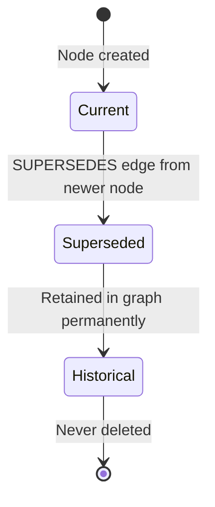
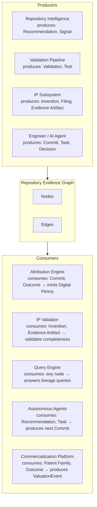

# Repository Evidence Graph Specification

## Purpose

This document defines the Repository Evidence Graph (REG) — the canonical,
shared substrate for all durable knowledge produced within a software repository.
It supersedes any subsystem-specific evidence graph definition, including the
per-invention evidence graphs described in `evidence-specification.md`.

The REG is not a feature of any single subsystem. It is the ground layer on which
Repository Intelligence, Repository IP, Digital Penny attribution, and future
autonomous software agents are built. Every artifact, decision, contribution,
and outcome in a repository is a node. Every relationship between them is a typed,
timestamped, immutable edge. The accumulated graph is the repository's memory —
the record of why things are the way they are, who contributed what, and what
value those contributions produced.

---

## Audience

- Engineers designing Agent IDE subsystems that produce or consume graph nodes
- AI systems operating within Agent IDE that reason over repository knowledge
- Architects of future products built on this graph (attribution systems,
  valuation engines, autonomous agents, commercialization platforms)
- Engineers and inventors who need to understand how their work is represented

---

## Status

`ACTIVE — v1.2 — 2026-06-28`

---

## Dependencies

| Document | Path | Relationship |
|---|---|---|
| IP README | `../README.md` | IP subsystem context — for orientation only; the REG does not depend on IP subsystem content |

> **Note (Architecture Remediation 2026-06-28):** Both `evidence-specification.md` and `glossary.md`
> have been removed from this dependency table. The REG is Layer 0; it cannot depend on Layer 2A
> documents. `glossary.md` is an IP-subsystem vocabulary document; the REG defines its own canonical
> node and edge type names independently. Where REG node type names (Invention, Patent Family,
> Filing) align with glossary terms, that alignment is intentional but the glossary is not a
> dependency — the REG's definitions are self-contained. `evidence-specification.md` was removed
> in the previous remediation pass; `glossary.md` is removed in this pass.

> **Note:** `evidence-specification.md` was removed from this
> dependency table. The REG is Layer 0; it cannot depend on a Layer 2A document.
> Concepts that originated in evidence-specification.md (confidence model, CORROBORATES,
> PRECEDES, MOTIVATED_BY edge types) have been moved to this document as universal
> definitions. `evidence-specification.md` now declares the REG as its dependency.

## Known Consumers

The following documents depend on this specification:

| Consumer | Path | What they consume |
|---|---|---|
| Evidence Specification | `./evidence-specification.md` | Confidence model, universal edge types, graph invariants — extended with IP-specific rules |
| Repository Intelligence Specification | `./repository-intelligence-specification.md` | All Layer 0 node types, edge types, confidence scale, and graph invariants — extended with Layer 1A signal, recommendation, task, and validation-finding concepts |
| Responsibility Matrix | `./responsibility-matrix.md` | All Layer 0 concept definitions — referenced for canonical ownership records |
| Architecture Review | `./architecture-review-2026-06-28.md` | Dependency graph and refactoring recommendations |

---

## Revision History

| Version | Date | Author | Summary |
|---|---|---|---|
| 1.0 | 2026-06-28 | Agent IDE Architect | Initial specification |
| 1.1 | 2026-06-28 | Agent IDE Architect | Architecture remediation: removed evidence-specification.md from dependencies; made confidence model self-contained and authoritative (Section 2.6); added self-contained schema versioning policy (Section 2.7); added layer annotations to node types 3.7, 3.8, 3.14–3.19 and edge types 4.8–4.9; added three universal edge types CORROBORATES (4.11), PRECEDES (4.12), MOTIVATED_BY (4.13); added Known Consumers table; added Architecture Review Remediation section |
| 1.2 | 2026-06-28 | Agent IDE Architect | Architecture remediation (pass 2): removed glossary.md from dependencies (Layer 0 cannot depend on Layer 2A vocabulary); added Section 1.3 Universal Node and Edge Principles (seven universal principles previously defined only in evidence-specification.md Section 1); added layer annotations to all six query patterns in Section 6 (6.1–6.2 as Layer 1A/1B placeholders, 6.3–6.4 and 6.6 as Layer 2A placeholders) |

---

## Section 1 — Product Thesis

### 1.1 Why a Graph

Software repositories produce knowledge continuously — in commits, decisions,
designs, test results, recommendations, and outcomes. Today, this knowledge
is scattered across isolated files, each representing one slice of the story
without any machine-readable record of how the slices connect. An architecture
decision record sits in `.ai/decisions/`; a commit implements it; a validation
run confirms it; a Repository Intelligence recommendation selects it as the
highest-value next improvement; an Invention Disclosure claims it; a Digital Penny
is minted when that commit is attributed. Each artifact exists. The relationships
between them do not — except as prose inside the documents themselves, invisible
to any automated system.

The Repository Evidence Graph solves this by making relationships first-class
citizens of the repository. Nodes are artifacts. Edges are typed, timestamped
relationships. The graph is the authoritative record of what produced what,
what supports what, and what is owed to whom.

This matters for five reasons:

**Lineage** — any node in the graph can be traced backward to the inputs that
produced it and forward to the outputs it contributed to. A recommendation can be
traced to the repository signals that generated it. A patent filing can be traced
to the commit that established the inventive date. A Digital Penny can be traced
to the commit that produced the value it compensates.

**Auditability** — every decision in the system is recorded as a graph operation.
Auditors — human or AI — can replay the graph's evolution and verify that every
conclusion followed from its stated inputs.

**Reuse** — subsystems share nodes rather than duplicating artifacts. A commit
node is authored once and referenced by Repository Intelligence, IP, attribution,
and validation subsystems simultaneously. No subsystem owns the node; all subsystems
read from the same ground truth.

**Composition** — future products are built by defining new node types and edge
types over the existing graph. They do not need to re-import or reconstruct
repository history; it is already there.

**Completeness over time** — isolated documents can be lost, renamed, or become
disconnected from the work they describe. Graph edges are permanent. Once an edge
is written, it persists regardless of how the underlying files evolve. The graph
accumulates; it does not decay.

### 1.2 What the Graph Is Not

The REG is not a database schema. It is a conceptual model. The section on
implementation is intentionally absent from this specification; that is a separate
engineering decision.

The REG is not a document management system. It does not replace files. Every
node references the file or artifact that it represents; the file remains the
human-readable record. The graph is the machine-readable index of relationships.

The REG is not a claim or a legal instrument. It is an engineering record.
Nodes that represent Inventions or Patent Families are engineering artifacts;
their legal interpretation is the domain of counsel.

### 1.3 Universal Node and Edge Principles

Every node and edge in the REG must satisfy all seven principles below. These
are Layer 0 constraints. Subsystem-specific specifications (Layer 1A, 1B, 2A)
may add domain-specific rules as extensions but may not relax these universal
principles.

> **Authority note for Layer 2A documents:** `evidence-specification.md` Section 1
> defines how these seven principles apply specifically to IP evidence artifacts.
> The authoritative definitions are here; that section is an IP-domain application.

**Repository-First**
Nodes representing repository artifacts (commits, files, tests, decisions) are
preferred over nodes representing external claims of the same fact. A node
sourced from a version-controlled commit carries timestamp provenance from the
version-control system and requires no additional verification. External nodes
(publications, filed artifacts, declarations) are acceptable when no repository
source exists, but must carry explicit provenance (`sourceKind: "external"`) and
have independently verifiable timestamps.

**Verifiable**
Every node must have a timestamp verifiable by a party other than the node's
creator. Version-control commit timestamps, repository push histories on hosted
platforms, and publication dates from external registries all satisfy this requirement.
Self-reported dates without external verification must produce `confidence: UNVERIFIED`.

**Immutable**
Nodes and edges are never deleted or modified after creation. This is enforced
by graph invariants INV-12 and INV-13. When content changes, a new node version
is created. The historical sequence is permanently preserved and replayable.

**Traceable**
Every node must be reachable from the Repository root node through a finite chain
of typed edges. Isolated nodes — those with no inbound or outbound edges connecting
them to the broader graph — are a graph invariant violation. Every relationship
must be declared as an explicit, typed edge; prose-only relationships within node
payloads are not recognized by query engines or validators.

**Time-Aware**
The REG maintains three time dimensions for every node (graph time, artifact time,
effective time — see Section 2.5). All temporal reasoning, lineage ordering, and
confidence inheritance must use artifact time, not graph time. Temporal edges
(PRECEDES, DERIVES_FROM) carry temporal constraints that are enforced as invariants
INV-06 and INV-07.

**Human-Reviewable**
Every node payload must be readable by a human engineer without specialized tooling.
Binary artifacts may be referenced by nodes but the node's `label` and payload
`description` fields must convey the artifact's evidential meaning in plain language.
Structured fields use standard formats (ISO 8601 dates, SHA commit hashes, relative
file paths). Abbreviations and domain-specific codes must be defined in the relevant
subsystem specification.

**AI-Readable**
Every node payload must be parseable by AI systems operating within Agent IDE
without requiring human interpretation to extract its meaning. Structured metadata
fields use the canonical schemas defined in Section 3. Free-text description fields
use complete sentences. Dates use ISO 8601. IDs use the canonical formats defined
in Section 2.3. Diagrams referenced from nodes carry a textual `altText` description.

---

## Section 2 — Core Model

### 2.1 Nodes

A node represents one artifact, entity, or concept in the repository's knowledge
space. Every node has:

| Property | Type | Description |
|---|---|---|
| `nodeId` | string | Globally unique identifier within the repository's REG |
| `nodeType` | string | One of the canonical node types defined in Section 3 |
| `label` | string | Human-readable name or title |
| `createdAt` | ISO 8601 | Timestamp at which this node was added to the graph |
| `createdBy` | string | Agent or human identity that created the node |
| `confidence` | string | `DEFINITIVE` / `HIGH` / `MEDIUM` / `LOW` / `UNVERIFIED` — see Section 2.6 |
| `version` | integer | Monotonically increasing version counter; incremented on each mutation |
| `supersededBy` | string? | `nodeId` of the node that supersedes this one, if applicable |
| `payload` | object | Node-type-specific structured data |
| `provenance` | object | See Section 2.4 |

Nodes are immutable in their historical form. When a node's content changes,
a new version is recorded and the `version` field is incremented. The historical
sequence of versions is preserved. No version is deleted.

### 2.2 Edges

An edge represents a typed, directional relationship between two nodes.
Every edge has:

| Property | Type | Description |
|---|---|---|
| `edgeId` | string | Globally unique identifier within the repository's REG |
| `edgeType` | string | One of the canonical edge types defined in Section 4 |
| `sourceNodeId` | string | The node the relationship originates from |
| `targetNodeId` | string | The node the relationship points to |
| `createdAt` | ISO 8601 | Timestamp at which this edge was added |
| `createdBy` | string | Agent or human identity that created the edge |
| `confidence` | string | Confidence in this specific relationship |
| `rationale` | string | Why this edge exists; what the relationship means in context |
| `payload` | object | Edge-type-specific structured data |
| `supersededBy` | string? | `edgeId` of the edge that supersedes this one, if applicable |

Edges are immutable once written. A relationship between two nodes that is
later determined to be incorrect is not deleted; a `CONTRADICTS` edge is added
to flag the conflict, and a superseding edge may be written with a corrected
relationship. The original edge persists as part of the historical record.

### 2.3 Identity

Node identity is determined by a canonical ID that is stable across time and
independent of file paths. File paths change; node IDs do not.

**ID format by node type:**

| Node Type | ID Format | Example |
|---|---|---|
| Repository | `REPO-{hash-of-remote-url}` | `REPO-a3f7b9c2` |
| Goal | `GOAL-{YEAR}-{SEQ}` | `GOAL-2026-0001` |
| Strategy | `STRAT-{YEAR}-{SEQ}` | `STRAT-2026-0001` |
| Architecture | `ARCH-{YEAR}-{SEQ}` | `ARCH-2026-0003` |
| Decision | `ADR-{YEAR}-{SEQ}` | `ADR-2026-0012` |
| Issue | `ISS-{platform}-{id}` | `ISS-github-47` |
| Recommendation | `REC-{YEAR}-{SEQ}` | `REC-2026-0001` |
| Task | `TASK-{YEAR}-{SEQ}` | `TASK-2026-0042` |
| Commit | `CMT-{full-sha}` | `CMT-a3f7b9c2d8e1f5b0...` |
| Source File | `FILE-{CMT}-{path-hash}` | `FILE-a3f7b9c2-src/correlator.ts` |
| Test | `TEST-{CMT}-{test-name-hash}` | `TEST-a3f7b9c2-evidence-anchor` |
| Validation | `VAL-{YEAR}-{SEQ}` | `VAL-2026-0004` |
| Benchmark | `BENCH-{YEAR}-{SEQ}` | `BENCH-2026-0002` |
| Evidence Artifact | `EV-{INV-ID}-{SEQ}` | `EV-INV-2026-0001-001` |
| Invention | `INV-{YEAR}-{SEQ}` | `INV-2026-0001` |
| Patent Family | `FAM-{YEAR}-{SEQ}` | `FAM-2026-0001` |
| Prior Art | `REF-{YEAR}-{SEQ}` | `REF-2026-0003` |
| Filing | `FILING-{YEAR}-{SEQ}` | `FILING-2026-0001` |
| Digital Penny | `DP-{YEAR}-{SEQ}` | `DP-2026-001337` |
| Outcome | `OUT-{YEAR}-{SEQ}` | `OUT-2026-0007` |

An ID is assigned once and never reassigned, even if the underlying artifact
is renamed, moved, or superseded.

### 2.4 Provenance

Every node and edge carries a provenance record that answers: how was this
knowledge produced?

```
provenance {
  sourceKind       : "human" | "ai-system" | "automated-pipeline" | "external"
  sourceIdentity   : string — human username, AI system name, pipeline ID, or external ref
  sourceArtifact   : string? — nodeId of the artifact that caused this node/edge to be created
  inputNodeIds     : string[] — nodeIds of nodes that were inputs to producing this node
  method           : string — how the node was produced ("manual-authoring" / "ai-generated" /
                              "pipeline-extraction" / "import" / "inference")
  confidence       : string — producer's confidence in the output
  reviewedBy       : string? — human or AI reviewer identity, if applicable
  reviewedAt       : ISO 8601? — when review occurred
}
```

Provenance is immutable. It records the production context at the moment the
node was created. Later reviews or validations add new edges rather than mutating
provenance.

### 2.5 Time

The REG maintains three distinct time dimensions for every node:

| Dimension | Meaning | Field |
|---|---|---|
| **Graph time** | When the node was added to the REG | `createdAt` |
| **Artifact time** | When the underlying artifact was produced | `payload.artifactDate` |
| **Effective time** | The time this node is authoritative for (may differ from both) | `payload.effectiveDate` |

Graph time is always the wall-clock time when the write occurs. Artifact time
may predate graph time by any amount — a commit from 2026-04-01 that is indexed
into the REG on 2026-06-28 has an artifact time of 2026-04-01 and a graph time
of 2026-06-28. Effective time is used when a node represents a state that applies
across a range (e.g., a strategy is effective from 2026-Q1 through 2026-Q3).

Time-ordering queries must use artifact time, not graph time. Lineage and
Inventive Date reasoning must be based on artifact time.

### 2.6 Confidence

The REG defines the canonical five-level confidence scale. This is the authoritative
definition; all subsystem-specific documents (including `evidence-specification.md`)
extend these definitions with domain-specific rules but do not override them.

| Level | Code | Meaning |
|---|---|---|
| Definitive | `DEFINITIVE` | Established by an authoritative external institution (patent office, standards body, public registry) |
| High | `HIGH` | Verifiable from version-controlled repository artifacts with no interpretive gap |
| Medium | `MEDIUM` | Verifiable but requires one inferential step or relies on non-repository sources |
| Low | `LOW` | Present in the graph but connection to claim is interpretive |
| Unverified | `UNVERIFIED` | Provenance cannot be confirmed independently |

**Confidence inheritance:** A node that `DERIVES_FROM` a chain of nodes whose
minimum confidence is `MEDIUM` cannot itself be `HIGH` unless it has independent
`HIGH`-confidence support via a `SUPPORTS` edge from a `HIGH` or `DEFINITIVE` node.

**Confidence upgrades:** Confidence is never silently upgraded. Upgrades require
an explicit new edge from a `HIGH` or `DEFINITIVE` source node, with a new
provenance record documenting the basis for the upgrade.

**Domain extensions:** Layer 2A documents may define which evidence types are
capped at specific confidence levels and additional downgrade rules. Those rules
are extensions of this model; they may not relax the inheritance constraints above.

### 2.7 Versioning

The REG version is the monotonically increasing count of write operations
(node creations, edge additions, node version increments). Every REG state is
fully reproducible by replaying the write log up to any version number.

**Node versioning:** When a node's payload changes, the `version` field increments
and the full previous payload is preserved in a version history attached to the node.
Edges always reference the node by `nodeId` without a version pin; they implicitly
reference the current version unless the edge payload specifies `targetVersion`.

**Schema versioning:** The REG schema is versioned independently from its content.
Schema versions follow semver: patch for non-breaking additions (new optional fields),
minor for new node or edge types, major for breaking changes to existing semantics.
All nodes carry the `schemaVersion` of the REG schema under which they were created.

---

## Section 3 — Node Types

Each node type below is defined with: canonical definition, required payload fields,
and the edge types it may participate in (as source and as target).

---

### 3.1 Repository

**Definition**
The root node of every REG. Represents the software repository itself — its
identity, remote URL, and initialization state. Every other node in the REG
is transitively connected to the Repository node.

**Required Payload**

| Field | Description |
|---|---|
| `remoteUrl` | Canonical remote URL |
| `defaultBranch` | Name of the default branch |
| `initializedAt` | Date REG was first initialized for this repository |
| `description` | One-paragraph description of the repository's purpose |

**Edge participation**
- Source of `CONTAINS` edges to all top-level subsystem nodes
- Target of no inbound edges (root node)

---

### 3.2 Goal

**Definition**
A documented engineering or product objective that motivates work within the
repository. Goals are maintained in `.ai/goals/` and form the top of the
strategic reasoning chain. Every Invention, Recommendation, and Task must
eventually trace to at least one Goal.

**Required Payload**

| Field | Description |
|---|---|
| `goalId` | Canonical ID |
| `title` | One-sentence goal statement |
| `description` | Full goal description |
| `priority` | Relative priority among active goals |
| `status` | `ACTIVE` / `ACHIEVED` / `SUPERSEDED` / `ABANDONED` |
| `achievementDate` | Date goal was achieved, if applicable |

**Edge participation**
- Source of `MOTIVATES` → Strategy, Recommendation, Task, Invention
- Target of `SUPPORTS` ← Outcome, Validation, Benchmark

---

### 3.3 Strategy

**Definition**
A deliberate plan for how a set of Goals will be pursued over a defined horizon.
Strategy nodes document the reasoning behind sequences of Recommendations and Tasks.

**Required Payload**

| Field | Description |
|---|---|
| `strategyId` | Canonical ID |
| `title` | Strategy name |
| `horizon` | Time horizon (e.g., `2026-Q2`) |
| `description` | Strategic intent |
| `status` | `ACTIVE` / `COMPLETED` / `SUPERSEDED` |

**Edge participation**
- Source of `IMPLEMENTS` → Goal (strategy implements a goal approach)
- Target of `MOTIVATES` ← Goal
- Source of `GENERATES` → Recommendation

---

### 3.4 Architecture

**Definition**
A documented architectural decision, component design, or system structure record
from `.ai/architecture/`. Architecture nodes represent durable design choices that
implementations must conform to.

**Required Payload**

| Field | Description |
|---|---|
| `architectureId` | Canonical ID |
| `title` | Architecture record title |
| `filePath` | Repository path |
| `commitHash` | Commit at which this version was authored |
| `date` | Date of the commit |
| `status` | `ACTIVE` / `SUPERSEDED` / `DEPRECATED` |
| `summary` | One-paragraph design summary |

**Edge participation**
- Source of `CONSTRAINS` → Decision, Task, Source File
- Target of `IMPLEMENTS` ← Commit, Source File
- Target of `SUPPORTS` ← Decision
- Source of `MOTIVATES` → Invention (architecture enables inventive method)

---

### 3.5 Decision

**Definition**
An Architecture Decision Record (ADR) from `.ai/decisions/` that documents
a specific technical choice, the alternatives considered, and the rationale
for the selected approach.

**Required Payload**

| Field | Description |
|---|---|
| `decisionId` | Canonical ID |
| `title` | Decision title |
| `filePath` | Repository path |
| `commitHash` | Commit at which this ADR was authored |
| `date` | Date of the commit |
| `status` | `ACCEPTED` / `DEPRECATED` / `SUPERSEDED` |
| `decisionSummary` | The choice made |
| `rationaleSum` | Why this choice was made over alternatives |

**Edge participation**
- Source of `IMPLEMENTS` → Architecture
- Source of `SUPPORTS` → Invention (decision establishes inventive rationale)
- Target of `SUPERSEDES` ← Decision (newer decision supersedes this one)
- Target of `DEPENDS_ON` ← Decision (decisions may depend on prior decisions)

---

### 3.6 Issue

**Definition**
A bug report, feature request, or tracked problem in a project management or
issue-tracking system. Issue nodes serve as evidence of problem existence prior
to an inventive solution, and as traceable inputs to Recommendations and Tasks.

**Required Payload**

| Field | Description |
|---|---|
| `issueId` | Canonical ID including platform prefix |
| `platform` | `github` / `gitlab` / `linear` / `jira` / `other` |
| `externalId` | Platform-native issue number |
| `url` | Stable URL |
| `title` | Issue title |
| `openedDate` | Date issue was opened |
| `closedDate` | Date issue was closed, if applicable |
| `status` | `OPEN` / `CLOSED` / `ARCHIVED` |

**Edge participation**
- Source of `MOTIVATES` → Recommendation, Task, Invention
- Target of `IMPLEMENTS` ← Commit (commit closes or addresses an issue)

---

### 3.7 Recommendation

> **Layer note:** This node type is defined here because Recommendation nodes are
> referenced by universal edge types (DERIVES_FROM, GENERATES, ATTRIBUTED_TO) and
> by the attribution subsystem. The full payload specification belongs in the Layer 1A
> (Repository Intelligence) document when that document is created. Until then, this
> document is the authoritative definition.

**Definition**
A structured recommendation produced by the Repository Intelligence subsystem
selecting a specific engineering action as the highest-value next improvement
for the repository. A Recommendation node represents a single recommendation
event at a specific point in time and is immutable once created.

**Required Payload**

| Field | Description |
|---|---|
| `recommendationId` | Canonical ID |
| `title` | Recommendation title as produced by the intelligence pipeline |
| `displayTitle` | Human-facing title |
| `implementationPrompt` | Full implementation prompt text |
| `actionability` | `code-fixable` / `process-change` / `strategic` / etc. |
| `packageType` | `implementation` / `task-clarification` |
| `selectionRationale` | Why this recommendation was selected over alternatives |
| `promptHash` | Hash of `implementationPrompt` for integrity verification |
| `generatedAt` | Timestamp of generation |
| `decisionRanking` | Structured ranking data used for selection |

**Edge participation**
- Source of `DERIVES_FROM` → Repository Intelligence artifacts, Goal, Strategy
- Source of `GENERATES` → Task
- Target of `SUPPORTS` ← Evidence Artifact, Validation
- Target of `SUPERSEDES` ← Recommendation (new recommendation replaces prior)
- Source of `ATTRIBUTED_TO` → Commit, Outcome (via attribution pipeline)

---

### 3.8 Task

> **Layer note:** Task nodes are universal (used by Repository Intelligence, Agent IDE
> workflow tracking, and attribution). The `workflowKey` payload field is an Agent IDE
> Layer 2B concern. When a Layer 1A Repository Intelligence specification is created,
> the canonical Task payload definition should migrate there.

**Definition**
A discrete unit of engineering work derived from a Recommendation and assigned
to an engineer or AI agent for execution. A Task node tracks the lifecycle of
one work item from assignment through completion.

**Required Payload**

| Field | Description |
|---|---|
| `taskId` | Canonical ID |
| `title` | Task title |
| `description` | Full task description |
| `status` | `PENDING` / `IN_PROGRESS` / `COMPLETE` / `ABANDONED` |
| `assignedTo` | Identity of the engineer or AI agent |
| `startedAt` | Timestamp when work began |
| `completedAt` | Timestamp when work was completed |
| `workflowKey` | Workflow state key for step tracking |

**Edge participation**
- Target of `GENERATES` ← Recommendation
- Source of `IMPLEMENTS` → Goal, Architecture
- Source of `GENERATES` → Commit (commits produced while executing the task)
- Target of `ATTRIBUTED_TO` ← Digital Penny

---

### 3.9 Commit

**Definition**
A version-control commit. Commit nodes are the primary evidence of engineering
work and the primary anchor for Inventive Date claims. They are the most
fundamental unit of repository contribution.

**Required Payload**

| Field | Description |
|---|---|
| `commitHash` | Full SHA commit hash |
| `authorIdentity` | Author name and email |
| `authorDate` | ISO 8601 author date |
| `committerDate` | ISO 8601 committer date |
| `message` | Full commit message |
| `changedFiles` | List of paths changed |
| `linesAdded` | Count of lines added |
| `linesRemoved` | Count of lines removed |
| `parentHashes` | Parent commit hashes |

**Edge participation**
- Source of `IMPLEMENTS` → Task, Architecture, Decision, Goal
- Source of `GENERATES` → Source File, Test
- Target of `ATTRIBUTED_TO` ← Digital Penny
- Source of `SUPPORTS` → Invention, Evidence Artifact
- Target of `DERIVES_FROM` ← Recommendation (commit was produced following a recommendation)

---

### 3.10 Source File

**Definition**
A specific version of a source file — identified by repository path and commit
hash — that implements part of the inventive method or contributes to a Task.

**Required Payload**

| Field | Description |
|---|---|
| `repositoryPath` | Relative path within the repository |
| `commitHash` | Commit at which this version is current |
| `language` | Programming language or file type |
| `linesOfCode` | Line count at this version |
| `purpose` | What this file does in the system |

**Edge participation**
- Target of `GENERATES` ← Commit
- Source of `IMPLEMENTS` → Architecture, Decision
- Source of `SUPPORTS` → Invention, Evidence Artifact
- Target of `VALIDATES` ← Test (test validates behavior of this file)

---

### 3.11 Test

**Definition**
An automated test at a specific commit that verifies the behavior of one or more
Source Files. Tests serve as both engineering quality records and IP evidence
artifacts when they directly exercise an inventive mechanism.

**Required Payload**

| Field | Description |
|---|---|
| `filePath` | Repository path to test file |
| `commitHash` | Commit at which this test exists |
| `testName` | Name or description of the specific test |
| `testKind` | `unit` / `integration` / `end-to-end` / `benchmark` |
| `assertionDescription` | What the test asserts |
| `lastPassDate` | Most recent date the test passed |

**Edge participation**
- Target of `GENERATES` ← Commit
- Source of `VALIDATES` → Source File, Architecture, Invention
- Source of `SUPPORTS` → Evidence Artifact, Validation

---

### 3.12 Validation

**Definition**
An output of Agent IDE's Repository Validation pipeline that confirms a set
of repository artifacts meets defined quality, correctness, or completeness
criteria. Validation nodes are also defined in the glossary as Repository
Validation.

**Required Payload**

| Field | Description |
|---|---|
| `validationId` | Canonical VAL-ID |
| `filePath` | Path to validation report |
| `commitHash` | Commit under which validation was run |
| `runDate` | Date validation was executed |
| `outcome` | `pass` / `fail` / `partial` |
| `coverage` | What was validated |
| `checksRun` | Count of checks executed |
| `checksPassed` | Count of checks passed |

**Edge participation**
- Source of `VALIDATES` → Source File, Architecture, Invention, Recommendation
- Source of `SUPPORTS` → Evidence Artifact, Goal
- Target of `DERIVES_FROM` ← Source File, Test, Commit

---

### 3.13 Benchmark

**Definition**
A reproducible performance or correctness measurement that demonstrates an
inventive method or implementation produces the described technical result
at a specific scale or under specific conditions.

**Required Payload**

| Field | Description |
|---|---|
| `benchmarkId` | Canonical BENCH-ID |
| `filePath` | Path to benchmark definition and results |
| `commitHash` | Commit at which benchmark was run |
| `runDate` | Date benchmark was executed |
| `metric` | What was measured |
| `result` | Measured value with units |
| `baselineResult` | Baseline for comparison |
| `environment` | Hardware, OS, runtime, dependency versions |

**Edge participation**
- Source of `SUPPORTS` → Invention, Evidence Artifact, Outcome
- Target of `DERIVES_FROM` ← Source File, Commit
- Source of `VALIDATES` → Architecture, Invention

---

### 3.14 Evidence Artifact

> **Layer note:** Evidence Artifact is a Layer 2A (Repository IP) node type defined
> here because it participates in universal edge types (SUPPORTS, DERIVES_FROM,
> SUPERSEDES, CORROBORATES, PRECEDES, MOTIVATED_BY) and must be referenceable
> by non-IP subsystems. The full evidence type taxonomy and metadata schema are
> authoritative in `evidence-specification.md` Section 2. This node type's presence
> in the REG enables cross-subsystem lineage queries without requiring Layer 0
> tooling to depend on Layer 2A documents.

**Definition**
A node representing a single evidence artifact conforming to the Evidence
Specification (`evidence-specification.md`). Evidence Artifact nodes are the
REG projection of the per-invention evidence record; they exist in the global
graph rather than only in invention-scoped graphs.

**Required Payload**
All fields from the canonical JSON schema in `evidence-specification.md`
Section 7, plus:

| Field | Description |
|---|---|
| `inventionId` | The Invention node this artifact supports |
| `evidenceType` | One of the 16 types defined in `evidence-specification.md` Section 2 |
| `inventiveRole` | `conception` / `progression` / `reduction-to-practice` / `commercial-impact` |

**Edge participation**
- Source of `SUPPORTS` → Invention, Evidence Artifact (corroboration), Disclosure section
- Source of `CORROBORATES` → Evidence Artifact
- Source of `DERIVES_FROM` → Source File, Commit, Benchmark, Validation
- Target of `SUPERSEDES` ← Evidence Artifact (when a stronger artifact replaces this one)

---

### 3.15 Invention

> **Layer note:** Layer 2A (Repository IP) node type. Defined here to enable
> universal edge participation (SUPPORTS, IMPLEMENTS, BELONGS_TO, CONTRADICTS,
> GENERATES). Full disclosure structure and IRL requirements are authoritative in
> `evidence-specification.md` and `inventions/TEMPLATE/disclosure.md`.

**Definition**
A documented novel technical solution corresponding to an Invention Disclosure
in `.ai/intellectual-property/inventions/`. The Invention node is the central
hub of the IP subgraph; all other IP nodes connect to it.

**Required Payload**

| Field | Description |
|---|---|
| `inventionId` | Canonical INV-ID |
| `title` | Invention title |
| `filingStatus` | Current Filing Status value (from glossary.md § Filing Status) |
| `inventiveDate` | ISO 8601 date — earliest verifiable conception artifact date |
| `irlLevel` | Current IP Readiness Level (`IRL-1` through `IRL-5`) |
| `trlLevel` | Current Technology Readiness Level (`TRL-1` through `TRL-5`) |
| `disclosurePath` | Path to disclosure.md |
| `summary` | One-paragraph technical summary |

**Edge participation**
- Target of `SUPPORTS` ← Evidence Artifact, Commit, Source File, Test, Benchmark, Validation
- Target of `IMPLEMENTS` ← Commit, Source File (implementation artifacts)
- Source of `DEPENDS_ON` → Goal, Architecture (traceability chain)
- Source of `BELONGS_TO` → Patent Family
- Source of `CONTRADICTS` → Prior Art (invention is distinguished from prior art)
- Target of `GENERATES` ← Recommendation (recommendation motivated this disclosure)

---

### 3.16 Patent Family

> **Layer note:** Layer 2A (Repository IP) node type. Defined here for edge
> participation. Full claim strategy and continuation planning are authoritative
> in the IP subsystem documents.

**Definition**
A group of related Inventions managed together for strategic purposes, as defined
in glossary.md § Patent Family. The Patent Family node is the coordination point
for claim strategy, continuation planning, and commercialization analysis.

**Required Payload**

| Field | Description |
|---|---|
| `familyId` | Canonical FAM-ID |
| `title` | Family name |
| `description` | Technical scope of the family |
| `status` | `ACTIVE` / `CLOSED` |
| `claimStrategyPath` | Path to claims-map.md |
| `continuationPlanPath` | Path to continuation-plan.md |

**Edge participation**
- Target of `BELONGS_TO` ← Invention
- Source of `CONTAINS` → Filing
- Target of `SUPPORTS` ← Evidence Artifact, Benchmark, Outcome
- Source of `DEPENDS_ON` → Prior Art (for differentiation)

---

### 3.17 Prior Art

> **Layer note:** Layer 2A (Repository IP) node type. Defined here for CONTRADICTS
> and DEPENDS_ON edge participation. Prior art analysis methodology is authoritative
> in the IP subsystem.

**Definition**
A specific documented prior-art source assigned a REF-ID, as defined in
glossary.md § Prior-Art Reference. Prior Art nodes establish what was known
before an invention and are used to bound novelty claims.

**Required Payload**

| Field | Description |
|---|---|
| `referenceId` | Canonical REF-ID |
| `title` | Publication or reference title |
| `authors` | Author list |
| `publicationDate` | ISO 8601 publication date |
| `url` | Stable URL or DOI |
| `summary` | Summary of relevant technical content |
| `similarityAssessment` | What this reference discloses relative to the invention |
| `differenceAssessment` | What it lacks relative to the inventive method |

**Edge participation**
- Target of `CONTRADICTS` ← Invention (invention is distinguished from this reference)
- Source of `SUPPORTS` → Novelty claims in Evidence Artifact nodes
- Target of `DEPENDS_ON` ← Invention (novelty analysis depends on knowing this reference)

---

### 3.18 Filing

> **Layer note:** Layer 2A (Repository IP) node type. Filing nodes carry
> `DEFINITIVE` confidence (the only node type that does so by definition). The
> Filing Status state machine is authoritative in `glossary.md` § Filing Status.

**Definition**
A patent application, provisional application, or defensive publication event —
the formal entry of an invention into the patent system or public record.
Filing nodes represent administrative facts established by external institutions
and carry `DEFINITIVE` confidence.

**Required Payload**

| Field | Description |
|---|---|
| `filingId` | Canonical FILING-ID |
| `filingDate` | ISO 8601 filing date (from Filing Artifact evidence) |
| `priorityDate` | ISO 8601 priority date |
| `issuingAuthority` | USPTO / EPO / WIPO / publication venue |
| `applicationNumber` | Office-assigned application number |
| `filingType` | `provisional` / `non-provisional` / `PCT` / `continuation` / `divisional` / `defensive-publication` |
| `status` | Maps to Filing Status in glossary.md |

**Edge participation**
- Target of `CONTAINS` ← Patent Family
- Source of `DERIVES_FROM` → Invention (filing is based on this invention)
- Source of `SUPERSEDES` → Filing (continuation supersedes provisional)
- Target of `SUPPORTS` ← Evidence Artifact (`filing-artifact` type)

---

### 3.19 Digital Penny

> **Layer note:** Layer 1B (Digital Penny Attribution) node type. Defined here
> because MINTED_FROM and ATTRIBUTED_TO edges connect to universal node types
> (Commit, Task, Outcome). The full Digital Penny economic model will be specified
> in a future Layer 1B document.

**Definition**
A unit of attribution representing a discrete contribution of value to the
repository. A Digital Penny node records: who contributed, what they contributed,
when, and which downstream outcomes the contribution participated in producing.

**Required Payload**

| Field | Description |
|---|---|
| `digitalPennyId` | Canonical DP-ID |
| `mintedAt` | Timestamp of minting |
| `mintedBy` | System identity that minted this penny |
| `contributorIdentity` | The engineer or AI agent attributed |
| `contributionSummary` | What contribution this penny represents |
| `value` | Relative value weight (dimensionless; interpretted by attribution model) |
| `mintingRationale` | Why this contribution warranted a Digital Penny |

**Edge participation**
- Source of `MINTED_FROM` → Commit, Task, Recommendation, Outcome (the contribution)
- Source of `ATTRIBUTED_TO` → Contributor identity node (future node type)
- Target of `DERIVES_FROM` ← Outcome, Invention (the value event that triggered minting)
- Source of `SUPPORTS` → Outcome (penny provides attribution record for the outcome)

---

### 3.20 Outcome

**Definition**
A measurable result documented in `.ai/outcomes/` that demonstrates the impact
of engineering work on one or more Goals. Outcome nodes close the traceability
chain: from Goal through Architecture through Implementation through Validation
to a concrete, measured result.

**Required Payload**

| Field | Description |
|---|---|
| `outcomeId` | Canonical OUT-ID |
| `title` | Outcome title |
| `description` | What was achieved |
| `measuredAt` | Date the outcome was measured |
| `metric` | What was measured |
| `result` | The measured value |
| `baselineResult` | Baseline value before the contributing work |
| `improvementDescription` | Narrative description of the improvement |

**Edge participation**
- Source of `SUPPORTS` → Goal (outcome demonstrates goal progress)
- Target of `DERIVES_FROM` ← Commit, Task, Validation, Benchmark (what produced this outcome)
- Source of `GENERATES` → Digital Penny (outcome triggers attribution)
- Target of `SUPPORTS` ← Benchmark, Validation
- Source of `SUPPORTS` → Invention (commercial-impact evidence path)

---

## Section 4 — Edge Types

Each edge type has deterministic semantics: given any two nodes and this edge type,
any two systems applying the definition must agree on what the edge means and
whether it is valid.

---

### 4.1 SUPPORTS

**Semantics:** The source node provides evidence for, or increases confidence in,
the target node. The relationship is epistemic: the source makes the target
more certain, more complete, or more justified.

**Direction:** source → target (source supports target)

**Valid source node types:** Evidence Artifact, Commit, Test, Benchmark, Validation,
Outcome, Decision, Prior Art, Source File

**Valid target node types:** Invention, Evidence Artifact, Goal, Recommendation,
Architecture, Validation, Patent Family, Outcome

**Constraints:**
- A `SUPPORTS` edge from a node with `confidence: UNVERIFIED` may not be the sole
  support for a target node that requires `MEDIUM` or higher confidence.
- `SUPPORTS` is not transitive across more than three hops without a direct edge.

---

### 4.2 DERIVES_FROM

**Semantics:** The source node was produced by processing, running against, or
reasoning over the target node. The source is downstream of the target; the
target is an input to the source's production.

**Direction:** source → target (source derives from target)

**Valid source node types:** Evidence Artifact, Benchmark, Validation, Recommendation,
Outcome, Filing, Digital Penny, Source File, Test

**Valid target node types:** Commit, Source File, Benchmark, Validation, Recommendation,
Evidence Artifact, Invention, Outcome

**Constraints:**
- `source.artifactDate ≥ target.artifactDate` (the derived artifact cannot predate its input)
- Confidence of the source node cannot exceed the minimum confidence of its
  `DERIVES_FROM` targets unless independent `SUPPORTS` edges raise it.
- Forms a DAG; no cycles permitted.

---

### 4.3 IMPLEMENTS

**Semantics:** The source node is a concrete realization of the target node.
The target describes or specifies something; the source brings it into existence.

**Direction:** source → target (source implements target)

**Valid source node types:** Commit, Source File, Task, Strategy, Decision

**Valid target node types:** Goal, Architecture, Decision, Task, Invention

**Constraints:**
- An `IMPLEMENTS` edge from a Commit to an Invention does not constitute
  reduction-to-practice evidence on its own; a `SUPPORTS` edge from an Evidence
  Artifact is required for that.
- A Source File `IMPLEMENTS` an Architecture only when the file can be
  directly traced to a named component in the architecture record.

---

### 4.4 VALIDATES

**Semantics:** The source node confirms, through direct execution or observation,
that the target node behaves as specified. Validation is active: the source
exercised the target and produced an outcome.

**Direction:** source → target (source validates target)

**Valid source node types:** Test, Validation, Benchmark

**Valid target node types:** Source File, Architecture, Invention, Recommendation, Goal

**Constraints:**
- A `VALIDATES` edge may only exist if the source node's `outcome` is `pass`
  or `partial`. A failing test does not validate; it contradicts.
- A `VALIDATES` edge from a Benchmark to an Invention contributes to
  reduction-to-practice evidence when the benchmark exercises the inventive method.

---

### 4.5 CONTRADICTS

**Semantics:** The source node conflicts with the target node. The two nodes
make claims or represent states that cannot simultaneously be true. A `CONTRADICTS`
edge flags a conflict that requires resolution; it does not resolve it.

**Direction:** source → target (source contradicts target)

**Valid source node types:** Evidence Artifact, Test, Validation, Benchmark, Prior Art, Decision

**Valid target node types:** Evidence Artifact, Invention, Architecture, Decision, Recommendation

**Constraints:**
- A `CONTRADICTS` edge must carry a `rationale` explaining the specific conflict.
- A `CONTRADICTS` edge between two Evidence Artifacts must be resolved before the
  Invention Disclosure can advance to `REVIEW` Filing Status.
- `CONTRADICTS` edges are never deleted; resolution is represented by a new
  `SUPERSEDES` edge from the resolving artifact.

---

### 4.6 DEPENDS_ON

**Semantics:** The source node requires the target node to be present and valid
in order for the source to be complete, correct, or meaningful. The source is
logically or evidentially incomplete without the target.

**Direction:** source → target (source depends on target)

**Valid source node types:** Invention, Decision, Architecture, Patent Family, Task, Validation

**Valid target node types:** Goal, Architecture, Decision, Prior Art, Invention, Validation

**Constraints:**
- `DEPENDS_ON` forms a DAG; no cycles permitted. Circular dependencies between
  nodes are a graph invariant violation (see Section 5).
- If a target node is superseded, all `DEPENDS_ON` edges pointing to it must
  be reviewed and either updated to point to the superseding node or explicitly
  retained with a rationale for why the dependency on the historical version is intended.

---

### 4.7 GENERATED

**Semantics:** The source node produced the target node as an output of its
operation. The relationship is causal: the source's execution or existence
caused the target to come into being.

**Direction:** source → target (source generated target)

**Valid source node types:** Recommendation, Task, Commit, Strategy, Goal, Outcome

**Valid target node types:** Task, Commit, Source File, Test, Digital Penny, Recommendation, Outcome

**Constraints:**
- A `GENERATED` edge establishes that the target would not exist without the
  source. This is a stronger claim than `DERIVES_FROM` (which describes input
  processing) and implies direct causal production.
- The source's `artifactDate` must be ≤ the target's `artifactDate`.

---

### 4.8 ATTRIBUTED_TO

> **Layer note:** This edge type is defined here because it connects universal
> node types (Commit, Outcome) to contributor identities. The attribution weighting
> model belongs in the future Layer 1B Digital Penny specification.

**Semantics:** The source node is attributed to the target identity. Attribution
records which person, team, or AI agent is credited with producing the source node.

**Direction:** source → target (source is attributed to target)

**Valid source node types:** Digital Penny, Commit, Recommendation, Outcome, Invention

**Valid target node types:** Contributor identity (human engineer, AI agent, pipeline)

**Constraints:**
- A Commit may have multiple `ATTRIBUTED_TO` edges when pair programming or
  AI-assisted authorship is involved. Each edge carries an `attributionWeight`
  in its payload representing the proportional share (0.0–1.0, sum must equal 1.0).
- Attribution is an engineering record, not a legal inventorship determination.
  Inventorship is determined by counsel; attribution is determined by the graph.

---

### 4.9 MINTED_FROM

> **Layer note:** Layer 1B (Digital Penny Attribution) edge type. Defined here
> because target node types (Commit, Task, Outcome, Invention, Recommendation)
> are universal. Full minting rules belong in the Layer 1B specification.

**Semantics:** The Digital Penny source node was minted because of the target
node's existence or value contribution. The target is the specific contribution
event that triggered the minting.

**Direction:** source → target (Digital Penny minted from this contribution)

**Valid source node types:** Digital Penny

**Valid target node types:** Commit, Task, Outcome, Invention, Recommendation

**Constraints:**
- Every Digital Penny node must have exactly one `MINTED_FROM` edge.
- The `mintedAt` timestamp of the Digital Penny must be ≥ the `artifactDate`
  of the `MINTED_FROM` target.
- The `mintingRationale` field of the Digital Penny payload must explain the
  causal link to the `MINTED_FROM` target.

---

### 4.10 SUPERSEDES

**Semantics:** The source node replaces the target node as the current authoritative
version of the artifact, decision, or evidence it represents. The target remains
in the graph as a historical record.

**Direction:** source → target (source supersedes target)

**Valid source node types:** Any node type may supersede another node of the same type

**Valid target node types:** Same type as source

**Constraints:**
- The source's `artifactDate` must be ≥ the target's `artifactDate`.
- The target node must have its `supersededBy` field set to the source's `nodeId`.
- A `SUPERSEDES` edge does not delete the target node or invalidate its outbound
  edges. Historical relationships from the superseded node remain valid for
  the time period during which that node was current.
- Only one node may supersede a given target. If two nodes both claim to supersede
  the same target, a `CONTRADICTS` edge must be raised.

---

### 4.11 CORROBORATES

**Semantics:** The source node independently supports the same claim or conclusion
as the target node. Unlike `SUPPORTS` (which points to the claim), `CORROBORATES`
points to another artifact — indicating that two artifacts arrive at the same
conclusion through independent paths. The relationship strengthens the target's
evidentiary standing without requiring the source to derive from it.

**Direction:** source → target (source corroborates target)

**Valid source node types:** Evidence Artifact, Benchmark, Validation, Test, Commit

**Valid target node types:** Evidence Artifact, Benchmark, Validation, Invention

**Constraints:**
- Source and target must support the same claim (same `claimLinks` intersection
  or same target Invention node) for the edge to be meaningful.
- A `CORROBORATES` edge does not itself raise the confidence of either node;
  it enables aggregated confidence assessment at the claim level.
- `source.artifactDate` and `target.artifactDate` may differ in either direction
  (corroboration is not temporally ordered).
- `CORROBORATES` edges must carry a `rationale` explaining what shared claim
  the two artifacts independently support.

---

### 4.12 PRECEDES

**Semantics:** The source node's artifact time predates the target node's artifact
time in a meaningful way — specifically, the source was created, committed, or
effective before the target in the inventive or engineering timeline. This edge
makes temporal ordering explicit and machine-readable.

**Direction:** source → target (source precedes target in time)

**Valid source node types:** Any node with `payload.artifactDate`

**Valid target node types:** Any node with `payload.artifactDate`

**Constraints:**
- `source.artifactDate ≤ target.artifactDate` (invariant INV-07). A `PRECEDES`
  edge that would violate this is rejected.
- `PRECEDES` is not transitive by default; each link in a temporal chain must be
  declared explicitly unless a query engine infers transitivity from the chain.
- Use `PRECEDES` only when the temporal ordering is evidentially significant
  (e.g., to establish that a conception artifact predates a competing reference).
  Do not use `PRECEDES` as a general ordering annotation for non-evidential sequences.

---

### 4.13 MOTIVATED_BY

**Semantics:** The source node was created in direct response to, or as a consequence
of, the target node. The relationship is causal but softer than `DERIVES_FROM`:
the source does not process the target's data; instead, the target's existence or
content motivated the decision to create the source.

**Direction:** source → target (source was motivated by target)

**Valid source node types:** Evidence Artifact, Benchmark, Validation, Decision,
Architecture, Recommendation, Task, Invention

**Valid target node types:** Issue, Decision, Architecture, Goal, Recommendation,
Evidence Artifact, Invention, Prior Art

**Constraints:**
- `source.artifactDate ≥ target.artifactDate` (the motivated artifact cannot
  predate its motivating input).
- `MOTIVATED_BY` does not imply data derivation. If the source was produced by
  processing the target's content, use `DERIVES_FROM` instead.
- A `MOTIVATED_BY` edge must carry a `rationale` explaining the motivation.

---

## Section 5 — Graph Invariants

The following invariants must hold at all times. A write operation that would
violate any invariant must be rejected before it is committed to the graph.

| ID | Invariant | Applies To |
|---|---|---|
| INV-01 | Every node has a globally unique `nodeId` within the repository's REG | All nodes |
| INV-02 | Every edge has a globally unique `edgeId` | All edges |
| INV-03 | Every edge's `sourceNodeId` and `targetNodeId` resolve to existing nodes | All edges |
| INV-04 | The graph is acyclic for `DERIVES_FROM` and `DEPENDS_ON` edges | DAG invariant |
| INV-05 | `SUPERSEDES` is a forest: each node is superseded by at most one other node | Supersession |
| INV-06 | For any `DERIVES_FROM` edge: `source.artifactDate ≥ target.artifactDate` | Temporal |
| INV-07 | For any `PRECEDES` relationship: `source.artifactDate ≤ target.artifactDate` | Temporal |
| INV-08 | For any `GENERATED` edge: `source.artifactDate ≤ target.artifactDate` | Temporal |
| INV-09 | For any `MINTED_FROM` edge: `digitalPenny.mintedAt ≥ target.artifactDate` | Attribution |
| INV-10 | Every Digital Penny node has exactly one `MINTED_FROM` edge | Attribution |
| INV-11 | `ATTRIBUTED_TO` weights on edges from the same source sum to 1.0 | Attribution |
| INV-12 | No node is deleted; superseded nodes remain with `supersededBy` set | Immutability |
| INV-13 | No edge is deleted; contradicted edges remain with a `CONTRADICTS` edge flagging the conflict | Immutability |
| INV-14 | Confidence of a `DERIVES_FROM` source never exceeds the minimum confidence of its inputs, without independent `SUPPORTS` evidence | Confidence |
| INV-15 | An Invention node with Filing Status `REVIEW` or higher has at least one `HIGH`-confidence Evidence Artifact with `SUPPORTS` pointing to its Inventive Date section | IP completeness |
| INV-16 | An `ATTRIBUTED_TO` edge may not point to a contributor identity that did not exist at `source.artifactDate` | Attribution |
| INV-17 | A `VALIDATES` edge may only exist where the source node's outcome is `pass` or `partial` | Validation semantics |
| INV-18 | Every node's `schemaVersion` matches the REG schema version under which it was created | Versioning |
| INV-19 | Every Commit node's `commitHash` is a 40-character hexadecimal string | Identity |
| INV-20 | The Repository node is unique per REG; no REG contains more than one Repository node | Root uniqueness |

---

## Section 6 — Query Model

The REG supports deterministic graph queries: given the same graph state, any
system evaluating the same query against the same graph must produce the same
answer. Queries are expressed as graph traversals with typed edge constraints
and confidence thresholds.

The queries below are defined by their traversal pattern. Each query specifies:
the start node type, the traversal path (edge types and directions in sequence),
the termination condition, and the answer extracted at termination.

---

### 6.1 Why is this Recommendation selected?

> **Layer note:** This query pattern references Recommendation (Layer 1A placeholder
> node type — see Section 3.7). When the Layer 1A Repository Intelligence specification
> is written, this query pattern should migrate there. It is defined here as a
> placeholder to demonstrate the universal traversal model.

**Start:** Recommendation node `R`

**Traversal:**
1. Follow `DERIVES_FROM` edges backward from `R` to all input nodes
2. For each input node, follow `DERIVES_FROM` backward recursively until reaching
   nodes with no `DERIVES_FROM` inbound edges (root inputs)
3. Follow `SUPPORTS` backward from `R` to all Evidence Artifact nodes
4. For each Evidence Artifact, retrieve `confidence` and `inventiveRole`

**Answer:**
- The set of root input nodes forms the evidence base for the recommendation
- The `decisionRanking` payload of `R` provides the selection rationale
- The `selectionRationale` field names the competing recommendations and explains
  why `R` ranked first
- The confidence distribution of supporting Evidence Artifacts shows the strength
  of the recommendation's evidentiary basis

---

### 6.2 Why was this Digital Penny minted?

> **Layer note:** This query pattern references Digital Penny (Layer 1B placeholder
> node type — see Section 3.19). When the Layer 1B Attribution specification is
> written, this query pattern should migrate there.

**Start:** Digital Penny node `DP`

**Traversal:**
1. Follow `MINTED_FROM` from `DP` to the contribution node `C`
2. Follow `ATTRIBUTED_TO` from `DP` to the contributor identity `I`
3. Follow `DERIVES_FROM` backward from `DP` to find the Outcome or Invention
   that triggered minting
4. Retrieve `mintingRationale` from `DP` payload

**Answer:**
- `C` is the specific contribution (commit, task, or outcome) that triggered minting
- `I` is the attributed contributor
- The Outcome or Invention node confirms what value the contribution participated in producing
- `mintingRationale` provides the human-readable explanation

---

### 6.3 Which evidence supports this Invention?

> **Layer note:** This query pattern is Layer 2A (Repository IP). It references
> Invention and Evidence Artifact (Sections 3.14–3.15, both Layer 2A placeholder
> node types). When the IP REG Extension specification is written, this query
> pattern should migrate there. The confidence filters referenced in step 5 are
> authoritative in `evidence-specification.md` Section 3.3.

**Start:** Invention node `INV`

**Traversal:**
1. Collect all nodes with a `SUPPORTS` edge pointing to `INV` — these are direct
   supporting artifacts
2. Collect all Evidence Artifact nodes with `SUPPORTS` → `INV`
3. For each Evidence Artifact, retrieve `evidenceType`, `confidence`,
   `inventiveRole`, and `artifactDate`
4. Sort by `inventiveRole` (conception → progression → reduction-to-practice →
   commercial-impact) and by `artifactDate` ascending within each role
5. Apply confidence filters per the requirements table in
   `evidence-specification.md` Section 3.3

**Answer:**
- Ordered evidence timeline from earliest conception artifact to most recent
  commercial-impact evidence
- Coverage report: which required roles have `HIGH`-confidence support and
  which are missing or undercovered
- Gap analysis: time intervals with no progression evidence

---

### 6.4 Which Patent Family owns this implementation?

> **Layer note:** This query pattern is Layer 2A (Repository IP). It references
> Invention and Patent Family (Sections 3.15–3.16, both Layer 2A placeholder node
> types). When the IP REG Extension specification is written, this query pattern
> should migrate there.

**Start:** Source File node `F` (or Commit node `C`)

**Traversal:**
1. Follow `SUPPORTS` forward from `F` to Invention nodes
2. Follow `BELONGS_TO` forward from each Invention to Patent Family nodes
3. If no direct path, follow `IMPLEMENTS` forward from `F` to Architecture nodes,
   then `SUPPORTS` forward from Architecture to Invention, then `BELONGS_TO` to
   Patent Family

**Answer:**
- The set of Patent Family nodes reachable from `F` through this traversal
- If the set is empty: this implementation is not yet linked to any invention
  (a traceability gap)
- If the set has multiple members: this implementation contributes to multiple
  families (document in claims-map.md)

---

### 6.5 What implementation produced this Benchmark?

**Start:** Benchmark node `B`

**Traversal:**
1. Follow `DERIVES_FROM` from `B` to Source File and Commit nodes
2. For each Source File, follow `GENERATES` backward to the Commit that
   introduced that version
3. Follow `ATTRIBUTED_TO` from each Commit to contributor identities
4. Follow `IMPLEMENTS` forward from each Commit to Task and Goal nodes

**Answer:**
- The set of Source File nodes and their authoring Commits that the benchmark
  ran against
- The contributor identities who authored those commits
- The Tasks and Goals the implementation was serving when the benchmark was run
- The full provenance chain: Goal → Task → Commit → Source File → Benchmark

---

### 6.6 What is the complete traceability chain for this Invention?

> **Layer note:** This query pattern is Layer 2A (Repository IP). Steps 1–3 and 5
> reference Invention, Evidence Artifact, Recommendation (Layer 2A and 1A placeholder
> node types). Step 4 (ATTRIBUTED_TO) is Layer 1B. The universal portions of this
> traversal (backwards DERIVES_FROM from any node to its inputs; forward SUPPORTS
> to any supporting node) are universal and may be used by any subsystem. The
> IP-specific result interpretation should migrate to the IP REG Extension specification.

**Start:** Invention node `INV`

**Traversal:**
1. Follow `DEPENDS_ON` forward from `INV` to Goal, Architecture, Decision nodes
2. Follow `SUPPORTS` backward from `INV` to all Evidence Artifact nodes
3. For each Evidence Artifact, follow `DERIVES_FROM` backward to Commit,
   Source File, Benchmark, and Validation nodes
4. Follow `ATTRIBUTED_TO` from each Commit to contributor identities
5. Follow `GENERATED` backward from `INV` to the Recommendation that motivated the disclosure

**Answer:**
- The complete directed subgraph connecting `INV` to every goal it serves,
  every architectural component it uses, every decision that shaped it, every
  evidence artifact that supports it, every commit that implements it, every
  contributor who authored those commits, and the recommendation that triggered
  the disclosure
- Traceability completeness score: what fraction of the seven required traceability
  dimensions have at least one connecting edge

---

## Section 7 — Repository Evolution

The REG grows continuously as the repository evolves. This section defines how
the graph changes over time without breaking historical lineage.

### 7.1 Append-Only Growth

The REG is an append-only log of write operations. New nodes and edges are
appended; nothing is deleted. The current state of the graph is the result of
replaying all write operations in order.

This means:
- Queries that ask "what does the REG say right now" read the current state
- Queries that ask "what did the REG say on date T" read the state after replaying
  all writes with `createdAt ≤ T`
- Historical lineage is permanently preserved

### 7.2 Supersession Without Deletion

When an artifact changes — a recommendation is replaced, a disclosure is updated,
a benchmark is re-run with better tooling — the old node is not deleted. A new
node is created and a `SUPERSEDES` edge points from new to old. The old node's
`supersededBy` field is set.



Queries that ask for "the current recommendation" follow `SUPERSEDES` chains
to the node with no outbound `SUPERSEDES` edge. Queries that ask for "the
recommendation on date T" stop traversal at the node that was current on that date.

### 7.3 Schema Evolution

When the REG schema changes:
- Existing nodes retain their original `schemaVersion` and remain valid under
  that version's rules
- New nodes carry the new `schemaVersion`
- Queries must handle nodes at different schema versions; the query engine
  applies the rules for each node's `schemaVersion`
- Backward-incompatible schema changes (major version bumps) require a migration
  plan that is documented as a new node in the REG itself (a `Schema Migration`
  meta-node, to be defined when the first major version change occurs)

### 7.4 Branching and Merging

When a repository uses feature branches, the REG must distinguish:
- Nodes that are branch-local (created on a feature branch, not yet on the default branch)
- Nodes that are canonical (on the default branch or merged)

Branch-local nodes carry a `branchRef` field in their provenance. When a branch
is merged, its nodes are promoted to canonical status by a merge event node.
Conflicts between branch-local nodes and canonical nodes are represented as
`CONTRADICTS` edges requiring resolution.

### 7.5 Lineage Preservation Across Refactors

When a file is renamed, split, or merged:
- The original Source File node is superseded by one or more new Source File nodes
- `SUPERSEDES` edges connect the new nodes to the original
- All edges that pointed to the original node remain valid and continue to point
  to it; queries follow `SUPERSEDES` to find the current form
- The continuity of the inventive record is preserved regardless of file system changes

---

## Section 8 — Future Extensions

The REG is designed as an open substrate. New products and subsystems extend
it by defining new node types and edge types without modifying the existing model.

### 8.1 Extension Protocol

To add a new node type:
1. Assign a canonical ID format (must not collide with existing formats in Section 2.3)
2. Define required payload fields
3. Specify which existing edge types it may participate in, as source and target
4. Define any new invariants specific to the new type
5. Document in a new section appended to this specification
6. Increment the schema minor version

To add a new edge type:
1. Define deterministic semantics (two systems given the same nodes must agree
   on whether the edge is valid)
2. Specify valid source and target node types
3. Define constraints (temporal, confidence, cardinality)
4. Document in a new section appended to this specification

Existing node types, edge types, and invariants are never removed. Deprecation
is represented by a `DEPRECATED` status on the node type definition; deprecated
types may not be used in new writes but remain valid in historical nodes.

### 8.2 Planned Extensions

| Extension | New Node Types | New Edge Types | Purpose |
|---|---|---|---|
| Contributor Graph | `Contributor`, `Team`, `Organization` | `MEMBER_OF`, `MANAGES` | Fine-grained attribution and organizational IP ownership |
| Standards Contribution | `StandardsBody`, `StandardsContribution` | `CONTRIBUTED_TO`, `FRAND_COMMITTED` | Tracking standards contributions and licensing commitments |
| Valuation | `ValuationEvent`, `ValuationModel` | `VALUED_AT`, `VALUED_BY` | IP portfolio valuation and Digital Penny economic model |
| Cross-Repository | `ExternalRepository`, `ExternalNode` | `REFERENCES`, `CLONES_FROM` | Evidence and attribution spanning multiple repositories |
| Autonomous Agent | `AgentSession`, `AgentAction` | `EXECUTED_BY`, `PROPOSED_BY` | Audit trail for AI-generated contributions and decisions |
| Regulatory Compliance | `ComplianceFramework`, `ComplianceCheck` | `COMPLIES_WITH`, `VIOLATES` | License compliance, export control, standards obligations |
| Litigation Support | `LitigationEvent`, `BlockchainAnchor` | `ANCHORED_AT`, `PRODUCED_FOR` | Litigation-grade evidence provenance |

### 8.3 The REG as Shared Substrate

Every subsystem within Agent IDE produces nodes and edges in the REG as a
side effect of its normal operation. No subsystem reads from another subsystem's
private files; instead, all cross-subsystem communication passes through the graph.



Every arrow in this diagram is a stream of typed nodes and edges. The REG is
the bus that decouples producers from consumers. A new consumer (a valuation
product, a regulatory compliance checker, a litigation-support export) plugs
in by defining the node and edge types it reads and produces. It does not need
to integrate with any existing subsystem directly.

### 8.4 The REG and Autonomous Software Agents

Future autonomous agents operating within Agent IDE will both consume and produce
REG nodes. An agent session produces: an `AgentSession` node, `AgentAction` nodes
for each step, `EXECUTED_BY` edges from actions to the session, and `PROPOSED_BY`
edges from artifacts the agent produces to its session node.

This means every artifact produced by an autonomous agent is traceable to the
specific session, the specific inputs the agent consumed, and the specific model
or system that ran it. The REG is the audit log for autonomous operation. Human
reviewers can reconstruct every decision an agent made by traversing its session
subgraph.

---

## Architecture Review Remediation

*Applied 2026-06-28 (pass 1 and pass 2) per recommendations in `architecture-review-2026-06-28.md`.*

**Refactoring 1 — Authority inversion fix (CRITICAL):**
The original v1.0 of this document referenced `evidence-specification.md` Section 3
as the authority for the confidence model. This was an authority inversion: the REG
is Layer 0 and cannot depend on a Layer 2A document. The confidence model is now
defined self-containedly in Section 2.6 of this document with explicit language
marking it as the canonical definition. `evidence-specification.md` has been updated
to reference Section 2.6 of this document as the authoritative source.

**Refactoring 2 — Dependency table corrected:**
`evidence-specification.md` was removed from the Dependencies table. A `Known Consumers`
table was added listing evidence-specification.md correctly as a consumer, not a dependency.

**Refactoring 3 — Three universal edge types added:**
CORROBORATES (4.11), PRECEDES (4.12), and MOTIVATED_BY (4.13) were added as universal
edge types in this document. These types were previously defined only in evidence-specification.md
Section 5 (a Layer 2A document). Because they express relationships between universal
node types (Commit, Benchmark, Validation, Architecture, Decision), they belong in Layer 0.
`evidence-specification.md` Section 5 has been updated to reference these types as
defined here and to document IP-specific usage notes.

**Refactoring 4 — Layer annotations added:**
Layer notes have been added to node types 3.7 (Recommendation), 3.8 (Task),
3.14 (Evidence Artifact), 3.15 (Invention), 3.16 (Patent Family), 3.17 (Prior Art),
3.18 (Filing), 3.19 (Digital Penny) and edge types 4.8 (ATTRIBUTED_TO), 4.9 (MINTED_FROM).
These annotations document the correct architectural layer for each type, explain
why the definition lives in this Layer 0 document (universal edge participation),
and identify which future Layer 1A or 1B document should eventually own the full
payload specification.

**Refactoring 5 — Schema versioning policy made self-contained:**
The Section 2.7 reference to `evidence-specification.md` Section 10.3 for schema
versioning policy has been replaced with a self-contained semver policy statement.

**Pass 2 — Additional remediations (v1.2):**

*Refactoring 5 — glossary.md removed from dependency table:* `glossary.md` (Layer 2A) was
declared as a REG dependency for "canonical term definitions." This was a Layer 0 → Layer 2A
dependency violation. The REG now defines its own canonical node and edge type names
self-containedly. Where REG node type names align with glossary terms, that alignment is
intentional but the glossary is not a dependency.

*Section 1.3 — Universal Node and Edge Principles added:* The seven evidence principles
previously defined only in `evidence-specification.md` Section 1 are now declared as
universal Layer 0 principles in Section 1.3 of this document. `evidence-specification.md`
Section 1 has been updated to reference Section 1.3 as the authority.

*Section 6 query pattern annotations:* Layer ownership annotations added to all six query
patterns. Queries 6.1 (Recommendation/Layer 1A) and 6.2 (Digital Penny/Layer 1B) are
annotated as placeholders. Queries 6.3, 6.4, and 6.6 are annotated as Layer 2A
(Repository IP), to be migrated to the IP REG Extension specification when that document
is created.

**Circular dependency status after remediation:**
- D5 (REG) → D4 (evidence-spec): **ELIMINATED** (pass 1).
- D5 (REG) → D2 (glossary): **ELIMINATED** (pass 2).
- D4 (evidence-spec) → D5 (REG): evidence-spec correctly depends on REG as Layer 0.
- D4 (evidence-spec) → D2 (glossary): correct — Layer 2A depends on Layer 2A vocabulary.
- No circular dependencies remain.

---

## Open Questions

1. Should the REG be per-repository or shared across repositories in an organization?
   Per-repository keeps boundaries clear; shared enables cross-repository evidence
   and attribution, but requires federated identity resolution.

2. When a contributor uses an AI coding assistant (not Agent IDE), how should the
   `ATTRIBUTED_TO` weight be split between the human author and the AI system?
   The `attributionWeight` field supports fractional attribution but the model
   for determining those fractions is not yet defined.

3. Should `CONTRADICTS` edges require a human to resolve them, or may an AI system
   resolve a contradiction by issuing a `SUPERSEDES` edge? Resolution policy
   is not yet defined.

4. What is the maximum hop depth for lineage queries before confidence degrades
   too far to be meaningful? The three-hop limit on `SUPPORTS` transitivity
   (Section 4.1) is a starting heuristic; empirical calibration is needed.

5. How should the REG represent work that spans a long-running feature branch —
   especially when commits on that branch become evidence for an Invention Disclosure
   before the branch is merged?
