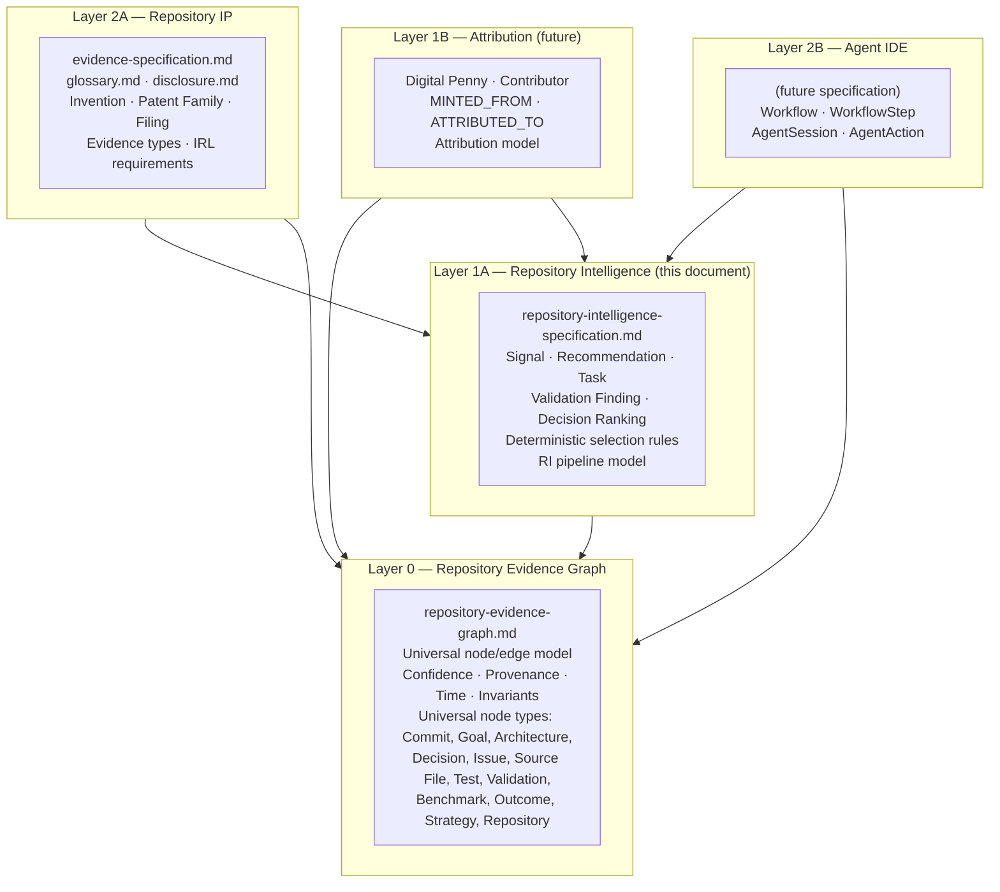
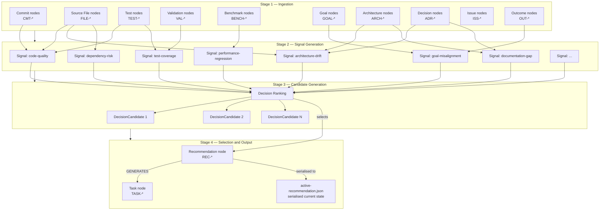
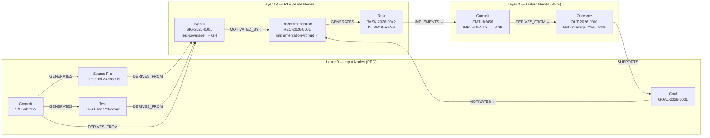

# Repository Intelligence Specification

## Purpose

This document defines Repository Intelligence (RI) as a Layer 1A subsystem of the
Repository Evidence Graph architecture. It specifies how raw repository artifacts —
commits, source files, tests, architecture records, decisions, issues, outcomes —
are transformed into structured intelligence signals, ranked into decision candidates,
and selected as recommendations that drive engineering work.

Repository Intelligence is the analysis and selection layer. It consumes Layer 0
(REG) nodes and produces higher-order nodes — Signals, Recommendations, Tasks,
Validation Findings, and Outcomes — that are themselves written back into the REG
and made available to Layer 2A (Repository IP), Layer 2B (Agent IDE), and future
Layer 1B (Attribution) consumers.

This document does not define REG primitives (node model, edge types, confidence
scale, graph invariants, universal principles). Those are authoritative in
`repository-evidence-graph.md`. This document defines only the Layer 1A concepts
that sit above those primitives.

---

## Audience

- Engineers building the Repository Intelligence pipeline or extending its signal
  generators
- AI systems operating within Agent IDE that produce or consume RI node types
- Architects of Layer 2A (IP) and Layer 2B (Agent IDE) specifications that depend
  on RI outputs
- Engineers and AI agents executing recommendations who need to understand how a
  recommendation was selected and what its implementation prompt represents
- Future Layer 1B (Attribution) specification authors who need to understand how
  Task completion connects to contribution attribution

---

## Status

`ACTIVE — v1.0 — 2026-06-28`

---

## Layer Position



Repository Intelligence is the lowest-numbered layer that produces structured
decisions. It is the only layer permitted to select a recommendation from a ranked
set of candidates. Layers above it consume its outputs; they do not re-rank or
re-select.

---

## Dependencies

| Document | Path | Relationship |
|---|---|---|
| Repository Evidence Graph | `./repository-evidence-graph.md` | Layer 0 substrate. Authoritative source for node model, edge types, confidence scale, graph invariants, and universal node types (Commit, Goal, Architecture, Decision, Issue, Outcome, etc.). All RI nodes are REG nodes. |

## Known Consumers

| Consumer | Path | What they consume |
|---|---|---|
| Evidence Specification | `./evidence-specification.md` | `repository-intelligence-artifact` evidence type (Section 2.6) — RI Signals and Recommendations used as IP evidence |
| Agent IDE (Layer 2B) | *(future specification)* | Recommendation `implementationPrompt`, `workflowKey` derivation, Task lifecycle |
| Attribution (Layer 1B) | *(future specification)* | Task completion → Commit chain → ATTRIBUTED_TO → Digital Penny |

---

## Revision History

| Version | Date | Author | Summary |
|---|---|---|---|
| 1.0 | 2026-06-28 | Agent IDE Architect | Initial specification. Defines Layer 1A Signal, Recommendation, Task, Validation Finding, Outcome, and Decision Ranking node types. Supersedes REG placeholder definitions for Recommendation (Section 3.7) and Task (Section 3.8). |

---

## Section 1 — Layer Position

Repository Intelligence occupies Layer 1A of the four-layer architecture. Its
position has three consequences:

**Upward from Layer 0:** RI reads REG nodes by type. It does not read raw files
directly; every file it reasons about must be represented as a REG node first. The
REG is the single source of truth about what exists in the repository and what
relationships those artifacts have.

**Downward obligation to Layer 0:** Every RI output — Signal, Recommendation, Task,
Validation Finding, Outcome — must be written back into the REG as a node with full
provenance. RI does not maintain private state outside the graph. The graph is its
audit log.

**Upward constraint on Layer 2+:** Layers 2A and 2B consume RI outputs but do not
modify the selection process. A Recommendation produced by RI is immutable. If a
higher layer needs a different recommendation, it must trigger RI to re-run, producing
a new Recommendation node that supersedes the prior one via a SUPERSEDES edge.

This document supersedes the placeholder payload definitions for Recommendation
(REG Section 3.7) and Task (REG Section 3.8). The edge participation rules in those
sections remain authoritative in the REG; only the payload schemas are elevated here.

---

## Section 2 — Repository Intelligence Pipeline

The RI pipeline transforms raw REG nodes into a selected Recommendation in four stages:



Each stage produces REG nodes. No stage retains private state. If the pipeline is
interrupted at any stage, the graph state at interruption can be read, and the pipeline
resumes from the last committed node rather than restarting from scratch.

---

## Section 3 — Inputs

### 3.1 Required Input Node Types

RI reads the following REG node types as inputs. All are universal node types defined
in `repository-evidence-graph.md` Section 3. RI does not define these types; it
consumes them.

| Node Type | REG Section | What RI reads from it |
|---|---|---|
| Repository | 3.1 | Root context: remote URL, default branch, initialization state |
| Goal | 3.2 | Active goals with priority ordering; used for goal-alignment scoring |
| Strategy | 3.3 | Active strategies; used to understand which goals are currently being pursued |
| Architecture | 3.4 | Active architecture records; used to detect drift between design and implementation |
| Decision | 3.5 | Accepted ADRs; used to understand rationale for current design choices |
| Issue | 3.6 | Open issues; used as signals for known problem areas |
| Commit | 3.9 | Recent commits; used for activity pattern analysis and Inventive Date anchoring |
| Source File | 3.10 | File-level metrics at a commit; used for code-quality signal generation |
| Test | 3.11 | Test pass/fail state; used for test-coverage signal generation |
| Validation | 3.12 | Validation run outcomes; used for quality-gate assessment |
| Benchmark | 3.13 | Performance measurements; used for regression detection |
| Outcome | 3.20 | Documented results; used for goal-progress assessment and next-action selection |

### 3.2 Input Freshness

RI evaluates the REG state at a specific point in time. The `evaluatedAt` field on a
Recommendation node records this timestamp. An RI pipeline run is always a snapshot
evaluation, not a continuous query.

For consistency with REG temporal reasoning (REG Section 2.5), RI uses `artifactDate`
(not `createdAt` / graph time) when sorting inputs by recency. A commit from six months
ago that was indexed into the REG today is treated as six months old, not as today's input.

### 3.3 Prior Recommendation Exclusion

Before generating candidates, RI reads all existing Recommendation nodes reachable
from the Repository node via SUPERSEDES chains. Candidates whose `title` or
`displayTitle` substantially duplicates a Recommendation that:

- Is the current head of a SUPERSEDES chain (not itself superseded), AND
- Has a downstream Task node with `status: COMPLETE` or `status: IN_PROGRESS`

are excluded from the current candidate set to avoid recommending work that has been
completed or is underway.

---

## Section 4 — Outputs

### 4.1 Output Node Types

The RI pipeline produces the following REG node types. All are written into the REG
as new nodes with full provenance records (see REG Section 2.4).

| Node Type | ID Format | Defined In | Lifecycle |
|---|---|---|---|
| Signal | `SIG-{YEAR}-{SEQ}` | Section 5 of this document | Created per pipeline run; superseded by later runs |
| Recommendation | `REC-{YEAR}-{SEQ}` | Section 6 of this document | Immutable once created; superseded by next recommendation |
| Task | `TASK-{YEAR}-{SEQ}` | Section 7 of this document | Mutable status; PENDING → IN_PROGRESS → COMPLETE or ABANDONED |
| Validation Finding | `VF-{YEAR}-{SEQ}` | Section 8 of this document | Snapshot per validation run; not superseded, CONTRADICTS used to flag reversals |
| Outcome | `OUT-{YEAR}-{SEQ}` | REG Section 3.20 (universal); RI produces instances | Created when a Task is verified to have produced a measurable result |

### 4.2 The active-recommendation.json Artifact

The RI pipeline serialises the current Recommendation node — including its selected
DecisionCandidate and full `implementationPrompt` — to a file at
`.ai/active-recommendation.json` in the repository. This file is the bridge between
the REG graph model and the runtime that executes recommendations.

**Authority rule:** `.ai/active-recommendation.json` is a derivative of the REG
Recommendation node. When the two diverge — which should not happen during normal
operation — the REG node is authoritative. The file is a convenience serialisation;
it does not override the graph.

**Contents:** The file must contain the full payload of the selected Recommendation
node plus the selected DecisionCandidate payload. It must not contain truncated or
reformatted versions of `implementationPrompt`; the full text is required.

**Persistence contract:** When a new Recommendation is selected (a new Recommendation
node is written to the REG and a SUPERSEDES edge is added from the new to the prior),
`active-recommendation.json` must be rewritten atomically before the pipeline reports
completion. If the file is absent, `readControlPlane()` must treat the repository as
having no current recommendation, not fall back to a stale prior recommendation.

---

## Section 5 — Repository Intelligence Signal

### 5.1 Definition

A Signal is a machine-computed, structured observation about a specific pattern
detected in one or more REG nodes. Signals are the intermediate product of Stage 2
in the RI pipeline — they transform raw repository state into actionable assessments.
A Signal is not a recommendation; it is an observation from which candidates are derived.

Signals are REG nodes. They have all standard REG node properties plus the
Signal-specific payload defined below. Once written, a Signal is immutable (REG
INV-12). When a new pipeline run produces an updated Signal for the same pattern,
a new Signal node is created and a SUPERSEDES edge points from new to old.

**Canonical ID format:** `SIG-{YEAR}-{SEQ}` (e.g., `SIG-2026-0001`)

### 5.2 Signal Kinds

| Signal Kind | Trigger Condition | Primary Input Node Types |
|---|---|---|
| `code-quality` | Static analysis findings, complexity thresholds, or lint violations in Source File nodes | Source File, Commit |
| `test-coverage` | Test node coverage below threshold, or Test nodes with `outcome: fail` | Test, Validation, Source File |
| `architecture-drift` | Source File nodes that implement patterns inconsistent with Architecture or Decision nodes | Architecture, Decision, Source File, Commit |
| `dependency-risk` | Source File nodes referencing dependencies with known vulnerability signals or version staleness | Source File, Commit |
| `performance-regression` | Benchmark nodes showing degradation versus prior baseline in the SUPERSEDES chain | Benchmark, Commit |
| `documentation-gap` | Architecture nodes with no corresponding IMPLEMENTS source files, or Decision nodes with no implementing commits | Architecture, Decision, Source File |
| `goal-misalignment` | Commit or Task activity with no IMPLEMENTS path to any active Goal node | Goal, Commit, Task, Outcome |
| `test-gap` | Source File nodes with no inbound VALIDATES edge from a Test node | Source File, Test |
| `validation-failure` | Validation nodes with `outcome: fail` that have not been resolved by a subsequent pass node | Validation |

Signal kinds are extensible. New kinds may be added by incrementing the schema minor
version (Section 19.3). Existing kinds are never removed.

### 5.3 Signal Payload

| Field | Type | Required | Description |
|---|---|---|---|
| `signalId` | string | yes | Canonical SIG-ID |
| `signalKind` | string | yes | One of the canonical kinds in Section 5.2, or an extension kind |
| `severity` | string | yes | `CRITICAL` / `HIGH` / `MEDIUM` / `LOW` / `INFO` |
| `confidence` | string | yes | REG confidence scale (REG Section 2.6): `DEFINITIVE` / `HIGH` / `MEDIUM` / `LOW` / `UNVERIFIED` |
| `sourceNodeIds` | string[] | yes | REG nodeIds of the nodes that produced this signal. At least one required. |
| `generatedAt` | ISO 8601 | yes | Timestamp of signal generation |
| `generatedBy` | string | yes | Pipeline identity (system name and version) |
| `summary` | string | yes | One-sentence human-readable description of the observation |
| `detail` | string | yes | Full description with specific artifacts, thresholds, and measured values |
| `actionability` | string | yes | `code-fixable` / `process-change` / `strategic` / `informational` |
| `estimatedEffort` | string | no | `XS` / `S` / `M` / `L` / `XL` |
| `affectedPaths` | string[] | no | Repository paths specifically implicated by this signal |
| `metricValue` | number | no | Numeric measurement (e.g., coverage percentage, latency ms) |
| `metricThreshold` | number | no | Threshold the metric failed to meet |
| `metricUnit` | string | no | Unit of measurement |

### 5.4 Signal Edge Participation

| Edge Type | Direction | Meaning |
|---|---|---|
| `DERIVES_FROM` | Signal → source REG nodes (`sourceNodeIds`) | Signal was computed from these nodes |
| `SUPPORTS` | Signal → Goal | Signal establishes that goal-directed work is needed |
| `MOTIVATED_BY` | Candidate / Recommendation → Signal | The candidate addresses this signal |
| `SUPERSEDES` | New Signal → prior Signal of same kind | Updated observation replaces prior |

### 5.5 Signal Confidence

Signal confidence is assigned by the generator using the REG confidence scale. The
confidence of a Signal reflects how certain the pipeline is that the observation is
correct — not how severe the issue is (that is `severity`). These are independent
fields.

A Signal with `confidence: MEDIUM` and `severity: CRITICAL` is a critical observation
the pipeline is not fully certain about. A Signal with `confidence: HIGH` and
`severity: LOW` is a low-priority but verified observation.

The REG confidence inheritance rule (REG INV-14) applies to Signal nodes: a Signal
that `DERIVES_FROM` nodes with minimum confidence `MEDIUM` may not itself be `HIGH`
without independent corroboration.

---

## Section 6 — Recommendation

### 6.1 Definition

A Recommendation is the output of Stage 4 — a single, selected engineering action
that the RI pipeline has determined is the highest-value next improvement for the
repository at the time of the pipeline run. A Recommendation is immutable once
written to the REG. It represents the pipeline's selection decision at a specific
moment; it does not change as the repository evolves. The next run produces a new
Recommendation node.

**This section supersedes the payload definition in REG Section 3.7.** The edge
participation rules in REG Section 3.7 remain authoritative.

**Canonical ID format:** `REC-{YEAR}-{SEQ}` (e.g., `REC-2026-0001`)

### 6.2 Recommendation Payload

| Field | Type | Required | Description |
|---|---|---|---|
| `recommendationId` | string | yes | Canonical REC-ID |
| `title` | string | yes | Full canonical title used as a stable key; unique within the repository's RI history |
| `originalRecommendationTitle` | string | no | Title of the prior recommendation this supersedes, if any; used for `workflowKey` derivation continuity |
| `displayTitle` | string | yes | Human-facing short title for UI display |
| `implementationPrompt` | string | yes | Complete, untruncated implementation guidance for an engineer or AI agent executing this recommendation. This is the single source of truth for what the recommendation asks for. It must not be reformatted, summarised, or generated from other fields by consumers. |
| `promptHash` | string | yes | SHA-256 hash of the UTF-8 encoding of `implementationPrompt`. Used by consumers to detect integrity violations. |
| `packageType` | string | yes | `implementation` — executable recommendation with a defined deliverable; `task-clarification` — recommendation requires clarification before execution |
| `actionability` | string | yes | `code-fixable` / `process-change` / `strategic` / `documentation` / `investigation` |
| `selectionRationale` | string | yes | Why this candidate was selected over alternatives. References specific ranking factors. |
| `generatedAt` | ISO 8601 | yes | Timestamp of recommendation generation |
| `evaluatedAt` | ISO 8601 | yes | Timestamp of the REG snapshot this recommendation was generated from |
| `candidateCount` | integer | yes | Total number of candidates evaluated before selection |
| `selectedCandidateId` | string | yes | ID of the selected DecisionCandidate (Section 13) |
| `candidates` | DecisionCandidate[] | yes | All candidates evaluated, in rank order. See Section 13. |
| `signalIds` | string[] | yes | SIG-IDs of all Signals that informed this recommendation |
| `decisionRanking` | object | yes | Structured ranking data. See Section 13. |

### 6.3 The implementationPrompt Invariant

The `implementationPrompt` field is the single source of truth for what a recommendation
asks an engineer or AI agent to do. Every consumer — UI display, clipboard copy, Codex
invocation, workflow initialisation — must read from this field exclusively. No consumer
may derive the implementation prompt from any other field, from the `displayTitle`, from
prior recommendations, or from the recommendation category.

This invariant exists because the RI pipeline's selection logic may produce an
`implementationPrompt` whose wording differs materially from what its title implies.
The title identifies the recommendation; the prompt specifies it. These are not
interchangeable.

**Consumers that violate this invariant produce stale-prompt bugs.** The canonical
diagnosis path for a stale prompt is: verify that the consumer reads
`data.recommendation.implementationPrompt` directly, not from any other field or any
cached version of the recommendation.

### 6.4 workflowKey Derivation

The `workflowKey` is a stable identifier for the workflow state associated with a
specific recommendation, used by Layer 2B (Agent IDE) to resume an in-progress
workflow or reset stale state when the recommendation changes.

**Derivation rule:**

```
workflowKey = "{packageType}:{category}:{effectiveTitle}"

where:
  packageType   = recommendation.packageType  (if "task-clarification": use "implementation")
  category      = selectedCandidate.category  (may be omitted if null)
  effectiveTitle = recommendation.originalRecommendationTitle
                   ?? recommendation.displayTitle
                   ?? recommendation.title
```

The `workflowKey` must be derived identically by all consumers. Any two systems given
the same Recommendation node must compute the same `workflowKey`. If `workflowKey`
computation logic is stored outside the REG, it must reference this section as the
authority.

### 6.5 Recommendation Freshness

A Recommendation is stale when:
1. The REG contains a Recommendation node that SUPERSEDES it (a newer recommendation exists), OR
2. The `active-recommendation.json` file contains a different `recommendationId` than the
   current head of the Recommendation SUPERSEDES chain

When either condition holds, consumers must discard cached state derived from the stale
recommendation and re-read from the current head of the SUPERSEDES chain.

---

## Section 7 — Task

### 7.1 Definition

A Task is a unit of engineering work created when a Recommendation is accepted for
execution. A Task node tracks the lifecycle of one work item from assignment through
completion. A Recommendation produces exactly one Task; if the same recommendation
is reissued (superseded and re-selected), a new Task is produced from the new
Recommendation node.

**This section supersedes the payload definition in REG Section 3.8.** The edge
participation rules in REG Section 3.8 remain authoritative.

**Canonical ID format:** `TASK-{YEAR}-{SEQ}` (e.g., `TASK-2026-0042`)

### 7.2 Task Payload

| Field | Type | Required | Description |
|---|---|---|---|
| `taskId` | string | yes | Canonical TASK-ID |
| `title` | string | yes | Task title, derived from `selectedCandidate.engineeringTask.title` or `selectedCandidate.title` or `recommendation.displayTitle` (in that priority order) |
| `description` | string | yes | Full task description |
| `status` | string | yes | `PENDING` / `IN_PROGRESS` / `COMPLETE` / `ABANDONED` |
| `assignedTo` | string | yes | Identity of the engineer or AI agent assigned to execute the task |
| `startedAt` | ISO 8601 | no | Timestamp when execution began |
| `completedAt` | ISO 8601 | no | Timestamp when execution completed |
| `category` | string | no | Engineering category (from `selectedCandidate.category`) |
| `ownerAction` | string | no | What the owner must do (from `selectedCandidate.ownerAction`) |
| `workflowKey` | string | yes | Workflow state key derived per Section 6.4 |
| `recommendationId` | string | yes | REC-ID of the Recommendation that generated this Task |

### 7.3 Task Lifecycle

```mermaid
stateDiagram-v2
    [*] --> PENDING : Task created\n(GENERATES edge from Recommendation)
    PENDING --> IN_PROGRESS : Engineer or agent begins execution
    IN_PROGRESS --> COMPLETE : Execution finished; Outcome node created
    IN_PROGRESS --> ABANDONED : Task discarded; rationale recorded
    COMPLETE --> [*] : Outcome node linked via DERIVES_FROM ← Commit chain
    ABANDONED --> [*] : SUPERSEDES chain continues from Recommendation

    note right of COMPLETE
        At least one Commit node with
        IMPLEMENTS → Task edge must exist
        before status transitions to COMPLETE.
        Outcome node must be created within
        one pipeline run of completion.
    end note

    note right of ABANDONED
        An ABANDONED Task does not prevent
        the same Recommendation from being
        re-selected in a future pipeline run.
        A new Task node is created; the
        ABANDONED Task remains in the graph.
    end note
```



### 7.4 Task-to-Commit Traceability

When an engineer or AI agent executes a Task, the commits produced during execution
must carry an `IMPLEMENTS` edge pointing to the Task node. This edge is the primary
mechanism by which the attribution pipeline traces contributions from Task to Commit
to contributor identity.

A Task marked `COMPLETE` with no inbound `IMPLEMENTS` edges from Commit nodes is a
traceability gap and must be flagged by validators.

---

## Section 8 — Validation Finding

### 8.1 Definition

A Validation Finding is a discrete, addressable observation produced by the RI
validation sub-pipeline that identifies a specific gap, violation, or risk in the
repository. Validation Findings are distinct from REG Validation nodes (which record
pipeline run outcomes) in that a Finding is about a specific artifact or pattern, not
about the pipeline run itself.

**Canonical ID format:** `VF-{YEAR}-{SEQ}` (e.g., `VF-2026-0001`)

### 8.2 Validation Finding Payload

| Field | Type | Required | Description |
|---|---|---|---|
| `findingId` | string | yes | Canonical VF-ID |
| `findingKind` | string | yes | Category of finding (see 8.3) |
| `severity` | string | yes | `BLOCKING` / `WARNING` / `INFO` |
| `confidence` | string | yes | REG confidence scale |
| `affectedNodeId` | string | yes | The REG nodeId of the node this finding is about |
| `ruleId` | string | no | For RI-internal rules: `RI-F{N}` format. For IP validation rules: cross-reference from `evidence-specification.md` Section 9 |
| `summary` | string | yes | One-sentence description of the finding |
| `remediation` | string | yes | Specific action that resolves this finding |
| `generatedAt` | ISO 8601 | yes | Timestamp of finding generation |
| `resolvedAt` | ISO 8601 | no | Timestamp when this finding was resolved |
| `resolvedBy` | string | no | Identity that resolved this finding |

### 8.3 Validation Finding Kinds

| Finding Kind | Description | Severity |
|---|---|---|
| `traceability-gap` | A node with no path to the Repository root via typed edges | BLOCKING |
| `confidence-violation` | A node whose confidence exceeds the maximum derivable from its inputs (REG INV-14) | BLOCKING |
| `temporal-violation` | A DERIVES_FROM or PRECEDES edge that violates temporal constraints (REG INV-06, INV-07) | BLOCKING |
| `task-completion-gap` | A Task node with status COMPLETE but no inbound IMPLEMENTS edges from Commits | WARNING |
| `goal-orphan` | An active Goal with no Recommendation, Task, or Outcome reachable from it | WARNING |
| `signal-unaddressed` | A Signal with severity HIGH or CRITICAL with no candidate or recommendation MOTIVATED_BY it | WARNING |
| `recommendation-staleness` | active-recommendation.json contains a different recommendationId than the REG head | BLOCKING |
| `prompt-integrity` | SHA-256 of active-recommendation.json implementationPrompt does not match promptHash in REG | BLOCKING |

### 8.4 Validation Finding Edge Participation

| Edge Type | Direction | Meaning |
|---|---|---|
| `DERIVES_FROM` | VF → affected REG node | Finding was computed from this node |
| `SUPPORTS` | VF → Recommendation | Finding supports selecting a specific recommendation |
| `CONTRADICTS` | VF → prior VF | New finding reverses a prior finding (e.g., a gap has been filled) |

---

## Section 9 — Outcome

### 9.1 Definition

An Outcome records a measurable result produced by completing a Task. Outcome nodes
are defined as universal in REG Section 3.20; this section defines how RI produces
them and what the production rules are.

RI produces an Outcome node when all of the following hold:
1. A Task node transitions to `status: COMPLETE`
2. At least one Commit node exists with `IMPLEMENTS` → Task
3. A measurable result can be computed from the repository state after the commits
   (a Validation run passing, a Benchmark improving, a Test that previously failed now passing)

RI must not create an Outcome node from a COMPLETE Task that has no verifiable result.
A narrative description is not sufficient; the Outcome must have a `metric` and
`result` field populated.

### 9.2 Outcome Edge Requirements

When RI creates an Outcome node:

| Edge | Required | Meaning |
|---|---|---|
| `DERIVES_FROM` ← Commit | yes (at least one) | The commits that produced this outcome |
| `SUPPORTS` → Goal | yes (at least one) | The goal this outcome advances |
| `DERIVES_FROM` ← Task | yes (exactly one) | The task whose completion produced this outcome |
| `SUPPORTS` → Recommendation | recommended | The recommendation that predicted this outcome would result |

---

## Section 10 — Decision Candidate

### 10.1 Definition

A DecisionCandidate represents a single actionable option evaluated during Stage 3
of the RI pipeline. Candidates are generated from Signals and ranked by the Decision
Ranking process. The selected candidate becomes the core of the Recommendation.

DecisionCandidates are not independent REG nodes. They are structured objects embedded
in the Recommendation node's `candidates` payload field. They exist within the
Recommendation that evaluated them; they are not separately queryable as nodes.

### 10.2 DecisionCandidate Structure

| Field | Type | Required | Description |
|---|---|---|---|
| `candidateId` | string | yes | Stable ID within the Recommendation (e.g., `C-001`). Not a REG nodeId. |
| `title` | string | yes | Canonical title for de-duplication and prior-recommendation comparison |
| `displayTitle` | string | yes | Human-facing short title |
| `category` | string | yes | Engineering category (e.g., `testing`, `architecture`, `performance`, `documentation`, `security`, `dependencies`) |
| `engineeringTask` | object | no | Structured task definition: `{ title, description, estimatedEffort }` |
| `ownerAction` | string | no | What the task owner must do in one sentence |
| `implementationPrompt` | string | yes | Full implementation guidance for this specific candidate |
| `score` | number | yes | Composite ranking score (0.0–1.0) |
| `rankingFactors` | object | yes | Per-dimension scores used to compute `score`. See Section 13. |
| `signalIds` | string[] | yes | SIG-IDs of the Signals that motivated this candidate |

---

## Section 11 — Decision Ranking

### 11.1 Purpose

Decision Ranking is the algorithm that converts a set of DecisionCandidates into a
rank-ordered list from which the top-ranked candidate is selected. The ranking is
deterministic: given the same candidates and the same REG state, any two executions
of the ranking algorithm must produce the same rank order. This determinism is an
invariant of the RI pipeline (RI-INV-01; see Section 17).

### 11.2 Ranking Dimensions

Each candidate is scored on the following dimensions. Scores are normalised to 0.0–1.0
per dimension before weighting.

| Dimension | Weight | Description |
|---|---|---|
| `goalAlignment` | 0.30 | How directly this candidate advances one or more active Goal nodes (follows MOTIVATES edges from Goal to candidate's signals) |
| `evidenceConfidence` | 0.20 | Minimum confidence of the Signal nodes motivating this candidate (REG confidence scale: DEFINITIVE=1.0, HIGH=0.8, MEDIUM=0.5, LOW=0.2, UNVERIFIED=0.0) |
| `severity` | 0.20 | Severity of the highest-severity Signal motivating this candidate (CRITICAL=1.0, HIGH=0.75, MEDIUM=0.5, LOW=0.25, INFO=0.0) |
| `effort` | 0.15 | Inverse of estimated effort (XS=1.0, S=0.8, M=0.6, L=0.4, XL=0.2, unknown=0.5) |
| `novelty` | 0.15 | Whether this candidate has not appeared in recent Recommendations (not superseded in the current SUPERSEDES chain) |

**Total weight:** 1.0. Weights are fixed in this version. Future versions may
make weights configurable per-repository (see Section 19).

### 11.3 Composite Score

```
score = (goalAlignment × 0.30)
      + (evidenceConfidence × 0.20)
      + (severity × 0.20)
      + (effort × 0.15)
      + (novelty × 0.15)
```

### 11.4 Tie-Breaking

When two candidates have equal composite scores (to four decimal places), tie-breaking
applies in this order:

1. Higher `goalAlignment` wins
2. Higher `severity` wins
3. Lower estimated effort wins (XS before XL)
4. Lexicographic order on `candidate.title` (ascending) — deterministic last resort

No two candidates with the same title may appear in the same candidate set.
Deduplication is applied before ranking.

### 11.5 Decision Ranking Payload

The `decisionRanking` field on the Recommendation node contains:

| Field | Type | Description |
|---|---|---|
| `algorithm` | string | Identifier for the ranking algorithm version (e.g., `"ri-rank-v1"`) |
| `evaluatedAt` | ISO 8601 | When the ranking was computed |
| `candidateCount` | integer | Number of candidates evaluated |
| `weights` | object | Dimension weights used: `{ goalAlignment, evidenceConfidence, severity, effort, novelty }` |
| `topScores` | array | `[{ candidateId, score, rankingFactors }]` for all candidates, rank-ordered |

---

## Section 12 — Traceability to REG

### 12.1 Every RI Output is a REG Node

Every node produced by the RI pipeline — Signal, Recommendation, Task, Validation
Finding — must be written to the REG with:

- A unique nodeId in the canonical ID format for its type
- A `provenance` record with `sourceKind: "ai-system"` or `"automated-pipeline"`,
  `sourceIdentity` set to the pipeline identifier and version, and `inputNodeIds`
  listing every REG node that was read to produce this output
- A `confidence` value on the REG scale (REG Section 2.6)
- `createdAt` set to the wall-clock time of the write

### 12.2 REG Traceability Path: Source Artifact to Selected Task



Every arrow in this diagram is a typed REG edge. Any system that reads the REG can
reconstruct this full chain from any node without accessing RI-private state.

### 12.3 Recommendation → Task → Outcome Lifecycle

```mermaid
stateDiagram-v2
    state "RI Pipeline" as RI {
        [*] --> SignalsGenerated : Repository scan complete
        SignalsGenerated --> CandidatesRanked : Signal → DecisionCandidate mapping
        CandidatesRanked --> RecommendationSelected : Top candidate selected
        RecommendationSelected --> RecommendationWritten : REC node written to REG;\nactive-recommendation.json written
    }

    state "Task Execution" as EX {
        RecommendationWritten --> TaskCreated : TASK node created;\nGENERATES edge from REC
        TaskCreated --> WorkInProgress : Engineer/agent begins;\nstatus → IN_PROGRESS
        WorkInProgress --> CommitsProduced : Commits with IMPLEMENTS → TASK
        CommitsProduced --> ValidationRun : Validation pipeline executes
        ValidationRun --> OutcomeRecorded : OUT node written;\nSUPPORTS → Goal
    }

    state "Next Cycle" as NC {
        OutcomeRecorded --> NewScan : Outcome node ingested;\nGoal progress updated
        NewScan --> NewRecommendation : New REC node;\nSUPERSEDES prior REC
    }

    OutcomeRecorded --> [*] : Traceability chain complete\nin REG
```

---

## Section 13 — Deterministic Selection Rules

The following invariants govern the RI pipeline. A pipeline implementation that
violates any of these is non-conformant with this specification, regardless of the
quality of its outputs.

| ID | Invariant | Consequence of Violation |
|---|---|---|
| RI-INV-01 | Given the same REG state, any two executions of the RI pipeline must produce the same Recommendation | Non-determinism is a specification violation; results are not reproducible or auditable |
| RI-INV-02 | A Recommendation's `implementationPrompt` must never be generated from any field other than the selected candidate's `implementationPrompt`; no fallback to `displayTitle`, prior prompts, or category descriptions | Stale-prompt bug; consumers receive guidance that does not match the selected candidate |
| RI-INV-03 | `promptHash` must be the SHA-256 hash of the UTF-8 `implementationPrompt` at the time of writing; it must never be computed from a truncated or normalised version | Integrity violations are undetectable |
| RI-INV-04 | A Recommendation node is immutable once written to the REG. `implementationPrompt` and `selectedCandidateId` must not change | Downstream tasks and workflows would be invalidated silently |
| RI-INV-05 | `active-recommendation.json` must be written atomically with the Recommendation node; partial writes must roll back | Consumers that read the file mid-write receive corrupt state |
| RI-INV-06 | A new Recommendation must write a SUPERSEDES edge to the prior Recommendation before `active-recommendation.json` is rewritten | `readControlPlane()` might serve the old file with the new node, or vice versa |
| RI-INV-07 | A Task node must carry a GENERATES ← Recommendation edge; a Task without this edge is an orphan and must not be acted on | No traceability from task back to the selection decision |
| RI-INV-08 | Ranking scores must be computed identically across pipeline implementations; dimension weights and tie-breaking rules must match Section 11 | Different pipeline implementations produce different selections from the same inputs |
| RI-INV-09 | Prior-recommendation exclusion (Section 3.3) must be applied before ranking, not after | Already-completed work may be recommended again |
| RI-INV-10 | A Signal node's `sourceNodeIds` must contain only REG nodeIds of nodes that actually exist in the REG at `generatedAt` | Orphaned signals cannot be traced back to source artifacts |

---

## Section 14 — Failure Modes

### 14.1 No Actionable Signals

**Condition:** The pipeline completes Stage 2 but generates no Signals with
`actionability` other than `informational`, or generates no Signals at all.

**Correct behaviour:** The pipeline writes a Validation Finding of kind
`goal-orphan` for each active Goal with no candidate addressing it. It does not
write a Recommendation node. It does not overwrite `active-recommendation.json`.
The prior recommendation remains current.

**Incorrect behaviour:** Writing a Recommendation with an empty or placeholder
`implementationPrompt`, or writing a Recommendation whose prompt is derived from
a Signal rather than a candidate.

### 14.2 Conflicting Signals

**Condition:** Two Signals of the same kind apply to the same source node with
conflicting severity assessments.

**Correct behaviour:** Emit a Validation Finding of kind `confidence-violation`
for the conflict. Use the lower of the two severity values for ranking purposes.
Emit both Signals with a CONTRADICTS edge from the lower-confidence Signal to
the higher-confidence Signal.

### 14.3 All Candidates Excluded by Prior-Recommendation Filter

**Condition:** Every generated candidate substantially duplicates a prior
Recommendation with a downstream COMPLETE Task.

**Correct behaviour:** Re-run candidate generation with the exclusion filter
relaxed for candidates whose corresponding Task completed more than 90 days ago.
If still no candidates survive, emit a Validation Finding with `findingKind:
goal-orphan` for each active Goal and do not write a Recommendation.

**Rationale:** A repository where all remaining work has been completed recently
is not an error condition. The pipeline reports this accurately rather than
inventing work to recommend.

### 14.4 Confidence Too Low to Select

**Condition:** All candidates have `evidenceConfidence` of `UNVERIFIED` (score 0.0)
because all their motivating Signals derive only from `UNVERIFIED` source nodes.

**Correct behaviour:** Do not write a Recommendation. Emit Validation Findings
for the `UNVERIFIED` source nodes explaining what verification is needed.

### 14.5 active-recommendation.json Integrity Failure

**Condition:** At startup, `readControlPlane()` detects that the SHA-256 of
`implementationPrompt` in `active-recommendation.json` does not match
`recommendation.promptHash`.

**Correct behaviour:** Treat the file as corrupt. Fall back to reading the
Recommendation node directly from the REG by querying for the current head of
the SUPERSEDES chain rooted at the Repository node. Do not use the file's prompt.
Emit a Validation Finding of kind `prompt-integrity`.

**Incorrect behaviour:** Using the file's prompt despite the integrity failure;
re-computing the prompt from other fields; silently ignoring the mismatch.

---

## Section 15 — Relationship to Repository IP

### 15.1 RI Signals as IP Evidence

A Repository Intelligence Signal that predates an Invention's conception date and
identifies the same problem the Invention solves is valid IP evidence of type
`repository-intelligence-artifact` (defined in `evidence-specification.md` Section 2.6).

When a Signal is used as IP evidence, it must:
1. Be linked as an Evidence Artifact node in the per-invention evidence subgraph
   (`evidence-graph.json`) with `evidenceType: "repository-intelligence-artifact"`
2. Carry a SUPPORTS edge pointing to the relevant disclosure section
3. Have `inventiveRole: "conception"` if it predates the first implementation commit
4. Have `confidence` no higher than `MEDIUM` (Signals are algorithmically generated;
   they do not achieve `HIGH` without corroboration from a repository artifact)

The Signal node's `signalId` should appear in the evidence artifact's `artifactPath`
field or equivalent cross-reference so that the REG node and the IP evidence record
are bidirectionally traceable.

### 15.2 Recommendations and Invention Disclosure Motivation

When an engineer creates an Invention Disclosure that was motivated by a specific
Recommendation (the Recommendation selected the engineering task that led to the
invention), the Invention node in the REG must carry a `GENERATES ←` edge from
the Recommendation node. This edge establishes that the IP pipeline is downstream
of the RI pipeline in the REG traceability chain.

The Disclosure Template (Section 16 of `inventions/TEMPLATE/disclosure.md`) asks
for the motivating Recommendation's ID. That ID resolves to a Recommendation node
in the REG, from which the full decision history is recoverable.

### 15.3 RI Does Not Own IP Concepts

RI is Layer 1A. Invention, Patent Family, Prior Art, Filing, Evidence Artifact
(IP-scoped), IRL levels, and Filing Status are all Layer 2A concepts. RI must not
produce or read these node types. The boundary is enforced through the layer
dependency rule: Layer 1A depends only on Layer 0 (REG). It does not depend on
Layer 2A documents.

---

## Section 16 — Relationship to Digital Penny Attribution

### 16.1 Task Completion as Attribution Trigger

When a Task transitions to `status: COMPLETE` and an Outcome node is created,
the Layer 1B Attribution pipeline (future specification) reads:

1. The Task node → `GENERATES ←` Commit nodes (via `IMPLEMENTS` edges)
2. Each Commit node → `ATTRIBUTED_TO` edges → contributor identities
3. The Outcome node → `SUPPORTS` → Goal nodes → impact measurement

From these inputs, the Attribution pipeline mints Digital Penny nodes, each with
a `MINTED_FROM` edge pointing to the specific Commit or Task that earned the penny.

RI's obligation to Attribution is to produce complete, traceable Task nodes
with `IMPLEMENTS ← Commit` edges. A Task with no commits is an attribution gap.

### 16.2 Recommendation Attribution

A Recommendation node may carry `ATTRIBUTED_TO` edges to the AI system or engineer
who triggered the RI run. When RI is invoked autonomously (scheduled scan), the
`ATTRIBUTED_TO` target is the pipeline identity. When RI is invoked by a human
engineer, the `ATTRIBUTED_TO` target is the engineer's identity.

This attribution is informational and carries `attributionWeight: 1.0` on the edge;
it does not split credit between the pipeline and the engineer.

---

## Section 17 — Future Evolution

### 17.1 Configurable Ranking Weights

The current ranking dimension weights (Section 11.2) are fixed at the specification
level. A future minor version of this specification will allow per-repository weight
configuration stored as a REG node of a new type (`RankingConfig`) that the pipeline
reads as an input. The ranking algorithm identifier in `decisionRanking.algorithm`
will change to reflect the configuration version.

### 17.2 Multi-Signal Aggregation

The current model assigns one or more Signals to each candidate independently. A
future version will support Signal clusters — groups of Signals that collectively
motivate a single candidate — with aggregated confidence computed per REG INV-14
rules. The candidate's `evidenceConfidence` score will become a function of the
cluster's minimum confidence rather than the minimum of individual signal confidences.

### 17.3 Cross-Repository Signals

Signals currently derive from nodes within a single repository's REG. A future
Layer 1A extension will support `ExternalRepository` node types (defined in REG
Section 8.2 Planned Extensions) that allow signals from dependency repositories,
shared architecture repositories, or monorepo sub-packages to inform recommendations
in the consuming repository.

### 17.4 Autonomous Re-ranking

A future Layer 2B (Agent IDE) specification will define AgentSession and AgentAction
node types that record each step of autonomous recommendation execution. When an
autonomous agent completes a Task, the RI pipeline may use the `AgentAction` node
history as input to re-ranking, weighting recommendations that have been successfully
completed by prior autonomous sessions higher in the `novelty` dimension.

### 17.5 Schema Evolution Policy

This specification follows the REG schema versioning policy (REG Section 2.7):
- New optional payload fields → patch version increment
- New Signal kinds → minor version increment
- New node types (e.g., RankingConfig) → minor version increment
- Changes to ranking dimension definitions or weights → minor version increment
- Breaking changes to existing node or edge semantics → major version increment

---

## Section 18 — Consistency Audit

This section records the consistency of this specification against all documents it
depends on, as of the date of this version.

### 18.1 Dependency Check

| Dependency | Version Referenced | Status |
|---|---|---|
| `repository-evidence-graph.md` | v1.2 | ✓ All REG node and edge types referenced by section number. No REG concepts re-defined. |

### 18.2 Concept Ownership Check

| Concept | Claimed Owner | Correct Owner per Architecture Review | Status |
|---|---|---|---|
| Node model, edge model, confidence scale, invariants | REG Section 2 | REG (Layer 0) | ✓ Not re-defined here |
| Universal node types (Commit, Goal, etc.) | REG Section 3.1–3.13, 3.20 | REG (Layer 0) | ✓ Consumed, not re-defined |
| Signal node type | This document Section 5 | Layer 1A (this document) | ✓ New type, correct layer |
| Recommendation node payload | This document Section 6 | Layer 1A (supersedes REG 3.7 placeholder) | ✓ |
| Task node payload | This document Section 7 | Layer 1A (supersedes REG 3.8 placeholder) | ✓ |
| Validation Finding node type | This document Section 8 | Layer 1A (this document) | ✓ New type, correct layer |
| Outcome production rules | This document Section 9 | Layer 1A (production rules); REG 3.20 (node definition) | ✓ |
| DecisionCandidate structure | This document Section 10 | Layer 1A (embedded in Recommendation) | ✓ |
| Decision Ranking algorithm | This document Section 11 | Layer 1A (this document) | ✓ |
| Invention, Patent Family, Filing | Not defined here | Layer 2A (evidence-specification.md, glossary.md) | ✓ Not referenced |
| Digital Penny, MINTED_FROM | Not defined here | Layer 1B (future Attribution spec) | ✓ Referenced by name only; not re-defined |
| workflowKey | This document Section 6.4 | Layer 1A (RI) with Layer 2B (Agent IDE) as consumer | ✓ Defined here as authoritative derivation rule |

### 18.3 Circular Dependency Check

| Dependency path | Status |
|---|---|
| This document → REG | ✓ Layer 1A → Layer 0 (correct direction) |
| REG → this document | Does not exist — REG has no Layer 1A dependency | ✓ |
| This document → evidence-specification.md | Referenced in Section 15.1 by section number for context only; this document does not depend on it | ✓ |
| This document → glossary.md | Not referenced | ✓ |

No circular dependencies.

### 18.4 Placeholder Supersession

| REG Placeholder | Superseded By | Status |
|---|---|---|
| REG Section 3.7 — Recommendation payload | This document Section 6.2 | ✓ Edge participation in REG 3.7 remains authoritative; payload definition migrated here |
| REG Section 3.8 — Task payload | This document Section 7.2 | ✓ Edge participation in REG 3.8 remains authoritative; payload definition migrated here |

Consumers that previously read from REG Section 3.7 or 3.8 for payload schema
guidance should update their reference to this document.
