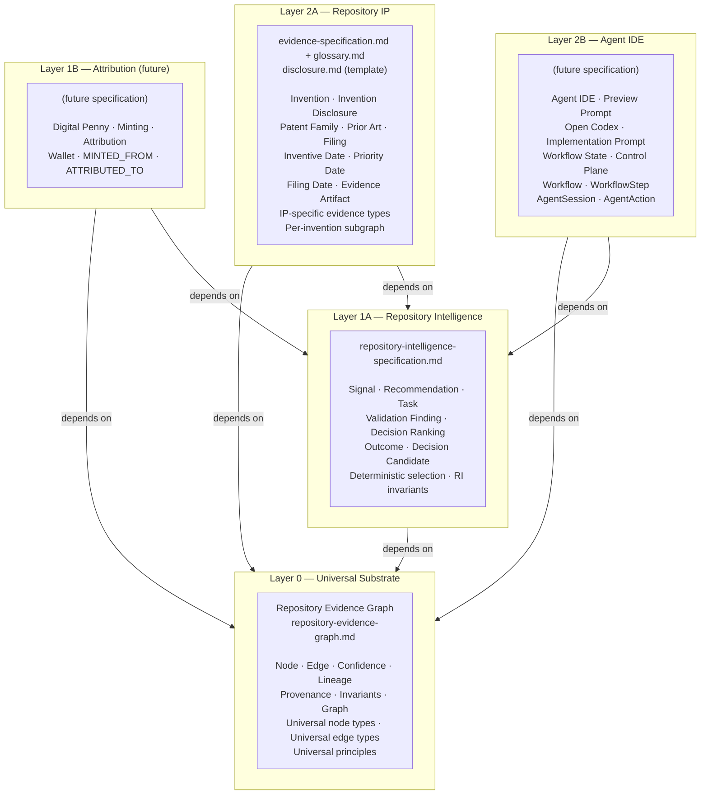
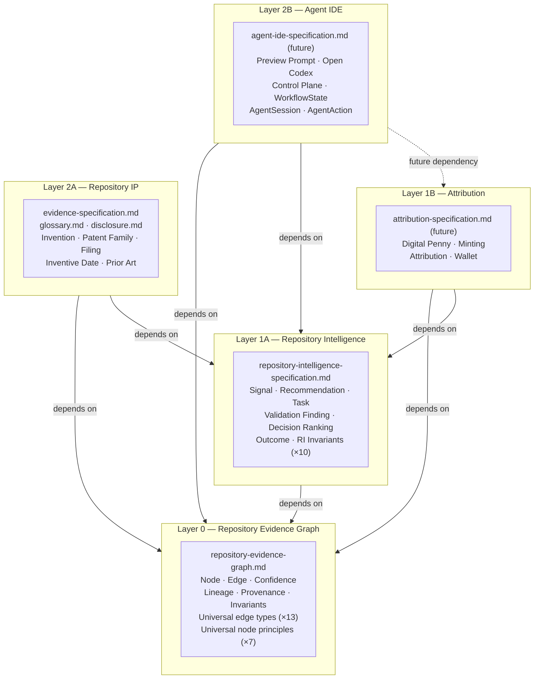
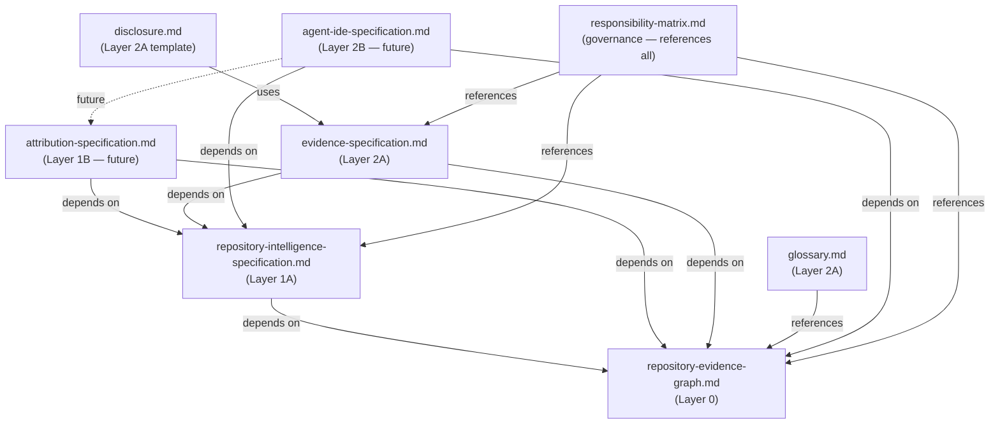

# Responsibility Matrix

## Purpose

This document is the canonical ownership map for the layered Repository Evidence
Graph (REG) platform. It assigns every major concept to exactly one owning layer
and one canonical document, and defines the governance rules that prevent
architectural drift as new specifications are written.

The Responsibility Matrix does not define concepts — it references the canonical
document that does. Any document that needs a concept must look it up in the
canonical document listed here, not redefine it locally.

---

## Audience

- Architects proposing new specification files
- AI agents generating or modifying specification documents
- Engineers resolving ownership disputes between specifications
- Reviewers assessing whether a pull request introduces a layer inversion or
  duplicate definition

---

## Status

`ACTIVE — v1.0 — 2026-06-28`

---

## Dependencies

| Document | Path | Relationship |
|---|---|---|
| Repository Evidence Graph | `./repository-evidence-graph.md` | Layer 0 canonical definitions |
| Repository Intelligence Specification | `./repository-intelligence-specification.md` | Layer 1A canonical definitions |
| Evidence Specification | `./evidence-specification.md` | Layer 2A IP-specific extensions |
| Architecture Review | `./architecture-review-2026-06-28.md` | Refactoring history; architectural constraints |

> **Note:** This document is a governance artifact. It does not define concepts; it
> records where concepts are defined. Its dependency table lists the documents whose
> content is authoritative for the concepts listed in Section 7.

---

## Known Consumers

| Consumer | Path | What they consume |
|---|---|---|
| All future Layer 1/2 specifications | — | Ownership table (Section 7); governance rules (Section 8); drift detection (Section 9) |
| AI agents generating new specifications | — | Concept ownership lookup; conflict resolution rules |

---

## Revision History

| Version | Date | Author | Summary |
|---|---|---|---|
| 1.0 | 2026-06-28 | Agent IDE Architect | Initial specification — establishes canonical ownership map for all existing concepts; defines governance rules, drift detection criteria, and recommended next file |

---

## Section 1 — Purpose

The Repository Evidence Graph platform spans five architectural layers. Each layer
has one or more canonical specification documents. As the number of specifications
grows, two failure modes recur:

1. **Duplicate definitions** — a concept is defined in two documents; the
   definitions diverge over time; consumers disagree on which is authoritative.
2. **Layer inversions** — a lower-layer document depends on a higher-layer document
   for a definition, inverting the intended dependency direction.

This document prevents both failure modes by:

- Assigning every concept to exactly one canonical document
- Recording the consuming layers for each concept
- Specifying whether any layer other than the owner may redefine the concept
- Providing governance rules for adding new concepts and changing ownership
- Providing drift detection criteria that can be evaluated by automated checks or
  AI agents

---

## Section 2 — Audience

Primary audiences:

- **Specification authors** (human or AI): Before introducing a new concept, consult
  Section 7 to verify it is not already owned by another document. Before writing a
  dependency, consult Section 7 to confirm the dependency direction is legal.
- **Reviewers**: Use Section 7 and Section 8 to assess whether a proposed change
  introduces a duplicate definition or a layer inversion.
- **AI agents**: See Section 8.5 for explicit instructions on how to consult this
  matrix before generating a new file.

---

## Section 3 — Dependencies

See the Dependencies table above. This document reads from — but does not extend —
the canonical documents listed there. No concept in this document is novel; every
row in Section 7 points outward.

---

## Section 4 — Revision History

See the Revision History table above.

---

## Section 5 — Layer Model

The platform is organized into five layers. A higher layer number indicates a
narrower scope and a stronger dependency on layers beneath it.

**Dependency rules:**

- A document at Layer N may depend on documents at Layer N−1 or lower.
- A document at Layer N must not depend on documents at Layer N+1 or higher.
- Layer 0 has no upstream dependencies within this platform.
- Two documents at the same layer may depend on each other only if no circular
  dependency is introduced (evaluated by Section 9 drift checks).

---

## Section 6 — Ownership Rules

1. **One owner per concept.** Every concept has exactly one canonical document. If
   a concept appears in two documents, the document listed in Section 7 as the
   canonical document is authoritative; all other occurrences are references, not
   definitions.

2. **The owner defines; consumers reference.** A consuming document may quote a
   concept name, link to the canonical document, and describe how it uses the
   concept in context. It must not provide a competing definition.

3. **Layer 0 owns all universal concepts.** Any concept that applies across more
   than one Layer 1 or Layer 2 domain belongs in `repository-evidence-graph.md`.
   Domain-specific elaborations of a universal concept belong in the domain's layer
   document.

4. **Extensions are not redefinitions.** A Layer 2 document may extend a concept
   (e.g., add IP-specific confidence downgrade rules) without redefining it. The
   extension must explicitly name the canonical document and the canonical section
   it extends.

5. **The "May Redefine?" column in Section 7 is final.** If the value is `No`, no
   document other than the canonical document may contain a definition of that
   concept. If the value is `Yes (extension only)`, a consuming document may add
   domain-specific rules but must not alter the base definition.

6. **Governance changes require a matrix update.** If a concept's ownership moves,
   the canonical document changes, or new consuming layers are added, Section 7 must
   be updated in the same commit.

---

## Section 7 — Responsibility Matrix

> **Reading this table:**
> - **Owning Layer** — the layer whose specification is the sole authority for this concept.
> - **Canonical Document** — the specific file where the definition lives.
> - **Consuming Layers** — layers that may use the concept but not redefine it.
> - **May Redefine?** — whether any non-owner may provide a competing definition (`No`) or may add a domain-specific extension (`Yes (extension only)`).

### 7.1 Layer 0 — Universal Substrate Concepts

| Concept | Owning Layer | Canonical Document | Consuming Layers | May Redefine? | Notes |
|---|---|---|---|---|---|
| Repository | Layer 0 | `repository-evidence-graph.md` §3.1 | L1A, L1B, L2A, L2B | No | Universal root node; all other nodes reachable from it |
| Evidence | Layer 0 | `repository-evidence-graph.md` §1.1 | L1A, L1B, L2A, L2B | Yes (extension only) | Universal concept; evidence-specification.md extends it with IP-specific types |
| Evidence Graph | Layer 0 | `repository-evidence-graph.md` §1 | L1A, L1B, L2A, L2B | No | The REG is the universal graph; per-invention subgraphs are Layer 2A scoped views |
| Node | Layer 0 | `repository-evidence-graph.md` §3 | L1A, L1B, L2A, L2B | Yes (extension only) | Universal node model and base fields; layers above define new node types |
| Edge | Layer 0 | `repository-evidence-graph.md` §4 | L1A, L1B, L2A, L2B | Yes (extension only) | Universal typed directed edge model; layers above may define new edge types |
| Confidence | Layer 0 | `repository-evidence-graph.md` §2.6 | L1A, L1B, L2A, L2B | Yes (extension only) | Five-level scale DEFINITIVE/HIGH/MEDIUM/LOW/UNVERIFIED; IP adds downgrade rules |
| Lineage | Layer 0 | `repository-evidence-graph.md` §4.2, §4.6, §4.12 | L1A, L1B, L2A, L2B | Yes (extension only) | Structural graph properties (DAG, temporal monotonicity, immutability) are universal |
| Provenance | Layer 0 | `repository-evidence-graph.md` §1.3, §3 | L1A, L1B, L2A, L2B | No | Every node carries `createdAt`, `createdBy`, `artifactDate`; universal |
| Graph Invariants | Layer 0 | `repository-evidence-graph.md` §5 | L1A, L1B, L2A, L2B | No | INV-01–INV-20 are universal; layer-specific invariants are named RI-INV or EV-INV |
| Universal Edge Types (SUPPORTS, DERIVES_FROM, IMPLEMENTS, VALIDATES, CONTRADICTS, DEPENDS_ON, GENERATED, ATTRIBUTED_TO, MINTED_FROM, SUPERSEDES, CORROBORATES, PRECEDES, MOTIVATED_BY) | Layer 0 | `repository-evidence-graph.md` §4.1–§4.13 | L1A, L1B, L2A, L2B | No | All 13 universal edge types owned by Layer 0 |
| Universal Node Principles (Repository-First, Verifiable, Immutable, Traceable, Time-Aware, Human-Reviewable, AI-Readable) | Layer 0 | `repository-evidence-graph.md` §1.3 | L1A, L1B, L2A, L2B | No | Seven principles apply to every node in the REG regardless of layer |
| Universal Node Types (Commit, Goal, Architecture, Decision, Issue, Source File, Test, Validation, Benchmark, Outcome, Strategy) | Layer 0 | `repository-evidence-graph.md` §3.1–§3.13 | L1A, L1B, L2A, L2B | No | Layer annotations in REG indicate which layer will own the payload extension |

### 7.2 Layer 1A — Repository Intelligence Concepts

| Concept | Owning Layer | Canonical Document | Consuming Layers | May Redefine? | Notes |
|---|---|---|---|---|---|
| Repository Intelligence Signal | Layer 1A | `repository-intelligence-specification.md` §5 | L2A, L2B | No | Node type `SIG-{YEAR}-{SEQ}`; 9 signal kinds; full payload defined in RI spec |
| Recommendation | Layer 1A | `repository-intelligence-specification.md` §6 | L2A, L2B | No | Supersedes REG §3.7 placeholder; `REC-{YEAR}-{SEQ}`; includes implementationPrompt invariant |
| Task | Layer 1A | `repository-intelligence-specification.md` §7 | L1B, L2A, L2B | No | Supersedes REG §3.8 placeholder; `TASK-{YEAR}-{SEQ}`; lifecycle PENDING→IN_PROGRESS→COMPLETE/ABANDONED |
| Decision Ranking | Layer 1A | `repository-intelligence-specification.md` §11 | L2A, L2B | No | Five weighted dimensions; composite score formula; tie-breaking rules; deterministic |
| Decision Candidate | Layer 1A | `repository-intelligence-specification.md` §10 | L2A, L2B | No | Embedded in Recommendation.candidates[]; NOT a separate REG node |
| Validation Finding | Layer 1A | `repository-intelligence-specification.md` §8 | L2A, L2B | No | `VF-{YEAR}-{SEQ}`; 8 finding kinds including recommendation-staleness and prompt-integrity |
| Outcome | Layer 1A | `repository-intelligence-specification.md` §9 | L1B, L2A, L2B | No | REG Outcome node production rules; requires Task COMPLETE + IMPLEMENTS Commit + measurable result |
| Implementation Prompt | Layer 1A | `repository-intelligence-specification.md` §6 | L2B | No | `implementationPrompt` field in Recommendation; single source of truth; no fallback or derivation |
| Workflow State (workflowKey derivation) | Layer 1A | `repository-intelligence-specification.md` §6 | L2B | No | `"{packageType}:{category}:{effectiveTitle}"` derivation rule owned by RI spec |

### 7.3 Layer 1B — Attribution Concepts (future)

| Concept | Owning Layer | Canonical Document | Consuming Layers | May Redefine? | Notes |
|---|---|---|---|---|---|
| Digital Penny | Layer 1B | *(future: attribution-specification.md)* | L2A, L2B | No | Unit of contribution attribution; MINTED_FROM edge to Task; Layer 0 defines the MINTED_FROM edge type |
| Minting | Layer 1B | *(future: attribution-specification.md)* | L2A, L2B | No | Process by which a Digital Penny is created from a Task; defined by Layer 1B |
| Attribution | Layer 1B | *(future: attribution-specification.md)* | L2A, L2B | No | ATTRIBUTED_TO edge type is Layer 0; the attribution model (who gets credited, when, how) is Layer 1B |
| Wallet | Layer 1B | *(future: attribution-specification.md)* | L2A, L2B | No | Contributor's accumulation of Digital Pennies; Layer 1B concept |

### 7.4 Layer 2A — Repository IP Concepts

| Concept | Owning Layer | Canonical Document | Consuming Layers | May Redefine? | Notes |
|---|---|---|---|---|---|
| Evidence Artifact | Layer 2A | `evidence-specification.md` §2 | L2B | No | IP-specific evidence types (Source Code, Commit, PR, Issue, etc.); extends Layer 0 evidence concept |
| Invention | Layer 2A | `evidence-specification.md` + `repository-evidence-graph.md` §3.14 | L2B | No | REG defines the node shell; evidence-spec defines the IP-specific payload and evidence requirements |
| Invention Disclosure | Layer 2A | `evidence-specification.md` + `repository-evidence-graph.md` §3.15 | L2B | No | REG defines the node shell; disclosure.md defines the template; evidence-spec defines evidence requirements |
| Patent Family | Layer 2A | `repository-evidence-graph.md` §3.16 (node shell) | L2B | No | Node shell in REG with layer annotation; IP payload to be defined in a future IP extension spec |
| Prior Art | Layer 2A | `repository-evidence-graph.md` §3.17 (node shell) | L2B | No | Node shell in REG; IP-specific prior art search methodology is Layer 2A |
| Filing | Layer 2A | `repository-evidence-graph.md` §3.18 (node shell) | L2B | No | Node shell in REG; `evidence-specification.md` §2.16 defines Filing Artifact evidence type |
| Inventive Date | Layer 2A | `evidence-specification.md` §1.5, §3.3, §5.2 | L2B | No | IP-specific temporal concept; upper bound set by earliest timestamped evidence artifact |
| Priority Date | Layer 2A | `evidence-specification.md` §2.16, §3.3 | L2B | No | Established by Filing Artifact at DEFINITIVE confidence only |
| Filing Date | Layer 2A | `evidence-specification.md` §2.16, §3.3 | L2B | No | Established by Filing Artifact at DEFINITIVE confidence only |
| Repository IP | Layer 2A | `evidence-specification.md` (overall scope) | L2B | No | The IP subsystem as a whole; Layer 2A is its architectural home |
| Per-Invention Evidence Subgraph | Layer 2A | `evidence-specification.md` §6 | L2B | No | IP-scoped DAG view of the REG reachable from one Invention node; not the full REG |

### 7.5 Layer 2B — Agent IDE Concepts (partial; future specification pending)

| Concept | Owning Layer | Canonical Document | Consuming Layers | May Redefine? | Notes |
|---|---|---|---|---|---|
| Agent IDE | Layer 2B | *(future: agent-ide-specification.md)* | — | No | The IDE product surface; outermost layer |
| Preview Prompt | Layer 2B | *(future: agent-ide-specification.md)* | — | No | UI surface that displays the current recommendation's implementation prompt |
| Open Codex | Layer 2B | *(future: agent-ide-specification.md)* | — | No | Agent IDE action that launches Codex with the implementation prompt |
| Control Plane | Layer 2B | *(future: agent-ide-specification.md)* | — | No | Agent IDE subsystem that manages workflow lifecycle |
| Workflow | Layer 2B | *(future: agent-ide-specification.md)* | — | No | Agent IDE task execution unit; driven by a RI Task node |
| WorkflowStep | Layer 2B | *(future: agent-ide-specification.md)* | — | No | Step within a Workflow; maps to an action in the Control Plane |
| AgentSession | Layer 2B | *(future: agent-ide-specification.md)* | — | No | Bounded execution session for an AI agent operating in the IDE |
| AgentAction | Layer 2B | *(future: agent-ide-specification.md)* | — | No | Discrete action taken by an agent during an AgentSession |

---

## Section 8 — Governance Rules

### 8.1 Adding a New Concept

A new concept may be introduced only when all three of the following conditions
are met:

1. **Not already owned.** The concept does not appear in Section 7. If a similar
   concept exists, the author must either (a) use the existing concept, or (b)
   formally propose a disambiguation that explains how the two concepts differ.

2. **Layer assignment is unambiguous.** The concept belongs to exactly one layer.
   If the concept is used by more than one Layer 2 domain, it belongs in Layer 0
   (universal) or Layer 1A/1B (cross-domain). If it is used by exactly one Layer 2
   domain, it belongs in that domain's layer.

3. **Canonical document is identified.** The concept must be defined in a specific
   document. If the appropriate canonical document does not exist yet, the concept
   must be held back until that document is created.

**Process:**

1. Update Section 7 of this document with the new row.
2. Add the definition to the canonical document.
3. Update the canonical document's `Known Consumers` table if the concept is
   consumed by other documents.
4. Commit the matrix update and the canonical document update in the same commit.

### 8.2 Changing Concept Ownership

Ownership of a concept may change when the architecture changes (e.g., a concept
previously considered IP-specific is found to be universal). To change ownership:

1. Identify the old canonical document and the new canonical document.
2. Move the definition from the old document to the new document.
3. Add a cross-reference in the old document pointing to the new location.
4. Update Section 7 of this document.
5. Run the drift detection checks in Section 9.
6. Commit all three changes (old document, new document, this matrix) in a single
   commit with a message that identifies the concept and the ownership change.

### 8.3 Resolving Conflicts

A conflict exists when two documents each contain a definition of the same concept.
Resolution procedure:

1. Look up the concept in Section 7.
2. The document listed as `Canonical Document` is authoritative.
3. The conflicting definition in the non-canonical document must be removed or
   converted to a cross-reference.
4. If Section 7 does not list the concept, the conflict must be escalated to an
   architecture review before either definition is used.
5. No AI agent may resolve an ownership conflict by choosing one definition over
   another without updating this matrix.

### 8.4 Layer 0 vs. Layer 1/2 Extensions

| Scenario | Correct action |
|---|---|
| A concept is needed in two or more Layer 1/2 documents | Move it to Layer 0 (REG) |
| A Layer 2 document adds IP-specific rules to a universal concept | Permitted as extension; must cite the canonical Layer 0 section |
| A Layer 2 document adds a new field to a Layer 0 node type | Not permitted; propose a new node type or a payload extension mechanism |
| A Layer 1 document adds a new universal edge type | Not permitted; propose adding the edge type to REG §4 |
| A Layer 2 document depends on another Layer 2 document | Permitted if they are in different domains and no circular dependency is introduced |
| A Layer 0 document cites a Layer 1 document | Not permitted; this is an authority inversion |

### 8.5 Instructions for AI Agents

Before generating a new specification file, an AI agent must:

1. **Read this document** (responsibility-matrix.md).
2. **For every concept the new file will introduce**, look it up in Section 7.
   - If the concept is already owned by another document, the new file must
     reference that document rather than defining the concept.
   - If the concept is not in Section 7, add a row to Section 7 before writing the
     definition into the new file.
3. **Verify the layer assignment** of the new file against Section 5. Confirm that
   every dependency of the new file is at an equal or lower layer.
4. **Run the drift detection criteria** in Section 9 (mentally or by code) against
   the proposed content.
5. **Update the Known Consumers table** in every canonical document that the new
   file consumes.
6. **Propose a Section 12 update** naming the next file, if applicable.

An AI agent must not generate a new specification file without completing steps
1–5. Generating a file first and consulting this matrix second is the primary
cause of architectural drift.

---

## Section 9 — Drift Detection

The following checks can be automated or run manually. Each check has a name,
a description, and the expected result when no drift is present.

### 9.1 Duplicate Definition Check

**Procedure:** For each concept in Section 7, search all specification files for
occurrences of the concept name followed by a definition pattern (e.g., "is defined
as", "means", "refers to", a Markdown heading at the same level as a definition, or
a JSON schema block).

**Expected result:** Each concept appears as a definition in exactly one file — the
file listed in Section 7.

**Drift signal:** A concept definition appears in two or more files. The non-canonical
occurrence must be converted to a cross-reference.

### 9.2 Layer Inversion Check

**Procedure:** For each specification file, read its Dependencies table. For each
dependency listed, determine the layer of the dependency and the layer of the file.

**Expected result:** Every dependency is at an equal or lower layer than the file
that declares it.

**Drift signal:** A file at Layer N lists a dependency at Layer N+1 or higher. This
is an authority inversion and must be corrected before the file is merged.

### 9.3 Circular Dependency Check

**Procedure:** Build a directed graph where nodes are specification files and edges
are declared dependencies. Apply a topological sort.

**Expected result:** The sort succeeds (DAG; no cycles).

**Drift signal:** The sort fails. Identify the cycle and break it by moving the
shared concept to the lower-layer document.

### 9.4 Undefined Concept Check

**Procedure:** For each concept referenced in a specification file (as a linked term
or a term used without definition), look it up in Section 7.

**Expected result:** Every referenced concept appears in Section 7 and has a
canonical document that defines it.

**Drift signal:** A concept is used in a specification file but does not appear in
Section 7. The concept must be added to Section 7 and defined in the appropriate
canonical document.

### 9.5 Unowned Concept Check

**Procedure:** Scan all specification files for concept definitions (headings,
schema blocks, "is defined as" patterns). For each definition found, look it up in
Section 7.

**Expected result:** Every definition has a corresponding row in Section 7 where
the file containing the definition is the `Canonical Document`.

**Drift signal:** A definition exists in a file but is not listed in Section 7, or
the file is listed as a consumer rather than the canonical document. Add the concept
to Section 7 or move the definition to the correct canonical document.

### 9.6 Cross-Layer Authority Violation Check

**Procedure:** For each row in Section 7 where `May Redefine?` is `No`, verify that
only the canonical document contains a definition.

**Expected result:** Non-canonical documents contain only cross-references (e.g.,
"as defined in `repository-evidence-graph.md` §2.6") for concepts marked `No`.

**Drift signal:** A non-canonical document contains a definition (not merely a
reference) for a concept marked `No`. The definition must be removed.

---

## Section 10 — Mermaid Diagrams

### 10.1 Layered Architecture

### 10.2 Concept Ownership Flow

```mermaid
graph LR
    subgraph Universal["Layer 0 — Universal Concepts"]
        direction TB
        REP[Repository]
        NOD[Node]
        EDG[Edge]
        CON[Confidence]
        LIN[Lineage]
        INV[Invariants]
        UET["Universal Edge Types (×13)"]
        UNP["Universal Principles (×7)"]
    end

    subgraph RI["Layer 1A — RI Concepts"]
        direction TB
        SIG[Signal]
        REC[Recommendation]
        TSK[Task]
        VF[Validation Finding]
        DR[Decision Ranking]
        IP2[Implementation Prompt]
        WK[workflowKey]
    end

    subgraph ATTR["Layer 1B — Attribution Concepts"]
        direction TB
        DP[Digital Penny]
        MINT[Minting]
        WAL[Wallet]
    end

    subgraph IP["Layer 2A — IP Concepts"]
        direction TB
        EVA[Evidence Artifact]
        IVN[Invention]
        IVD[Invention Disclosure]
        PF[Patent Family]
        PA[Prior Art]
        FIL[Filing]
        INVD[Inventive Date]
        PD[Priority Date]
        FD[Filing Date]
    end

    subgraph AIDE["Layer 2B — Agent IDE Concepts"]
        direction TB
        PREV[Preview Prompt]
        COD[Open Codex]
        CTL[Control Plane]
        WF[Workflow]
        AS[AgentSession]
    end

    Universal --> RI
    Universal --> ATTR
    Universal --> IP
    Universal --> AIDE
    RI --> IP
    RI --> AIDE
    ATTR --> IP
    ATTR --> AIDE
    IP --> AIDE
```

### 10.3 Document Dependency Graph

---

## Section 11 — Consistency Audit

### 11.1 Every Listed Concept Has Exactly One Owner

**Result: PASS**

Every concept in Section 7 has exactly one row in the table and one entry in the
`Canonical Document` column. No concept appears in more than one row with a
different canonical document.

### 11.2 Every Owning Layer Has a Canonical Document

| Layer | Canonical Document | Status |
|---|---|---|
| Layer 0 | `repository-evidence-graph.md` v1.2 | EXISTS — ACTIVE |
| Layer 1A | `repository-intelligence-specification.md` v1.0 | EXISTS — ACTIVE |
| Layer 1B | `attribution-specification.md` | FUTURE — not yet generated |
| Layer 2A | `evidence-specification.md` v1.2 | EXISTS — ACTIVE |
| Layer 2B | `agent-ide-specification.md` | FUTURE — not yet generated |

Layer 1B and Layer 2B concepts listed in Section 7 are correctly annotated as
`*(future)*`. No Layer 1B or Layer 2B concept is currently orphaned — all are
pending a single future specification each.

### 11.3 No Layer 0 Document Depends on Layer 1/2 Documents

**Result: PASS**

`repository-evidence-graph.md` v1.2 Dependencies table contains one entry:

> IP README (`../README.md`) — orientation only; not a specification dependency

Both `evidence-specification.md` (Layer 2A) and `glossary.md` (Layer 2A) were
removed from the REG dependency table in Architecture Remediation passes 1 and 2
(2026-06-28). No Layer 0 document depends on any Layer 1 or Layer 2 document.

### 11.4 No Layer 2 Document Defines Layer 0 Concepts

**Result: PASS**

`evidence-specification.md` v1.2 was converted from an authority specification to
an extension specification in Architecture Remediation pass 2 (2026-06-28). Its
Section 1 (Evidence Principles) now explicitly states that the seven universal
principles are authoritative in `repository-evidence-graph.md` §1.3 and that the
section provides only IP-specific application guidance. Its Section 6 was retitled
from "Repository Evidence Graph" to "Per-Invention Evidence Subgraph" to eliminate
the title conflict with the REG document. Its Section 9 validation rules tables
include a `REG Invariant` column identifying which rules are universal (owned by
REG) and which are IP-specific.

### 11.5 Circular Dependency Check

**Result: PASS**

Topological sort of document dependency graph (Section 10.3):

1. `repository-evidence-graph.md` (no dependencies)
2. `repository-intelligence-specification.md` (depends on REG)
3. `evidence-specification.md` (depends on REG, RI)
4. `responsibility-matrix.md` (references all; governance only)

No cycles. DAG invariant holds.

---

## Section 12 — Recommended Next File

**Recommended next file:** `attribution-specification.md`

**Rationale:**

- Layer 1B (Attribution / Digital Penny) is the only layer with active concepts
  in Section 7 that lacks a canonical document.
- All four Layer 1B concepts (Digital Penny, Minting, Attribution, Wallet) are
  currently unowned except by this matrix's forward reference to a future file.
- Layer 1B depends on Layer 0 (REG) and Layer 1A (RI), both of which now have
  complete, remediated specifications.
- Two Layer 2 documents (Layer 2A and Layer 2B, when generated) will depend on
  Layer 1B. Generating Layer 1B before Layer 2B completes the dependency graph
  in the correct top-down order.
- `attribution-specification.md` should define: Digital Penny node type and ID
  format; Minting rules and eligibility; Attribution model (ATTRIBUTED_TO edge
  semantics at the Layer 1B level); Wallet as an accumulation concept; relationship
  to Task completion and the RI pipeline; relationship to Repository IP (IP
  valuation); invariants governing attribution immutability.

**Layer 2B (`agent-ide-specification.md`)** is the alternative candidate.
It would close the final gap in the document dependency graph. However, Layer 2B
depends on Layer 1B, and generating Layer 2B before Layer 1B would require either
forward-referencing an undefined layer or deferring the attribution dependency
entirely. Generating Layer 1B first is architecturally cleaner.

Do not generate `attribution-specification.md` without explicit approval.
